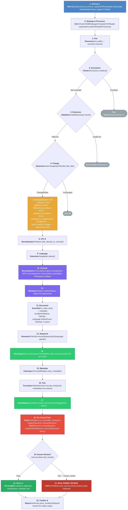
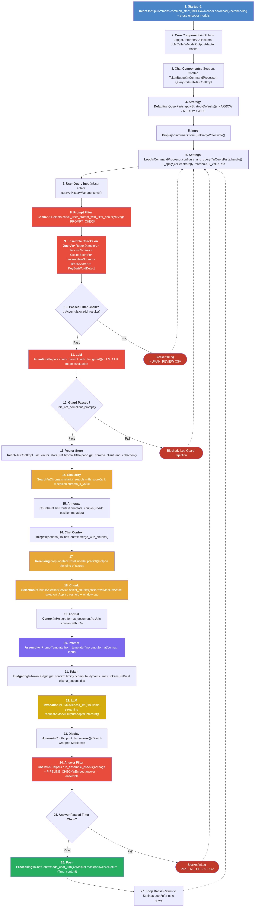
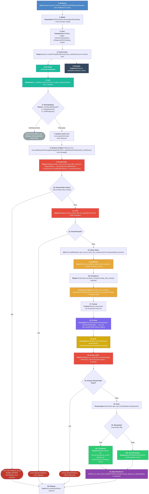
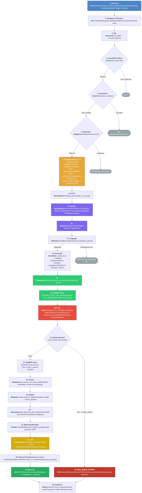
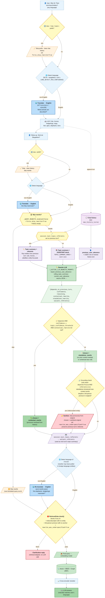
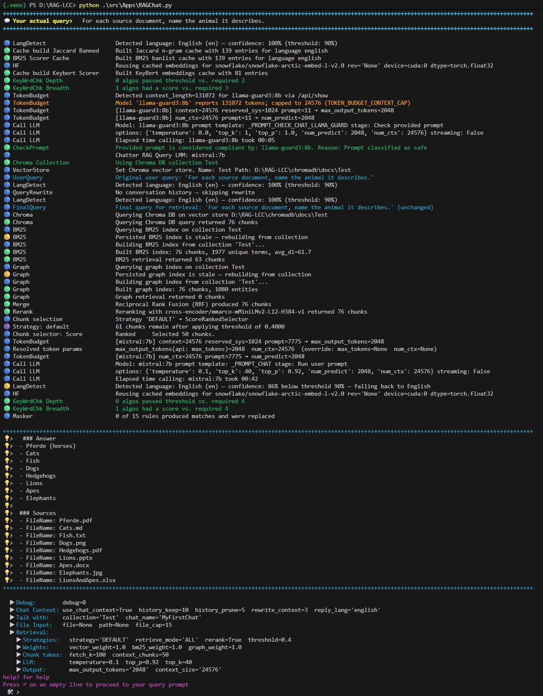
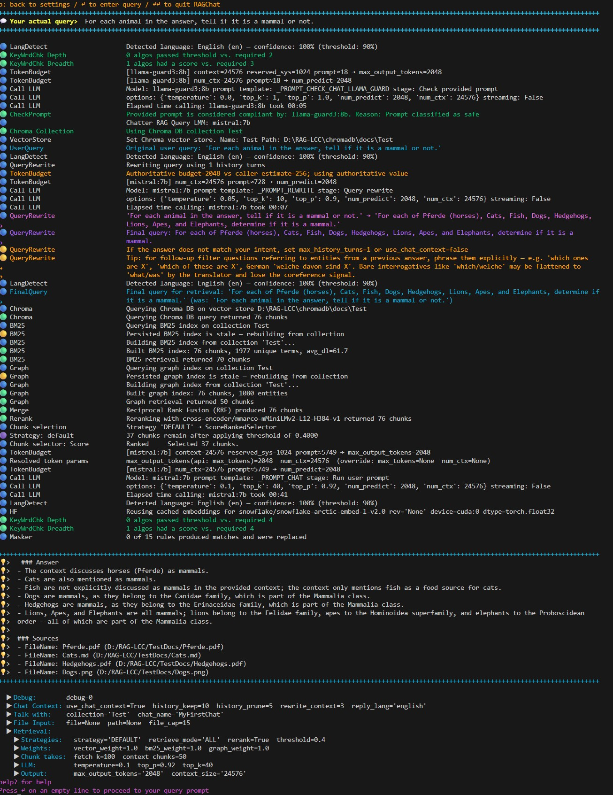

# Architecture Overview

> **Lab / Research Use Only.** See [Lab Disclaimer](#-lab-disclaimer) below and [LEGAL.md](LEGAL.md) for governance guidance.

## 🔬 Lab Disclaimer

This software is a **research and experimental laboratory tool**. It is not a certified compliance product, a legal instrument, or a substitute for qualified legal, security, or regulatory advice.

- Detection algorithms, thresholds, and consensus rules are configurable and must be tuned by the operator for their specific context. Default values are illustrative starting points only.
- No automated system can guarantee detection of all policy violations, data leaks, or compliance issues. False negatives (missed violations) and false positives (incorrect flags) will occur.
- The "[compliance](#-definition-compliance-rag-lcc)" terminology used throughout this codebase refers to a configurable keyword/phrase detection pipeline, not to any legal standard or certification.
- The operator is solely responsible for validating that the tool behaves correctly for their use case, for reviewing all outputs, and for any decisions made based on those outputs.
- This tool does not provide legal advice, does not constitute a Data Protection Impact Assessment (DPIA), and does not satisfy any regulatory obligation on its own.
- **This tool is not intended for production use.** It is a lab and research environment only. There is no hardening, no security audit, no SLA, and no support commitment.
- Use is entirely at the operator's own risk.

## 📖 Definition: Compliance (RAG-LCC)

Compliance in the context of RAG‑LCC means the configurable, algorithmic process used to detect, flag, and optionally block or redact content according to operator‑supplied keyword lists, thresholds, and consensus rules. Compliance checks are a technical detection pipeline only and do not by themselves establish legal, regulatory, or contractual compliance. Final decisions about enforcement, disclosure, or remediation must be made by a qualified human operator.

Key points

Detection only: RAG‑LCC performs automated detection and scoring; it does not make legal determinations.

Operator control: Keyword lists, thresholds, and consensus rules are supplied and tunable by the operator.

Human review required: Any blocking, redaction, or external disclosure requires human review and recorded sign‑off.

Scope: Applies to document ingestion, prompt validation, and LLM output validation as configured in Configuration/Config_*.py.

Limitations: Detection is probabilistic; false positives and false negatives will occur.

## 🏗️ System Design

RAG-LCC follows a modular, configuration-driven architecture intended for laboratory and research use. The system provides a tunable pipeline for experimenting with LLM parameters, detection algorithm combinations, and keyword-based filter chains.

Four applications share the same core infrastructure:

- **RAGLoad** — ingests documents into a ChromaDB vector store; applies text masking and optional compliance checks during ingestion.
- **RAGChat** — retrieves relevant chunks from the store and answers queries via an LLM; applies compliance checks to both the prompt and the LLM response.
- **RAGChatService** — exposes the same RAG pipeline as RAGChat over an OpenAI-compatible REST API; entry point is a network listener instead of the terminal GUI.
- **DocClassify** — classifies documents in a directory using keyword extraction, stemming, and optional LLM-assisted label generation; writes results to CSV.

## 🎯 Core Design Principles

1. **Configuration-Driven**: All behavior parameterized via Python config files (`Config_*.py`) with CLI override support
2. **Offline-First**: Designed to operate locally; actual behavior depends on configuration and third‑party components
3. **User Responsibility**: Framework enables; users verify compliance and appropriateness
4. **Explicit Over Hidden**: No automatic assumptions about behavior
5. **Singleton Patterns**: Stateful components use singletons to maintain consistency
6. **Modular Detection**: Multiple algorithms with consensus scoring for compliance checks

## 🧩 Component Hierarchy

```text
src/
│
├── Apps/                          Entry points
│   ├── RAGLoad.py                 Document ingestion pipeline
│   ├── RAGChat.py                 Interactive retrieval + multi-turn chat (CLI)
│   ├── RAGChatService.py          OpenAI-compatible REST API wrapper for RAGChat
│   ├── DocClassify.py             Batch document classification
│   └── resources/                 Static assets (favicon, etc.)
│
├── Configuration/                 Config files read at startup
│   ├── Config_Global.py           Shared defaults (paths, hardware, chunking, debug)
│   ├── Config_Models.py           Model definitions and endpoint metadata
│   ├── Config_Banned.py           Banned-phrase lists, detection thresholds, masking rules
│   ├── Config_WebSearch.py        Web search backend and intent-filter settings
│   ├── Config_Internet_Env.py     Internet access and network-tracing env vars
│   ├── Config_RAGChat.py          Chat strategies, query rewrite, multi-query, grounding
│   ├── Config_RAGChatService.py   Service-specific overrides (re-exports Config_RAGChat)
│   ├── Config_RAGLoad.py          Ingestion-specific settings
│   └── Config_DocClassify.py      Classification model params and extraction keys
│
├── Config/                        Config loader
│   ├── Config.py                  Hierarchical config resolver (lookup-order chain)
│   └── AddConstantsFromConfigFile.py  Injects config module attributes into a Config instance
│
├── Pipeline/                      Pipeline orchestration
│   └── LoadAndClassifyProcessor.py  Drives the load + classify pipeline (RAGLoad / DocClassify)
│
├── Strategies/                    Processing strategies and retrievers
│   ├── DocumentIngestionStrategy.py  Chunk, embed, and store documents
│   ├── ClassifyStrategy.py        LLM-based document classification
│   ├── ClassifyHelper.py          Classification workflow helpers
│   ├── ProcessingStrategy.py      Base / abstract strategy contract
│   ├── HomeBrewChunkSelector.py   Custom chunk selection logic (NARROW / WIDE / etc.)
│   ├── StrategyType.py            Strategy enum and type constants
│   ├── BM25Retriever.py           Okapi BM25 keyword retrieval
│   ├── GraphRetriever.py          Entity co-occurrence graph retrieval (spaCy NER + BFS)
│   ├── WebRetriever.py            DuckDuckGo web search retrieval leg
│   ├── WebPreFilter.py            Query sanitisation and injection-detection before web calls
│   ├── WebSearchFilter.py         Intent-classifier gate on web queries
│   └── Chunkers/                  Chunker implementations
│       ├── ChunkerStrategy.py     Base class / ABC for all chunkers
│       ├── RecursiveChunker.py    Fixed-size word chunks with overlap
│       ├── SemanticChunker.py     Embedding-based semantic boundary detection
│       ├── SentenceWindowChunker.py  Sentence-packed chunks up to MAX_CHUNK_SIZE
│       ├── SlidingWindowChunker.py   Overlapping sentence windows
│       ├── HeadingChunker.py      Heading-aware structural chunking (breadcrumb mode)
│       ├── PageBasedChunker.py    ABC for page-oriented chunkers
│       ├── SlideChunker.py        Per-slide chunking (PPTX / PPT)
│       ├── PdfPageChunker.py      Per-page chunking (PDF)
│       └── SentenceSplitter.py    Sentence boundary utility used by multiple chunkers
│
├── Chat/                          RAGChat conversation layer
│   ├── RAGChatImpl.py             Core retrieval + generation loop
│   ├── Chatter.py                 Session shell and turn management
│   ├── CommandProcessor.py        In-chat command dispatch (strategy!, mode!, debug!, …)
│   ├── ChatContext.py             Multi-turn context storage and pruning
│   ├── PromptRewrite.py           Query rewriting / coreference resolution (LLM-based)
│   ├── QueryParts.py              Query decomposition and session parameter access
│   ├── RetrievalGate.py           Blocks under-specified queries; returns ❔ clarification
│   └── MarkedDocsViewer.py        CLI picker for highlighted source documents
│
├── Api/                           RAGChatService REST layer
│   ├── ChatCompletionHandler.py   OpenAI /v1/chat/completions request handler
│   ├── MarkedDocsService.py       HTTP server for /marked/<token> highlighted-doc links
│   └── MarkedDocsStore.py         In-memory TTL cache for highlighted document bytes
│
├── Algos/                         Detection and scoring algorithms
│   ├── BM25Scorer.py              Okapi BM25 probabilistic phrase scoring
│   ├── JaccardScorer.py           Character n-gram Jaccard similarity
│   ├── RegexScorer.py             Regex + Levenshtein fuzzy matching
│   ├── LevenshteinScorer.py       Edit-distance scoring
│   ├── KeyBertScorer.py           KeyBERT semantic keyword detection
│   ├── CosineScorer.py            Embedding cosine similarity (disabled by default)
│   ├── Masker.py                  Regex-based span redaction (PII, credentials, etc.)
│   ├── ReverseStemmer.py          Stem → best-matching original-word lookup
│   ├── Synonyms.py                WordNet synonym expansion for banned-word lists
│   ├── UnicodeNormalizer.py       Leet-speak decoding and Unicode confusable normalisation
│   └── ComplianceAlgoResult.py    Result container shared across all scorers
│
├── Compliance/                    Compliance pipeline execution
│   ├── Compliance.py              Orchestrates per-app detection pipelines
│   ├── BannedPhraseCollector.py   Loads, translates, and expands banned-phrase lists
│   ├── SharedHelpers.py           Shared detection utilities (consensus rules, CSV output)
│   ├── Exclusions.py              Exclusion-list management (previously-flagged files)
│   ├── HfTranslator.py            M2M100 query translation (HuggingFace, lazy singleton)
│   ├── ArgosDownloader.py         Argos Translate package download and consent workflow
│   └── HFDownloader.py            HuggingFace model download, cache scan, and consent
│
├── AI/                            Model loading and inference
│   ├── AIHelpers.py               Embedder and cross-encoder loading (singleton wrappers)
│   ├── LLMCaller.py               LLM call dispatcher (Ollama / vLLM)
│   ├── LLMBackendAdapter.py       Protocol adapter (Ollama ↔ vLLM REST differences)
│   ├── ModelOutputAdapter.py      Normalises raw LLM output to a common response shape
│   ├── ModelsCache.py             In-process model instance registry
│   ├── TensorHelpers.py           GPU / CPU tensor utilities
│   └── TokenBudget.py             Per-model context-window budget allocation
│
├── Helpers/                       General-purpose utilities
│   ├── Helpers.py                 Startup helpers (Tesseract, NLTK, spaCy init)
│   ├── FileUtils.py               Document extraction (PDF, images, Office, text)
│   ├── ChromaDBHelper.py          ChromaDB collection interface (HNSW, BM25, graph)
│   ├── Accumulator.py             Score aggregation across detection algorithms
│   ├── DebugHelper.py             DEBUG_LEVEL evaluation (`on`, `only`, `active`, `parse`, `check`)
│   ├── CSVWriter.py               Compliance and classification CSV output
│   ├── ClassifyCSVReader.py       Reads DocClassify CSV for classify-then-load filtering
│   ├── ValidExtensions.py         Supported file-type registry and routing
│   ├── OfficeDocConverter.py      MS Office → text via COM automation (pywin32)
│   ├── PerfLogger.py              Performance event logging (start/stop timestamps)
│   ├── PipelineSettingsSummarizer.py  Human-readable pipeline-state summary for the startup banner
│   └── SourcePathLinkifier.py     Converts file paths to OSC-8 terminal hyperlinks
│
├── Globals/                       Shared runtime state
│   ├── Globals.py                 Global singletons (compliance log, perf log handles)
│   ├── Session.py                 Per-session state (strategy, debug level, chat context)
│   └── CounterInstance.py         Thread-safe event counters
│
├── Gui/                           Terminal UI components
│   ├── PrettyWriter.py            Word-wrapped, coloured terminal output
│   ├── Informer.py                System-status reporter (startup banner, index stats)
│   ├── Banner.py                  Application header / logo display
│   ├── Colors.py                  ANSI colour constants (truecolor + 256-color fallback)
│   ├── CollectionPicker.py        Interactive ChromaDB collection selector
│   ├── FileList.py                Interactive file-picker for marked documents
│   ├── HistoryManager.py          Chat history persistence (load / save)
│   ├── LicensePager.py            License text pager for model consent workflow
│   └── Symbols.py                 Unicode symbol constants used across the GUI
│
├── Commons/                       Cross-cutting infrastructure
│   ├── Exceptions.py              Custom exception hierarchy
│   ├── SingletonMixin.py          Thread-safe singleton base class
│   ├── StartupCommons.py          Shared startup sequence (env vars, config hash checks)
│   └── NetworkTracer.py           Optional socket-level network activity tracer
│
├── VisualMarkers/                 Answer grounding and source highlighting
│   ├── AnswerGrounder.py          Sentence-level overlap detection (grounded vs ungrounded)
│   ├── VisualMarker.py            Abstract base for per-format highlight injectors
│   ├── VisualMarkerFactory.py     Selects the right marker implementation by file type
│   ├── PdfVisualMarker.py         /Highlight annotations via pdfplumber + pypdf
│   ├── DocxVisualMarker.py        <w:highlight> XML injection via python-docx
│   ├── PptxVisualMarker.py        <a:highlight> XML injection via python-pptx + lxml
│   └── PlainTextVisualMarker.py   <mark>…</mark> wrapping for .md and .txt files
│
└── Scripts/                       Operator utilities (run directly, not imported)
    ├── Setup.py                   Interactive first-run setup wizard
    ├── CopyExampleConfigs.py      Copies example Config_*.py files into place
    ├── RecalcConfigHashes.py      Recomputes and updates _*_CONFIG_HASH values
    ├── ArgosTranslatePackages.py  Install / remove Argos Translate language packages
    ├── BM25IndexInspector.py      Inspect persisted BM25 index contents
    ├── GraphIndexInspector.py     Inspect persisted entity-graph index contents
    ├── NLTK_Stopwords_WordNet.py  Download NLTK stopwords and WordNet corpora
    ├── PipInstall.py              Offline pip install helper
    ├── UpdateConfigValues.py      Batch-update config values from the CLI
    └── VerifySignatures.py        Verify file integrity / signatures
```

## 🔀 Data Flow

The following diagrams illustrate the intended data flow for experimentation; actual execution paths may vary depending on configuration, runtime conditions, and errors.

### 📥 RAGLoad Pipeline



### 💬 RAGChat / RAGChatService Pipeline

`RAGChatService` follows the same pipeline as `RAGChat`. The difference is the entry point: `RAGChat` uses an interactive terminal GUI, while `RAGChatService` accepts requests through an OpenAI-compatible HTTP listener and dispatches them to worker threads.

After query rewrite, a **RetrievalGate** step checks whether the rewritten query is specific enough to retrieve meaningfully. If not (e.g. *"what are the specifications?"* or *"does it have spines?"* with no prior entity anchor), the gate short-circuits retrieval and returns a `❔` clarification message to the user instead of calling the LLM. Detection uses spaCy `Person=3` morphology — no hand-maintained word lists.

#### RAGChat



#### RAGChatService



#### 🔒 RAGChatService — OpenAI Surface (Intentional Restrictions vs. Known Gaps)

`RAGChatService` is an **opinionated façade** in front of the LLM, not a
drop-in OpenAI replacement. Its trust boundary depends on the controlled
prompt template (`_PROMPT_CHAT`), the validated parameter allow-list
(`ChatCompletionRequest`), the pinned compliance chain, and the fact
that operator-curated ChromaDB collections are the only retrieval
source. Most absences from the OpenAI surface are therefore **deliberate
security restrictions**, not defects.

**Intentional restrictions (security-by-design):**

| Omitted surface | Why it's omitted |
| --- | --- |
| `tools` / `tool_choice` / `tool_calls` / `function_call` | Arbitrary tool calling would let callers execute side-effects outside the audited RAG pipeline and bypass compliance. |
| Vision (image parts in `messages[*].content`) | Image bytes are not subject to the text-based banned-content detection; allowing them would be a content-policy bypass. |
| `/v1/audio/transcriptions`, `/v1/audio/speech` | Same reasoning — transcription / TTS would route content around the compliance chain. |
| `response_format` / JSON mode / structured outputs | Forcing structured outputs could override the pinned prompt and suppress compliance disclaimers and clarification prompts. |
| `/v1/embeddings` | Exposing the embedder as a generic service would leak its capacity to non-RAG callers and expand the trust boundary. |
| `/v1/images/generations` | Out of scope — image generation does not belong in a RAG façade. |
| OpenWebUI "Knowledge" passthrough / file attachments | Operator-curated, hash-pinned ChromaDB collections are the only retrieval source; per-request uploads would bypass the ingestion-time compliance scan. |
| Per-request system-prompt overrides from the OpenWebUI *Workspace → Models* UI | The pinned `_PROMPT_CHAT` is part of the compliance contract; per-request overrides would be an injection vector. |
| `/v1/completions`, `/v1/moderations`, `/v1/files`, `/v1/assistants`, `/v1/threads`, `/v1/batches`, `/v1/fine_tuning/*` | Out of scope. |
| Free-form `extra` Advanced Parameters | Restricted to the declared allow-list in `ChatCompletionRequest`. |

**Known gaps (not security choices, just unimplemented):**

- **TLS / HTTPS on the listener itself** — uvicorn runs plain HTTP; deployments beyond localhost need a reverse proxy.
- **CORS** — no `CORSMiddleware`; browser clients on a different origin require a proxy.
- **`usage` token counts** in responses — accounting is not populated.
- **Health / metrics endpoints** (`/health`, `/metrics`, `/ready`).
- **Client-disconnect cancellation** of in-flight Ollama generations.
- **Per-user API keys / rate limiting** — single shared API key in `_MODELS.ragchatservice._RAGCHATSERVICE.API_KEY`.
- **Concurrency** — a global `asyncio.Lock` serialises all requests through the singleton `Chatter` / `RAGChatImpl`. Per-request `Session` isolation **is** implemented; the lock is a throughput limit, not a correctness issue.
- **Title / tags / follow-up suggestions** — currently returned as canned placeholders.

### 🏷️ DocClassify Pipeline



## ⚙️ Configuration System

All default values referenced in this document reflect the state of this repository and are not recommendations or guarantees of suitability.

Configuration is hierarchically resolved:

1. **Defaults** - Default used in this repository
2. **Configuration Files** - `Configuration/Config_*.py` files
3. **Environment Variables** - Override via ENV
4. **CLI Flags** - Command-line argument override (applies to `Config_Global.py` and the app-specific config only; `Config_Models.py`, `Config_Banned.py`, and `Config_WebSearch.py` are not exposed as CLI flags)

Each application loads from:

- `Config_Global.py` - Common settings
- `Config_Models.py` - Model selections
- `Config_Banned.py` - Detection, compliance rules
- `Config_WebSearch.py` - Web search settings
- Application-specific `Config_*.py`

Parameters are accessible via `Config().get(key_path)` using dot notation.

### 🔑 Key Configuration Areas

| Area | File | Purpose | CLI Overridable |
| --- | --- | --- | --- |
| Global | `Config_Global.py` | Paths, device, debugging | ✅ Yes |
| Models | `Config_Models.py` | Embedding, cross-encoder, LLM | ❌ No |
| RAGLoad | `Config_RAGLoad.py` | Chunking, batch sizes | ✅ Yes |
| RAGChat | `Config_RAGChat.py` | Retrieval thresholds, re-ranking | ✅ Yes |
| RAGChatService | `Config_RAGChatService.py` | HTTP listener, API key, thread pool, CLI-like algo results toggle (re-exports `Config_RAGChat.py`) | ✅ Yes (via re-export) |
| DocClassify | `Config_DocClassify.py` | Classification settings, `REVERSE_STEMMING` | ✅ Yes |
| Compliance | `Config_Banned.py` | Keyword/phrase lists, detection thresholds | ❌ No |
| Web Search | `Config_WebSearch.py` | Web search mode, backend, query compliance gates | ❌ No |
| Network | `Config_Internet_Env.py` | Network connection, network trace | ❌ No |

**Notes:**

- CLI overrides apply **only** to `Config_Global.py` and the app-specific config files (`Config_RAGChat.py`, `Config_RAGLoad.py`, `Config_DocClassify.py`).
- Keys in `Config_Models.py`, `Config_Banned.py`, `Config_WebSearch.py`, and `Config_Internet_Env.py` are **not** exposed as CLI arguments — edit these files directly to change their values.
- Keys starting with `_` are internal and cannot be overridden via CLI arguments.
- Keys starting with `$` are indirect lookups (the value names another config key).

### 🔩 Model Implementation Selectors

`Config_Models.py` uses a two-level lookup to resolve model configurations. Eight top-level variables select which *implementation* (impl) to use for each model *role*:

```python
_ACTIVE_LLM_CHK            = "llama_guard"   # llama_guard, llama, mistral
_ACTIVE_LLM                = "mistral"       # mistral, llama
_ACTIVE_LLM_REWRITE_PROMPT = "mistral"       # mistral, llama
_ACTIVE_EMBED              = "snowflake"     # snowflake
_ACTIVE_CROSS              = "mmarco"        # mmarco
_ACTIVE_ENDPOINT           = "ollama"        # ollama, vllm
_ACTIVE_OPENWEBUI          = "openwebui"     # openwebui
_ACTIVE_TRANSLATION        = "m2m100"        # m2m100
```

At runtime the framework resolves a role via `_MODELS[<impl>][<role>]`. For example, with `_ACTIVE_LLM = "mistral"` the LLM configuration is read from `_MODELS["mistral"]["_LLM"]`.

To switch models, change the impl value to another key that carries a matching role entry in `_MODELS` (the allowed values are listed in the inline comments above).

### 🧩 Extraction & KeyBERT Variant Configuration

`Config_DocClassify.py` organises the LLM extraction parameters and the
KeyBERT keyword-extraction parameters into **named variants** (`STRICT`,
`BALANCED`, `RECALL`).  Two independent selector keys control which variant
is active at runtime:

| Selector Key | Controls | Default used in this repository |
| --- | --- | --- |
| `_ACTIVE_EXTRACTION_CONFIG` | `_EXTRACTION_MODEL_PARAMS` (temperature, top-k, top-p sent to the extraction LLM) | `"STRICT"` |
| `_ACTIVE_KEYBERT_CONFIG` | `_KEY_BERT` (TOP\_N, n-gram ranges for the two-pass KeyBERT extraction) | `"STRICT"` |

Because the selectors are independent you can mix and match, e.g. use a
`STRICT` extraction LLM with a `BALANCED` KeyBERT pass to widen keyword
coverage while keeping the LLM deterministic.

#### Variant summary

| Variant | Extraction LLM | KeyBERT |
| --- | --- | --- |
| `STRICT` | `temperature=0.0`, `top_k=1`, `top_p=1.0` — near-greedy, STRICT — near-greedy, maximum determinism | `TOP_N_FIRST=60`, `TOP_N_SECOND=30`, `NGRAM_PASS1=(1,4)` — minimal noise |
| `BALANCED` | `temperature=0.0`, `top_k=10`, `top_p=0.85` — small candidate pool, less brittle | `TOP_N_FIRST=80`, `TOP_N_SECOND=50`, `NGRAM_PASS1=(1,5)` — moderate coverage |
| `RECALL` | `temperature=0.1`, `top_k=40`, `top_p=0.92` — wider sampling, still conservative | `TOP_N_FIRST=150`, `TOP_N_SECOND=100`, `NGRAM_PASS1=(1,6)` — maximum recall |

#### Consumer code

At startup each consumer reads the active variant name once and resolves
parameters via dot-notation, e.g.
`Config().get("_EXTRACTION_MODEL_PARAMS.STRICT.TEMPERATURE_EXT")`.

| Consumer | Uses extraction config | Uses KeyBERT config |
| --- | --- | --- |
| `ClassifyStrategy.py` | Yes (`TEMPERATURE_EXT`, `TOP_K_EXT`, `TOP_P_EXT`) | Yes (`TOP_N_FIRST`, `TOP_N_SECOND`) |
| `AIHelpers.py` | No | Yes (`TOP_N_FIRST`, `TOP_N_SECOND`) — falls back to flat layout when no variant is defined (e.g. RAGChat) |
| `ClassifyHelper.py` | No | Yes (`NGRAM_PASS1`, `NGRAM_PASS2`) |

> **Note:** `Config_RAGChat.py` keeps a flat `_KEY_BERT` dict (no variant
> nesting) and does not define either selector key.  `AIHelpers.py`
> detects this automatically and falls back to the flat layout.

### 🗂️ Selector Pattern Overview

Several configuration files use a **selector + variant dictionary** pattern:
a top-level selector variable chooses the active slot from a nested dictionary
of named parameter sets. This allows switching between pre-defined
configurations by changing a single value.

The pattern is used consistently across five config files:

| Config file | Selector variable | Dictionary | Variants (default **bold**) | Purpose |
| --- | --- | --- | --- | --- |
| `Config_Models.py` | `_ACTIVE_LLM`, `_ACTIVE_LLM_CHK`, `_ACTIVE_LLM_REWRITE_PROMPT`, `_ACTIVE_TRANSLATION`, `_ACTIVE_EMBED`, `_ACTIVE_CROSS`, `_ACTIVE_ENDPOINT`, `_ACTIVE_OPENWEBUI` | `_MODELS[<impl>][<role>]` | see [Model Implementation Selectors](#-model-implementation-selectors) | Model selection per role |
| `Config_Global.py` | `_ACTIVE_CHROMA_EMBED_AND_RETRIEVE_PARAMS_CONFIG` | `_CHROMA_EMBED_AND_RETRIEVE_PARAMS` | **`THOROUGH`**, `COMPACT` | HNSW neighbor counts |
| `Config_Global.py` | `_ACTIVE_CHUNKER_CONFIG` | `_CHUNK_STRATEGY` | **`DETAILED`**, `FAST` | Chunker strategy profile and per-file-type routing (see [Chunking Architecture](#-chunking-architecture)) |
| `Config_DocClassify.py` | `_ACTIVE_EXTRACTION_CONFIG` | `_EXTRACTION_MODEL_PARAMS` | **`STRICT`**, `BALANCED`, `RECALL` | LLM sampling (temperature, top-k, top-p) |
| `Config_DocClassify.py` | `_ACTIVE_KEYBERT_CONFIG` | `_KEY_BERT` | **`STRICT`**, `BALANCED`, `RECALL` | KeyBERT two-pass keyword extraction |
| `Config_Banned.py` | `_ACTIVE_DETECTION_CONFIG` | `_BANNED_DETECT` | **`STRICT_DETECT_CONFIG`** | Detection pipeline thresholds per app |
| `Config_Banned.py` | `_ACTIVE_BANNED_CONFIG` | (named dict) | **`_STRICT_BANNED`** | Banned keyword lists |
| `Config_Banned.py` | `_ACTIVE_MASKING_CONFIG` | (named dict) | **`_STRICT_MASKING_REGEXES`** | Masking regex rules |
| `Config_RAGChat.py` | `_ACTIVE_CHUNK_SELECT_STRATEGY` | `_STRATEGIES` | `NARROW`, `BALANCED_FILE_CAP`, `WIDE`, `ULTRA_WIDE`, **`DEFAULT`** | Retrieval strategy profiles |

At runtime, consumers read the selector once and resolve parameters via
dot-notation, e.g.
(switching the chroma variant requires dropping and reloading the collection
because HNSW parameters are immutable after creation):

```python
active = cfg.get_str("_ACTIVE_CHROMA_EMBED_AND_RETRIEVE_PARAMS_CONFIG")   # → "THOROUGH"
cfg.get_int(f"_CHROMA_EMBED_AND_RETRIEVE_PARAMS.{active}.NEIGHBORS_RETRIEVE")  # → 512
```

Helper methods in `Helpers.py` encapsulate this lookup for frequently used
selectors (`get_chroma_config_slot`, `get_compliance_config_slot`,
`_get_keybert_config`).

### Strategy Selection Pattern

RAG-LCC uses a consistent two-level **selector → profile → parameters**
pattern throughout its configuration system.  The same structure applies
across all config files:

1. **A selector variable** (prefixed `_ACTIVE`) holds the name of the active
   profile, e.g. `_ACTIVE_CHUNKER_CONFIG = "DETAILED"` selects the
   detailed mode; `"FAST"` selects the fast mode.
2. **A companion dictionary** maps profile names to parameter sets,
   e.g. `_CHUNK_STRATEGY["DETAILED"]` contains per-file-type chunker
   routing, while `_CHUNK_STRATEGY["FAST"]` maps everything to
   `RECURSIVE`.
3. At runtime the code reads the selector once and resolves the matching
   sub-dict.  Callers never hard-code a profile name.

```text
┌──────────────────────────────┐       ┌──────────────────────────────────┐
│  Selector variable           │       │  Companion dictionary            │
│  _ACTIVE_CHUNKER_CONFIG      │──────▶│  _CHUNK_STRATEGY["DETAILED"]     │
│  = "DETAILED"                │       │  _CHUNK_STRATEGY["FAST"]         │
└──────────────────────────────┘       └──────────────────────────────────┘
```

The pattern is applied in three flavours across the codebase:

| Flavour | Selector example | Dictionary | Where resolved |
| --- | --- | --- | --- |
| **Flat profile** | `_ACTIVE_CHUNK_SELECT_STRATEGY` | `_STRATEGIES` | `QueryParts`, `RAGChat`, `ChatCompletionHandler` |
| **Nested profile with file-type routing** | `_ACTIVE_CHUNKER_CONFIG` | `_CHUNK_STRATEGY` | `DocumentIngestionStrategy.__init__` + `_resolve_chunker_for_file` |
| **Model impl lookup** | `_ACTIVE_LLM`, `_ACTIVE_LLM_CHK`, `_ACTIVE_LLM_REWRITE_PROMPT`, `_ACTIVE_EMBED`, … | `_MODELS[<impl>][<role>]` | `Helpers.get_model_args` (adds `_ACTIVE` prefix automatically) |

For model selectors, callers pass the **role** name (e.g. `"_EMBED"`) to
`get_model_args()`.  The method prepends `_ACTIVE` to derive the selector
key (`_ACTIVE_EMBED`), reads the impl value (`"snowflake"`), then navigates
`_MODELS["snowflake"]["_EMBED"]` to return the full parameter dict.

### 🔌 Endpoint Fallback Mechanism

When RAG-LCC starts, it verifies that the configured LLM backend (Ollama or vLLM) is reachable in two stages:

1. **Early startup probe** — `StartupCommons.common_start()` probes the endpoint immediately after the startup banner, before any model or pipeline is loaded. If the endpoint cannot be reached, `LocalLLMEndpointNotAvailable` is raised and the application exits cleanly. Probe behaviour is controlled by `TRY_FALLBACK_URLS` in the endpoint's config block (see below).

2. **Pipeline probe** — `Informer.inform()` runs the same fallback logic later in the startup sequence (per application) for OpenWebUI and as a secondary check for Ollama/vLLM.

### 🎯 Fallback Logic

The fallback mechanism is implemented in `Helpers.find_provider_url()` and used by:

- `StartupCommons.common_start()` — early probe for Ollama and vLLM (when `TRY_FALLBACK_URLS=True`)
- `Informer._check_ollama_is_running()` — probes Ollama (default port 11434)
- `Informer._check_vllm_is_running()` — probes vLLM (default port 4000)
- `Informer._check_openwebui_is_running()` — probes OpenWebUI (default port 8080)

### 🔀 `TRY_FALLBACK_URLS` — per-endpoint probe mode

Each endpoint block in `Config_Models.py` exposes a `TRY_FALLBACK_URLS` flag that controls how the early startup probe behaves:

| Value | Behaviour |
| --- | --- |
| `True` *(default)* | Tries up to 6 candidate URLs in the fallback sequence (see below). An orange *"Trying next: \<url\>"* warning is emitted after each failure. |
| `False` | Probes only the configured `BASE_URL` once. If it fails the error is shown immediately and the app exits — no fallback attempts. Recommended when `BASE_URL` is a fixed remote IP. |

### 📋 Six-Step Candidate Sequence

Given a configured `BASE_URL` (e.g., `http://host.docker.internal:11434/api/generate`), the system:

1. **Extracts** the configured scheme, host, and port (e.g., `http`, `host.docker.internal`, `11434`)
2. **Builds up to 6 candidate roots** in the following order:
   1. **Configured host + configured port** — `http://host.docker.internal:11434`
   2. **localhost + configured port** — `http://localhost:11434`
   3. **127.0.0.1 + configured port** — `http://127.0.0.1:11434`
   4. **host.docker.internal + configured port** — `http://host.docker.internal:11434`
   5. **localhost + default port** (if different from configured port) — `http://localhost:4000` (for vLLM when configured port is 11434)
   6. **host.docker.internal + default port** (if different from configured port) — `http://host.docker.internal:4000`
3. **Deduplicates** candidates — if the configured host is already `localhost`, no duplicate entry is added
4. **Probes each candidate** in order using `requests.get()` with a 2-second timeout
5. **Returns the first successful URL** (scheme + host + port + generate path) or `None` if all attempts fail
6. **Logs every attempt** — "OK" in info blue; on failure logs "→ failed" then an orange *"Trying next: \<url\>"* warning (omitted after the last candidate)

### 🔄 Runtime Behavior

**On successful probe / fallback:**

- The effective URL is **written back** to the config in memory via `Config.set(..., force=True)`
- A **yellow warning** is emitted: *"Configured endpoint unavailable; using fallback endpoint: ..."*
- The application proceeds normally with the fallback endpoint

**On complete failure:**

- A **red error message** is logged with instructions to start the backend or update the config
- `LocalLLMEndpointNotAvailable` is raised (early startup probe) or `OllamaNotRunning` / `VllmNotRunning` (pipeline probe)
- The application exits

### 🐳 Common Use Cases

| Scenario | Configured `BASE_URL` | Successful Candidate |
| --- | --- | --- |
| **RAG-LCC and Ollama both on host** | `http://host.docker.internal:11434/...` | `http://localhost:11434/...` (candidate #2) |
| **RAG-LCC in Docker, Ollama on host** | `http://localhost:11434/...` | `http://host.docker.internal:11434/...` (candidate #4) |
| **Wrong port configured** | `http://localhost:11434/...` (vLLM on 4000) | `http://localhost:4000/...` (candidate #5) |
| **Configured URL is correct** | `http://localhost:11434/...` | `http://localhost:11434/...` (candidate #1) |
| **Fixed remote IP** | `http://192.168.1.99:11434/...` | set `TRY_FALLBACK_URLS=False` — probe once, fail fast |

### 🔧 Implementation Details

- **Configured port extraction:** Uses `urlparse()` to parse `BASE_URL` and extract `hostname` and `port`
- **Default ports:** Each provider has a standard default port (Ollama: 11434, vLLM: 4000, OpenWebUI: 8080)
- **Probe vs. Generate paths:** Probe path is a health/status endpoint (e.g., `/api/tags` for Ollama, `/v1/models` for vLLM, `/` for OpenWebUI); generate path is the actual endpoint used for inference (e.g., `/api/generate` for Ollama)
- **Thread-safe:** Each probe is a synchronous HTTP request; no parallel probing
- **Timeout:** Hard-coded 2-second timeout per candidate
- **Headers:** Authentication headers are forwarded to the probe request when applicable

See also: [CONFIGURATION_REFERENCE.md § Inference Endpoint Provider Metadata](CONFIGURATION_REFERENCE.md#%EF%B8%8F-inference-endpoint-provider-metadata) for BASE_URL configuration examples.

## �🛡️ Compliance Chain

### 📦 Processing Layers

RAG-LCC applies checks in three sequential stages:

**Layer 1: Text Masking** (Applied after extraction)

- Character-level masking of configured patterns
- Runs for all document types in all applications
- Downstream processing works on the masked copy of the text
- Does not guarantee removal of all obfuscation techniques

**Layer 2: Algorithm Checks** (Configurable keyword/phrase detection)

- Multiple detection algorithms run according to configuration
- Each has individually configurable thresholds
- Consensus rules determine the combined result
- Results depend entirely on keyword lists and threshold settings supplied by the operator

**Layer 3: Prompt Check** (Optional LLM-based check)

- Sends text to a configured LLM for additional screening
- Only executes when algorithm checks produce no flag (configurable)
- Subject to all limitations of the underlying LLM
- Higher latency; output depends on model behaviour

### 🔄 Execution Sequence by Application

**RAGLoad & DocClassify**:

```text
Extract → Normalize → MASK (masked copy used downstream)
                          ↓
                    Algorithm Checks (fast)
                          ↓
                  Algos detect issue? → YES → Block/Flag
                          ↓ NO
                  Prompt Check (if enabled)
                          ↓
                  Prompt detects issue? → YES → Block/Flag
                          ↓ NO
                  Continue to embedding/classification
```

**RAGChat**:

```text
PROMPT VALIDATION PHASE:
  User Query → Algorithm Checks → Algos Fire? → YES: Block
                                         ↓ NO
                              Prompt Check → Fires? → YES: Block
                                         ↓ NO
                              Proceed with retrieval

RETRIEVAL PHASE:
  Search masked documents → Retrieve → Re-rank

GENERATION & RESPONSE VALIDATION PHASE:
  LLM generates response
                     ↓
          Algorithm Checks on Response ← Output validation layer
                     ↓
          Algos detect issue? → YES: Redact/mask response
                     ↓ NO
              Return response to user
```

### 📝 Design Notes

1. **Normalization then masking**: Extracted text is normalized first, then masked; the masked copy is used downstream.
2. **Algorithms are deterministic**: Results depend on the configured keyword lists and thresholds.
3. **Prompt check is a supplementary step**: It runs only when algorithm checks produce no flag, and is subject to the limitations of the chosen LLM.
4. **Response checking is optional**: Applies algorithm checks to LLM output before returning it to the caller.
5. **No guarantee of completeness**: None of these layers guarantee that all violations will be detected.

### ⚙️ Configuring the Chain

- **Control algorithm strictness**: Adjust individual thresholds in `Config_Banned.py`
- **Set consensus rules**: Configure which algorithms must agree for blocking
- **Enable/disable prompt check**: Balance between latency and coverage
- **Chain is OR-based**: If ANY check detects issue, content is flagged

### 📖 WordNet Synonym Expansion (Optional)

When enabled (`_WORDNET.ENABLED = True` in `Config_Global.py`), the banned‑word list is expanded with English synonyms from [NLTK WordNet](https://wordnet.princeton.edu/) before translation and detection.
This is handled by `Algos/Synonyms.py` (singleton, lazy‑loaded, cached).

**Which algorithms receive the expanded list:**

| Algorithm | Uses expanded list? | Reason |
| ----------- | -------------------- | ------- |
| RegexScorer | Yes | Strict `\b` matching only fires on exact words; synonyms give it new targets. |
| JaccardScorer | Yes | Character n‑gram overlap misses semantic synonyms; expansion fills the gap. |
| BM25Scorer | Yes | Pure term‑frequency scorer — cannot match words absent from the list. |
| KeyBertScorer | **No** | Embedding similarity already captures semantic neighbours; expansion would be redundant. |
| LevenshteinScorer | Indirect | Post‑processes RegexScorer output, so it automatically benefits from Regex's expanded list. |
| Masker | No | Pattern‑based (credit cards, SSNs, etc.), not driven by the banned‑word list. |

**Expansion flow (runs once at scorer initialisation):**

```text
Banned list (English)  ───▶  Synonyms.expand()  ───▶  Expanded list
    ~70 phrases             │                        ~70-280 phrases
                            │
                   WordNet lookup (depth=1)
                   POS filter (noun + verb)
                   Max 3 synonyms / phrase
                   Stoplist exclusion
                   Deduplication
```

The expanded list is then passed through the existing translation pipeline (`SharedHelpers.get_banlist_for_language`) so synonyms are also translated to the document language when applicable.

**Explosion control:** Depth cap, per‑phrase synonym cap, POS filtering, and a configurable stoplist prevent the list from growing unboundedly.

**Graceful degradation:** If NLTK or the WordNet corpus is not installed, an orange warning is printed and the original (unexpanded) list is used — no functionality is lost.

For installation and configuration details see [README § 8a](INSTALL.md#-8a-nltk-wordnet-synonyms-optional--banned-word-expansion).

## 🧮 Detection Algorithm Architecture

Configured algorithms work for compliance checking:

Config slot template used by scorers:

- `f"{compliance_slot}.PIPELINE.<Algo>.<Key>"` where `compliance_slot` is stage/app dependent
- Typical resolved slots include pipeline checks (e.g., `...RAGLoad.PIPELINE_CHECK`, `...RAGChat.PIPELINE_CHECK`) and chat prompt checks (`...RAGChat.PROMPT_CHECK`)

### 🔍 Regex Detector (`RegexScorer.py`)

- Two-step matching: strict word-boundary match is attempted first; if it misses and `FUZZY_REGEX_EVAL_AFTER_HARD` is `True`, a fuzzy anchored pattern match is tried as fallback
- Strict match assigns `SOFT_SCORE_HARD` (default used in this repository 1.0); fuzzy-only match assigns `SOFT_SCORE_FUZZY` (default used in this repository 0.75) — this lets the consensus layer distinguish high-confidence exact hits from approximate ones
- Setting `FUZZY_REGEX_EVAL_AFTER_HARD` to `False` disables the fuzzy step entirely, so only exact word-boundary matches produce a score
- Fast and memory-efficient; suitable for known patterns
- RegexScorer internally calls LevenshteinScorer; their scores and thresholds are merged into a single combined result so that two similar algorithms do not carry disproportionate weight in the consensus vote
- Config slot hints: `Regex.THRESHOLD`, `Regex.THRESHOLD_MIN`, `Regex.SOFT_SCORE_HARD`, `Regex.SOFT_SCORE_FUZZY`, `Regex.FUZZY_REGEX_EVAL_AFTER_HARD`, `Regex.WINDOW_MAX_CHARS`, `Regex.PREFIX_SUFFIX_LEN`, `Regex.SEPARATOR_CLASS`

### 🧩 Jaccard Scorer (`JaccardScorer.py`)

- Token-based similarity (Jaccard index)
- Containment scoring
- Character n-gram similarity
- Good for word-level variations
- Config slot hints: `Jaccard.THRESHOLD`, `Jaccard.THRESHOLD_MIN`, `Jaccard.CHAR_NGRAM_RANGE`

### 📏 Cosine Similarity Detector (`CosineKeyWordDetect.py`)

- SBERT embeddings (Snowflake Arctic-embed default used in this repository)
- Semantic similarity matching
- Captures meaning beyond exact surface forms
- Configurable similarity threshold for experimentation
- CosineScorer and KeyBertScorer produce very similar results. This is why CosineScorer is not activated in the provided example configuration
- Config slot hints: `Cosine.THRESHOLD`, `Cosine.THRESHOLD_MIN`

### 🔑 KeyBERT Detector (`KeyBertWordDetect.py`)

- Keyword extraction using SBERT embeddings
- Deterministic phrase ordering for stable results
- OrderedDict caching for consistent index mapping
- Frozen phrase matrix for batch matching
- Two-pass keyword extraction: broad first pass, refined second pass
- Configurable n-gram ranges
- Config slot hints: `Keybert.THRESHOLD`, `Keybert.THRESHOLD_MIN`, `Keybert.TOP_K`

### 📏 Levenshtein Distance (`LevenshteinScorer.py`)

- Edit distance calculation
- Typo and obfuscation detection
- Captures character-level variations
- Config slot hints: `Regex.Levenshtein.THRESHOLD` (nested under Regex pipeline settings)

### 📊 BM25 Scorer (`BM25Scorer.py`)

- Probabilistic relevance scoring between input text and banned phrases using BM25
- Language-aware banlist preparation with cached token frequencies, IDF, and average phrase length
- Configurable BM25 parameters (`TERM_FREQ_SATURATION`, `LENGTH_NORMALIZATION`)
- Overlap and raw-score gating (`MIN_OVERLAP`, `MIN_RAW_SCORE`) before normalization
- Percentile-based score normalization (`NORM_PERCENTILE`) to produce stable `[0,1]` scores for thresholding
- Config slot hints: `BM25.THRESHOLD`, `BM25.THRESHOLD_MIN`, `BM25.TERM_FREQ_SATURATION`, `BM25.LENGTH_NORMALIZATION`, `BM25.MIN_OVERLAP`, `BM25.MIN_RAW_SCORE`, `BM25.NORM_PERCENTILE`

### 🎭 Masking (`Masker.py`)

- Masking is done at document extraction and, although RAGChat works with the already masked chunks ingested into ChromaDB, also on prompt replies
- The masker is regex-based

### 🔤 Unicode normalisation (`UnicodeNormalizer.py`)

- Leet-speak/confusable normalization is applied on input extraction for a canonical text form.

### 🛡️ Prompt Check (`AIHelpers.check_prompt_with_llm_guard`)

- Optional LLM-based screening that sends the user prompt (or document text) to a dedicated compliance model
- Only executes when algorithm checks produce no flag — acts as a supplementary safety net
- The compliance model is selected via `_ACTIVE_LLM_CHK` in `Config_Models.py` (`llama_guard` default; `llama` and `mistral` also available)
- Each application defines its own `PROMPT_CHECK` block inside `_BANNED_DETECT` (`Config_Banned.py`):

| Application | `Check` | `LLM_PARAM` | Own `PIPELINE`? |
| --- | --- | --- | --- |
| RAGLoad | `False` | — | No |
| RAGChat / RAGChatService | `True` | `temperature=0, top_k=1, top_p=1` | Yes (consensus 2/3) |
| DocClassify | `True` | `temperature=0.1, top_k=20, top_p=0.8` | Yes (consensus 4/4) |

- When `PROMPT_CHECK` has its own `PIPELINE`, the same algorithm suite (Regex, Jaccard, BM25, KeyBERT) runs on the prompt text **before** the LLM call — if any algorithm flags the prompt, the LLM check is skipped and the prompt is blocked directly
- Higher latency than algorithm-only checks; output depends on model behaviour
- Subject to all limitations of the underlying LLM

### 📤 Response Validation

- After the LLM generates a response, algorithm checks run on the output text before it is returned to the caller
- Uses the `PIPELINE_CHECK` configuration for the active application
- If algorithms detect an issue, the response is redacted/masked
- This layer is separate from prompt-side checks and applies only to RAGChat / RAGChatService

### 🤝 Consensus Scoring & Experimentation

All configured algorithms run for a given phrase; results are combined using **depth** and **breadth** consensus metrics:

#### Depth: Strength of Individual Detection

**Depth** measures how many distinct algorithms **passed their individual thresholds** for a chunk.

- Each algorithm has a per-algorithm threshold (e.g., `THRESHOLD_REGEX`, `THRESHOLD_JACCARD`)
- A result **counts toward depth** only if `score >= algorithm_threshold`
- Depth is the count of unique algorithms meeting this criterion
- **Use case**: Require higher confidence by mandating multiple independent algorithms agree at strong confidence levels

**Config parameter**: `REQUIRED_ALGOS_ABOVE_THRESHOLD` (e.g., `2` = at least 2 algos must pass their thresholds)

#### Breadth: Coverage of Detection

**Breadth** measures how many distinct algorithms **produced a score above `THRESHOLD_MIN`** for a phrase, regardless of whether that score exceeds the algorithm's primary `THRESHOLD`.

- Each algorithm already discards scores below its `THRESHOLD_MIN` (noise floor) before results reach the consensus stage
- A result **counts toward breadth** if it survived the `THRESHOLD_MIN` gate (i.e. `score >= THRESHOLD_MIN`)
- Breadth is the count of unique algorithms reporting a hit for a given phrase
- **Use case**: Catch variations by requiring multiple algos to detect something, even if each individual signal is below the primary threshold

**Config parameter**: `REQUIRED_DIFFERENT_ALGOS_HAVE_A_SCORE` (e.g., `2` = at least 2 algos must report scores above their noise floor)

#### Consensus Rule

A chunk is flagged for human review when the following conditions are met according to the configured rules:

```Python
(depth_algo_count >= REQUIRED_ALGOS_ABOVE_THRESHOLD)
    OR
(any_phrase_breadth_count >= REQUIRED_DIFFERENT_ALGOS_HAVE_A_SCORE)
```

This means:

- **Depth-driven**: Multiple algorithms all confident → flag
- **Breadth-driven**: Multiple algorithms all detecting something (weak or strong) → flag
- **OR logic**: Either condition triggers

#### Examples

| Config | Behavior | Use Case |
| -------- | ---------- | ---------- |
| `REQUIRED_ALGOS_ABOVE_THRESHOLD=2` `REQUIRED_DIFFERENT_ALGOS_HAVE_A_SCORE=3` | Flag if (≥2 algos passing threshold) OR (≥3 algos with any score) | Balance sensitivity with false-positive control |
| `REQUIRED_ALGOS_ABOVE_THRESHOLD=3` `REQUIRED_DIFFERENT_ALGOS_HAVE_A_SCORE=5` | Strict: require strong depth (3 algos confident) or extremely broad signals (5+ algorithms detecting) | Minimizes false positive; increases false negatives |
| `REQUIRED_ALGOS_ABOVE_THRESHOLD=1` `REQUIRED_DIFFERENT_ALGOS_HAVE_A_SCORE=2` | Flag if just 1 algo passes threshold OR 2 algos detect anything | Minimizes false negatives; increases false positives |

#### Tuning for your Context

Results combined via:

1. **Individual threshold application** - Adjust per-algorithm thresholds in `Config_Banned.py`
2. **Depth consensus** - Raise `REQUIRED_ALGOS_ABOVE_THRESHOLD` for stricter consensus
3. **Breadth consensus** - Raise `REQUIRED_DIFFERENT_ALGOS_HAVE_A_SCORE` to require more algos detecting weakly
4. **Algorithm mix** - Enable/disable algorithms in `ALGOS_TO_PROCESS` to change available voters

**Lab note**: Depth and breadth are adjustable via `Config_Banned.py` to explore different detection behaviours. Results will vary significantly with different configurations, and you are responsible for validating the settings match your operational requirements.

## 🏷️ Classification Output Quality

### 🔄 Reverse Stemming

KeyBERT keyword extraction uses a SnowballStemmer to normalise candidate terms before matching.
This increases recall but produces stemmed tokens in classification output (e.g. `'compli'` instead of `'compliance'`).

`ReverseStemmer` solves this transparently:

```text
KeyBERT extraction
    ↓
stem_keywords_with_weights()
    ├─ returns stemmed keyword list   ─────────────────────────────→ detection/scoring
    └─ returns ReverseStemmer map  (stem → most matching original word)
                    ↓
         ClassifyStrategy._process_extract()
                    ↓
         (if REVERSE_STEMMING=True)
         reverse_stem_map.apply_to_meta(doc["meta"], user_classification_keys)
                    ↓
         Stemmed tokens in classification keys replaced with original words
                    ↓
         CSV output with human-readable keywords
```

Key properties:

- Single mutation point: metadata is mutated once before all CSV write paths
- No duplication: `prepare_for_csv_print` needs no stemming logic
- Weight-winner: when one stem maps to multiple originals, the highest-weight source word is kept

## 🤖 Model Integration

### 🧲 Embedding Models

- HuggingFace local models with optional quantization
- Batch processing for efficiency
- Caching of phrase embeddings for detection

### 🧠 LLM Integration

- Ollama-compatible endpoint (local or remote)
- Streaming response handling
- Temperature, top-k, top-p sampling control
- Optional CPU-only execution mode

### 🔧 JSON Repair for LLM Replies

LLMs occasionally return malformed JSON — missing closing braces/brackets, or set-like literals (`{"a", "b"}`) instead of proper strings. The **`TRY_FIX_JSON_LLM_REPLY`** switch in `Config_Global.py` controls whether `ModelOutputAdapter` attempts to auto-repair these issues.

| Value | Behaviour |
| --- | --- |
| `True` (default used in this repository) | Automatically append missing `}` / `]` closers and flatten set-like literals to comma-separated strings. A warning is logged for every repair. |
| `False` | No repairs are applied. If a fixable issue is detected, a warning is logged suggesting the operator enable `TRY_FIX_JSON_LLM_REPLY`. |

Repairs handled:

- **Missing closing braces / brackets** — appended to truncated JSON output.
- **Set-like values** — `{"val1", "val2"}` flattened to `"val1, val2"`.

Every repair (or skipped repair) is logged via `PrettyWriter` under the `JSON Repair` tag so the operator can audit what was changed.

### 🔀 Cross-Encoder Models

- Re-ranking document results
- Paired input scoring
- Weighted blending with ChromaDB scores

### 🤗 HF Model Downloading & Caching

All HuggingFace model downloads are routed through the **`HFDownloader`** class (`Compliance/HFDownloader.py`). No model loading code contacts HuggingFace Hub directly; every download goes through a consent-based flow that records an auditable metadata trail.

#### Offline-first principle

If `HF_HUB_OFFLINE` is set to `"1"` in `Config_Internet_Env.py`, every model load uses `local_files_only=True`. If the model is not already present in the local HF cache, the load raises an exception that is caught by the caller (`get_hf_embeddings`, `load_quantized_model`, or `get_cross_encoder` in `AIHelpers`) and forwarded to `HFDownloader.download()`.

#### Lazy initialization

`CosineScorer` and `KeyBertScorer` (in `Algos/`) defer all heavy work — model loading, device selection, and cache building — until the first call to `verify()`. This ensures that importing or instantiating these singletons never triggers a network request or GPU allocation.

#### Download decision flow

```text
Model load (local_files_only=True)
        │
        ├── Success → use cached model, no network
        │
        └── Failure → HFDownloader.download(key)
                │
                ├─ 1. Metadata short-circuit
                │     Existing download_meta.json has matching
                │     config_hash + valid local_path?
                │     YES → return immediately (no cache scan, no download)
                │
                ├─ 2. HF cache scan (_find_cached_snapshot)
                │     Walk _HF_HUB_CACHE / models--<id> / snapshots /
                │     Found? → write metadata, return (no download)
                │
                ├─ 3. Internet check
                │     HF_HUB_OFFLINE == "1"?
                │     YES → raise InternetConnectionDisabledError
                │           (message includes model name, revision,
                │            and cache path searched)
                │
                └─ 4. User consent prompt
                      Display model name, revision, source, license.
                      User types "y" → snapshot_download()
                      User types anything else → raise HFDownloaderError
```

#### Revision resolution

The config key `_MODELS.<type>.REVISION` can be:

| Value | Meaning |
| ----- | ------- |
| 40-char hex hash | Pinned to that exact commit / snapshot |
| `""` (empty) | "Latest available" — no specific version pinned |

When `REVISION` is empty, `_find_cached_snapshot` enumerates the `snapshots/` directory and picks the **most-recently-modified** sub-directory. Once found, the actual 40-character snapshot hash is:

1. **Written to `download_meta.json`** (the `"revision"` field) so that subsequent runs can short-circuit without re-scanning the cache directory.
2. **Propagated into runtime config** via `cfg.set("<key>.REVISION", resolved_hash)` so that downstream code (`get_model_args`) returns the real hash. This makes cache keys in `get_hf_embeddings` and `load_quantized_model` deterministic (e.g. `model_ac6544c8…_cuda:0_float16` instead of `model_none_cuda:0_float16`).

The same resolution happens after a fresh `snapshot_download()`: the hash is extracted from the returned path (`…/snapshots/<hash>`) and persisted identically.

#### When does a new download happen?

A download is triggered **only** when all of these are true:

1. The model cannot be loaded locally (`local_files_only=True` fails).
2. No valid `download_meta.json` points to an existing local path with a matching config hash.
3. No matching snapshot exists in the HF hub cache directory.
4. Internet access is enabled (`HF_HUB_OFFLINE != "1"`).
5. The user explicitly consents at the interactive prompt.

Importantly, under typical conditions and unchanged cache state, re-downloads are not triggered — even across restarts, config reloads, or version upgrades of RAG-LCC. The resolved hash is persisted in metadata and compared on subsequent runs.

#### Metadata & audit trail

Every download (or cache-hit) writes a `download_meta.json` file under `ModelGovernance/consents/<config_key>/`:

```json
{
  "model_id": "snowflake/snowflake-arctic-embed-l-v2.0",
  "license_url": "https://www.apache.org/licenses/LICENSE-2.0.txt",
  "license_hash": "283ea6cc2997a1a70da0049e09adf9317bb60ca1b51279b65196b83a69e1996b",
  "tls_cert_fingerprint": "7317c0207cddc1f60f5bab13a886180a5f4e3ab733efe7a167cd1273ee6c02ea",
  "accepted_by": "your user",
  "accepted_by_source": "os",
  "accepted_by_verified": false,
  "accepted_at": "2026-03-01T19:14:43.444321Z",
  "host": "your host",
  "pid": 20492,
  "config_hash": "6cff5e0085cb2e66068ed5dfe2b394a3abdf70499f49874f129cfe209f195b24",
  "downloaded_at": "2026-03-01T19:14:43.444321Z",
  "source": "fetched",
  "consent": true,
  "config": {
    "MODEL": "snowflake/snowflake-arctic-embed-l-v2.0",
    "FRIENDLY_NAME": "Snowflake Arctic Embed L v2.0",
    "REVISION": "",
    "SOURCE": "https://huggingface.co/Snowflake/snowflake-arctic-embed-l-v2.0",
    "LICENSE": "Apache-2.0",
    "LICENSE_URL": "https://www.apache.org/licenses/LICENSE-2.0.txt",
    "COMPLIANCE_MSG": "Embedder: Snowflake arctic-embed-l-v2.0 is the newest addition to the suite of embedding models Snowflake has released optimizing for retrieval performance and inference efficiency",
    "MODEL_CARD": "https://huggingface.co/Snowflake/snowflake-arctic-embed-l-v2.0"
  }
}
```

If the operator changes the model configuration (different model name, different revision, etc.) the config hash will differ, existing metadata will not match, and HFDownloader will prompt for re-consent before downloading the new model.

## 🌐 Internet Access

Internet access is configured in `Config_Internet_Env.py`.  All defaults ship as offline (`HF_HUB_OFFLINE="1"`, `TRANSFORMERS_OFFLINE="1"`, etc.).
See [Internet Access in INSTALL.md](INSTALL.md#-internet-access) for the full environment‑variable reference table and startup‑banner examples.

## 🌍 Argos Translate (Compliance only)

RAG‑LCC uses [Argos Translate](https://github.com/argosopentech/argos-translate) to translate the English banned-word list into the detected document language so that compliance checks work across languages. Argos is **only** used for this Compliance EN→X path; user-query translation uses the m2m100 backend (see [User-Query Translation](#user-query-translation) below).

- **Environment variables** — `ARGOS_MODEL_PROVIDER` and `ARGOS_STANZA_DOWNLOAD` (see table above) control provider selection and network access.
- **Language pairs & code mapping** — configured via the `_ARGOS_DEFINITIONS` slot in `Config_Global.py`. Only EN→X pairs need to be installed. See [Translation configuration (Argos) in CONFIGURATION_REFERENCE.md](CONFIGURATION_REFERENCE.md#-translation-configuration-argos) for the full reference, available pairs, and install/remove commands.
- **Language-detection minimum length** — `_LANGUAGE_DETECTION.MIN_WORDS` (default `3`) sets the minimum word count a text must have before language detection is attempted; shorter texts skip detection and fall back to English, preventing single words from being misclassified.
- **Language-detection confidence** — `_LANGUAGE_DETECTION.MIN_CONFIDENCE` (default `0.60`) and `_LANGUAGE_DETECTION.CONF_FULL_WORDS` (default `10`) control a word-count-scaled threshold: confidence required starts at 0.90 for short text and decreases linearly to `MIN_CONFIDENCE` at `CONF_FULL_WORDS` words; results below the effective threshold fall back to English, avoiding spurious translation warnings for short queries.
- **Package management** — `python src/Scripts/ArgosTranslatePackages.py install | remove | status`

Each Argos package (~100 MB) bundles an OpenNMT translation model and the required stanza tokenizer, so no additional network downloads are needed at runtime when `ARGOS_STANZA_DOWNLOAD="0"`.

## 🎫 Token Budget

Token budget calculations are heuristic and may not reflect actual tokenizer behavior or model‑specific limits in all cases.

Every LLM call needs a `max_output_tokens` limit — too large and the model may exceed the hardware context window; too small and the reply is truncated. RAG‑LCC resolves this dynamically via the **`TokenBudget`** singleton (`AI/TokenBudget.py`).

### ⚙️ Per-Model Configuration

Token budget parameters are now configured **per model role** in `Config_Models.py`. Each
model entry (`_LLM`, `_LLM_CHK`, `_LLM_REWRITE_PROMPT`) declares its own values:

| Key | Typical Values | Purpose |
| --- | ------- | ------- |
| `TOKEN_BUDGET_CONTEXT_CAP` | 32 768 | Hardware cap — if backend metadata reports a larger context window, this value is used instead. Protects weak CPUs / GPUs from being asked to fill a context they cannot hold. |
| `TOKEN_BUDGET_RESERVED_OUTPUT` | 2 048 (main LLMs)<br>64 (guard models) | Maximum tokens reserved unconditionally for the model reply (upper clamp). Guard models use smaller values since they emit short verdicts. |
| `TOKEN_BUDGET_RESERVED_SYSTEM` | 1 024 (main LLMs)<br>64 (guard models) | Tokens reserved for the system / instruction preamble that wraps every prompt. |

`TokenBudget.compute_dynamic_max_tokens()` accepts an optional `model_role` parameter
(e.g., `"_ACTIVE_LLM_CHK"`). When provided, the method reads that specific model's
budget values instead of defaulting to `_ACTIVE_LLM`. This ensures compliance-check
models like llama-guard3 use their configured 64/64 reserves instead of the main
model's 2048/1024 defaults.

### 🔍 Per-Model Context Detection

On first access for a given model name, `TokenBudget` queries the backend
(`/api/show` for Ollama, `/v1/models` for vLLM) and caches the reported context
window. If the backend is unreachable, the config cap is used as a safe fallback.
Because the main inference model and the compliance-check model may differ, each
gets its own cached limit.

```text
Backend metadata query ─► detected context_limit
                               │
                   ┌───────────┴───────────┐
                   │ detected > cap?       │
                   │   yes → use cap       │
                   │   no  → use detected  │
                   └───────────────────────┘
                               │
                           cached per model
```

### 🧮 Dynamic Budget Formula

Before every LLM call, `compute_dynamic_max_tokens(prompt, model, model_role)` is invoked:

```text
prompt_tokens  ≈ word_count(prompt) × 1.3      (no tokeniser dependency)

# Read budget values from model_role config if provided, else use _ACTIVE_LLM defaults
reserved_output, reserved_system = read_from(model_role or "_ACTIVE_LLM")

available      = context_limit - reserved_system - prompt_tokens
max_output_tokens = clamp(available, 1, reserved_output)
```

The resulting `max_output_tokens` is passed to the backend alongside `num_ctx` (the
cached context limit) so it allocates the correct KV-cache rather than defaulting
to 2 048.

### 🎨 User Overrides (RAGChat only)

Operators can override several parameters at chat time without restarting.
All override commands follow the same suffix convention:

| Suffix | Action |
| --- | --- |
| `=<value>` | Assign directly from the query prompt (e.g. `terminal_line_size=120`) |
| `!` | Interactive picker with validation |
| `?` | Show current effective value |

The current effective values are visible in the `show?` status block printed
after each answer.

Overridable settings include:

| Setting | Where shown | Notes |
| --- | --- | --- |
| `max_output_tokens` | `▶ Output` | Warning emitted when override exceeds computed budget |
| `context_size` | `▶ Output` | Warning emitted when override exceeds computed budget |
| `terminal_line_size` | `▶ Output` | Controls wrapping width for all terminal output; takes effect immediately on the next printed line. `TERMINAL_LINE_SIZE` in `Config_RAGChat.py` (and `Config_RAGChatService.py` via import) is a `{"debug": 180, "no_debug": 100}` dict; the active branch is resolved at use time from the live `session.debug_level` value, so toggling debug level mid-session changes the width immediately. Other apps read a flat `120` from `Config_Global.py`. |
| `fetch_k`, `context_chunks` | `▶ Chunk takes` | |
| `temperature`, `top_p`, `top_k` | `▶ LLM` | |
| `strategy`, `retrieve_mode`, `rerank`, `threshold` | `▶ Strategies` | |
| `vector_weight`, `bm25_weight`, `graph_weight` | `▶ Weights` | |
| `debug_level`, `debug_mode` | `▶ Debug` | `debug_level!` shows a named-preset picker driven by `_ALLOWED_DEBUG_LEVELS`; also prompts for `ge`/`is` mode. `debug_mode` can be changed independently. Both write the combined string back to `Config.DEBUG_LEVEL` via `DebugHelper`. |

See `Chatter._resolve_token_params()` for the token-budget resolution logic.

**Implementation note:** `PrettyWriter.terminal_line_size` and
`Chatter.terminal_line_size` are `@property` accessors that read
`TERMINAL_LINE_SIZE` from `Config` on every invocation, so a live
`terminal_line_size=` assignment takes effect immediately without requiring
new object construction.

## 🗄️ Storage Layer

### 🗃️ ChromaDB Integration

- HNSW indexing for efficient similarity search
- Cosine similarity metric
- Configurable neighbor exploration parameters
- Collection-based namespacing

### 💾 Metadata Handling

- Type filtering (Chroma compatibility)
- None value removal
- Complex type stringification
- Searchable metadata fields

## �️ Visual Markers

When `mark_text=true` is set in a session, RAG-LCC produces highlighted copies of every local source document that contributed chunks to the answer. All highlighting work is done entirely in memory; the pipeline never writes to disk.

### 🏭 Factory and Highlighters

```text
VisualMarkerFactory.for_path(src_path)
├── .pdf   → PdfVisualMarker    (pdfplumber bbox extraction + pypdf /Highlight annotations)
├── .docx  → DocxVisualMarker   (python-docx  <w:highlight> XML injection)
├── .pptx  → PptxVisualMarker   (python-pptx + lxml  <a:highlight> XML injection)
└── .md / .txt → PlainTextVisualMarker  (<mark>…</mark> on matching lines)
```

Each highlighter returns `bytes` — the annotated document as an in-memory byte string.  The source file on disk is never modified.

### 📍 Pipeline position

`RAGChatImpl._mark_sources()` runs after chunk selection:

1. Groups retrieved chunks by their on-disk `FilePath`.
2. Skips web results (`Source == "Web"`) and missing files.
3. Dispatches to the appropriate highlighter via `VisualMarkerFactory`.
4. Stores `(source_path, highlighted_bytes)` tuples on `session.marked_documents`.
5. Stores raw chunk texts on `session.chunk_texts_for_grounding` for the CLI answer-grounding step.

### 📬 Delivery — CLI (`RAGChat`)

`Chatter._open_marked_documents()` → `MarkedDocsViewer.open_marked_documents()`:

- **OSC 8 terminals** (Windows Terminal, VS Code, iTerm2, Kitty, WezTerm, …): all files are written to a `tempfile.mkdtemp(prefix="rag_marked_")` directory so that the URIs in the hyperlinks are immediately valid.  When `_ABSOLUTE_PATH` is configured, the dir is created inside `<project_root>/tmp/`; otherwise the system temp directory is used.  A single `atexit` handler (registered via `atexit.register(_cleanup_dir, path, project_root)`) deletes the directory with `shutil.rmtree(ignore_errors=True)` when the Python interpreter shuts down normally.  `_cleanup_dir` contains an inline jailbreak guard: if `project_root` was supplied it refuses to delete any path that does not start with that root, matching the protection in `FileUtils.delete_file_or_dir`.  If the process is killed or crashes the OS temp-cleaner (or the platform's `tmp/` purge schedule) handles removal.
- **Picker terminals**: files are written **lazily** — only the one the user selects is written to disk.  If the user presses Enter to skip, no temp directory is ever created and no `atexit` handler is registered.
- `.txt` sources are saved as `.txt.md` so the OS default viewer opens them as Markdown.

### 🌐 Delivery — Service (`RAGChatService`)

`MarkedDocsStore` (bounded, TTL-expiring in-memory byte cache):

- Tokens are 256-bit `secrets.token_urlsafe(32)` values — unforgeable capability tokens.
- Entries expire after `ttl_seconds` (default 1800 s) and are evicted FIFO when the byte cap is reached.
- `GET /marked/<token>.<ext>` serves the bytes with `Content-Disposition: inline` and `Cache-Control: no-store`.  The route is intentionally **outside** `/v1/*` so the Bearer middleware is bypassed — the token itself is the access credential.
- A Markdown link block is appended to the LLM answer (both streaming and non-streaming paths).

### 🎨 Answer grounding

**CLI (`RAGChat`):** After the LLM answer is produced, `ground_answer_cli()` wraps sentences that can be traced back to a retrieved chunk with an ANSI background colour (`_MARKED_DOCS_COLORS.answer_ansi`, default `48;5;214` — orange). Grounding strictness is controlled by `_MARKED_DOCS_GROUNDING.min_sentence_tokens`, `_MARKED_DOCS_GROUNDING.min_fragment_len`, and `_MARKED_DOCS_GROUNDING.min_overlap_window`. `PrettyWriter` re-applies the active ANSI codes at the start of each continuation line so the background colour is preserved across terminal line-wraps.

**API (`RAGChatService`):** Grounding is shown only in the marked PDF/DOCX/PPTX documents (orange highlights). The chat response text is not annotated — inline HTML `<mark>` tags are not used because OpenWebUI's DOMPurify sanitiser strips `style=` attributes, which would cause the raw tags to appear as literal text.

**Streaming downgrade:** When `mark_text` is enabled and the client requests `stream=True`, the reply is automatically downgraded to buffered (non-streaming) because grounding requires the complete answer text before sentence-level highlighting can be applied. The log line reads:

``` Text
🔵 Call LLM streaming:  False — document grounding active (mark_text=True, streaming downgraded)
```

Streaming resumes automatically when `mark_text` is disabled.

---

## �📦 Processing Strategies

Strategy pattern allows pluggable processing pipelines:

```text
ProcessingStrategy (Abstract)          ← Strategies/ProcessingStrategy.py
├── DocumentIngestionStrategy          ← Strategies/DocumentIngestionStrategy.py
├── ClassifyStrategy                   ← Strategies/ClassifyStrategy.py
└── [Custom strategies can be added]

Supporting modules in Strategies/:
├── ClassifyHelper          - Classification workflow helpers
├── HomeBrewChunkSelector   - Custom chunking logic
└── StrategyType            - Strategy enum / type constants

Orchestration:
└── Pipeline/LoadAndClassifyProcessor  - Drives the load + classify pipeline
```

Each strategy implements:

- Validation before processing
- Error handling and recovery
- Progress tracking
- Result aggregation

## 🔪 Chunking Architecture

All chunking settings live in the **COLLECTION SCHEMA** section of
`Config_Global.py` because they define how documents are stored in ChromaDB.
Changing any chunking parameter requires dropping and reloading the collection
(`RETRIEVAL_STORES_KEEP = False`).

### Chunker Selection

`_ACTIVE_CHUNKER_CONFIG` selects one of the named profiles in
`_CHUNK_STRATEGY`.  Each profile maps file extensions to a chunker:

| Chunker | Strategy class | Typical use |
| --- | --- | --- |
| `RECURSIVE` | `RecursiveChunker` | Tabular data, source code, images (OCR text) |
| `SEMANTIC` | `SemanticChunker` | Prose, technical documents (default) |
| `SENTENCE_WINDOW` | `SentenceWindowChunker` | Dense narrative text |
| `SLIDING_WINDOW` | `SlidingWindowChunker` | Plain text, logs |
| `HEADING` | `HeadingChunker` | Markdown, Word documents (`.md`, `.docx`). Each chunk carries the heading trail in `metadata["HeadingPath"]`. The trail's placement inside the chunk text is controlled by `_CHUNKERS.HEADING.BREADCRUMB_MODE`: `prefix` (legacy), `suffix` (default — keeps leading tokens focused on body content), or `off` (metadata only). |
| `SLIDE` | `SlideChunker` | PowerPoint presentations (`.pptx`) |
| `PDF_PAGE` | `PdfPageChunker` | PDF files — one chunk per page with `PageNumber` metadata |

### Profiles

`DocumentIngestionStrategy` reads `_ACTIVE_CHUNKER_CONFIG` (e.g. `"DETAILED"`),
looks up the matching sub-dict in `_CHUNK_STRATEGY`, and routes each file
extension to the chunker listed there.  Extensions not listed fall back to
the `"DEFAULT"` key (defaults to `SEMANTIC`).

```python
_ACTIVE_CHUNKER_CONFIG = "DETAILED"

_CHUNK_STRATEGY = {
    "DETAILED": {
        "pdf":  "SEMANTIC",
        "docx": "HEADING",
        "pptx": "SLIDE",
        "txt":  "SLIDING_WINDOW",
        "csv":  "RECURSIVE",
        # ... see Config_Global.py for the full map
        "DEFAULT": "SEMANTIC",
    },
    "FAST": {
        "DEFAULT": "RECURSIVE",
    },
}
```

### Chunker Implementations

All chunkers implement the `ChunkerStrategy` abstract base class
(`Strategies/Chunkers/ChunkerStrategy.py`) which requires a `chunk_size`
property and a `chunk(content, metadata)` method.

Page-based chunkers (`SlideChunker`, `PdfPageChunker`) share an intermediate
abstract class `PageBasedChunker` that provides the full chunk-assembly
pipeline (`_pages_to_texts()`, `_split_oversized()`, `_to_docs()`).  Concrete
subclasses only need to implement `_parse_pages()` (and optionally
`_format_prefix()` / `_extra_meta_for_page()`).

| Chunker | How it splits | Oversized handling |
| --- | --- | --- |
| **RecursiveChunker** | `RecursiveCharacterTextSplitter` with configurable `CHUNK_SIZE` and `CHUNK_OVERLAP` | Built-in (splitter handles it) |
| **SemanticChunker** | Consolidates short fragments (`MIN_SENTENCE_WORDS`), embeds sentences, computes consecutive cosine similarities, breaks at the bottom `BREAKPOINT_PERCENTILE` valleys | `RecursiveCharacterTextSplitter` fallback |
| **SentenceWindowChunker** | Packs sentences until `MAX_CHUNK_SIZE` words, no overlap | `RecursiveCharacterTextSplitter` fallback |
| **SlidingWindowChunker** | Packs sentences until `MAX_CHUNK_SIZE` words, re-includes last `OVERLAP_SENTENCES` in next chunk | `RecursiveCharacterTextSplitter` fallback |
| **HeadingChunker** | Parses Markdown headings (`#`-`######`) or DOCX heading styles; prepends breadcrumb trail (`H1 > H2 > H3`) | `RecursiveCharacterTextSplitter` fallback; breadcrumb prefix preserved |
| **SlideChunker** | Re-reads `.pptx` via python-pptx; one chunk per slide (`Slide N: <title>\n\n<body>`) | `RecursiveCharacterTextSplitter` fallback; slide prefix preserved |
| **PdfPageChunker** | Re-reads PDF via pypdf; one chunk per page (`Page N\n\n<body>`); adds `PageNumber` int to metadata | `RecursiveCharacterTextSplitter` fallback; page prefix preserved |

#### Legacy format handling

HeadingChunker and SlideChunker only re-read native XML formats (`.docx`,
`.pptx`). Legacy formats (`.doc`, `.ppt`) go through `OfficeDocConverter`
which creates a temporary converted file, loads it into memory, then deletes
the temp file. Because the original path no longer points to readable XML,
these chunkers fall back to flat `RecursiveCharacterTextSplitter` splitting
with an orange console warning.

#### Short-fragment consolidation (`MIN_SENTENCE_WORDS`)

PDF table rows, spec sheets, and other structured content often extract as
many tiny sentences (e.g. `39  PCIe 4.0 x8 card slot 6` — 7 words).
Embedding each fragment individually produces noisy vectors that hurt
retrieval quality.

Before embedding, `SemanticChunker._consolidate_short()` greedily merges
consecutive sentences whose word count is below `MIN_SENTENCE_WORDS`
(default **15**). A long sentence (≥ threshold) flushes the buffer and
stands alone. Setting the threshold to **0** disables consolidation.

#### SemanticChunker progress

For large documents the SemanticChunker shows a progress bar during the
embedding phase (the slowest step). Sentence count and final chunk count
are reported as info-level messages.

### Chunker Parameters (`_CHUNKERS`)

Each key in `_CHUNKERS` defines the parameter set for one chunker:

```python
_CHUNKERS = {
    "RECURSIVE":       { "CHUNK_SIZE": 256, "CHUNK_OVERLAP": 32 },
    "SEMANTIC":        { "MAX_CHUNK_SIZE": 256, "BREAKPOINT_PERCENTILE": 15, "EMBED_BATCH_SIZE": 32, "MIN_SENTENCE_WORDS": 15 },
    "SENTENCE_WINDOW": { "MAX_CHUNK_SIZE": 256 },
    "SLIDING_WINDOW":  { "MAX_CHUNK_SIZE": 256, "OVERLAP_SENTENCES": 3 },
    "HEADING":         { "MAX_CHUNK_SIZE": 256 },
    "SLIDE":           { "MAX_CHUNK_SIZE": 256 },
    "PDF_PAGE":        { "MAX_CHUNK_SIZE": 400, "PRESERVE_NEWLINES": False },
}
```

### Collection Schema coupling

HNSW neighbour counts (`_CHROMA_EMBED_AND_RETRIEVE_PARAMS`) and chunker
settings (`_ACTIVE_CHUNKER_CONFIG`, `_CHUNK_STRATEGY`, `_CHUNKERS`) are grouped under the same
**COLLECTION SCHEMA** banner in `Config_Global.py`. Changing *any* of these
requires `RETRIEVAL_STORES_KEEP = False` and a full reload.

### Class hierarchy

```text
ChunkerStrategy (ABC)                     ← Strategies/Chunkers/ChunkerStrategy.py
├── RecursiveChunker                       ← Strategies/Chunkers/RecursiveChunker.py
├── SemanticChunker                       ← Strategies/Chunkers/SemanticChunker.py
├── SentenceWindowChunker                 ← Strategies/Chunkers/SentenceWindowChunker.py
├── SlidingWindowChunker                  ← Strategies/Chunkers/SlidingWindowChunker.py
├── HeadingChunker                        ← Strategies/Chunkers/HeadingChunker.py
└── PageBasedChunker (ABC)                ← Strategies/Chunkers/PageBasedChunker.py
    ├── SlideChunker                      ← Strategies/Chunkers/SlideChunker.py
    └── PdfPageChunker                    ← Strategies/Chunkers/PdfPageChunker.py

Supporting:
├── SentenceSplitter                      ← Strategies/Chunkers/SentenceSplitter.py
└── DocumentIngestionStrategy._make_chunker()    ← factory
    DocumentIngestionStrategy._resolve_chunker_for_file()  ← per-file-type router
```

## 📡 Retrieval Stores

RAG-LCC builds and maintains three persistent local stores per collection during `RAGLoad`, plus an optional live web source. All three local stores are queried at chat time depending on the active `retrieve_mode`; the web leg is additive when `web_search` is enabled. When `RETRIEVAL_STORES_KEEP = False`, all three local stores are deleted and rebuilt together.

| Store | Directory | Built by | Queried by |
| --- | --- | --- | --- |
| ChromaDB (vector) | `chromadb/<collection>/` | `DocumentIngestionStrategy` | `RAGChatImpl` (Chroma similarity_search) |
| BM25 index | `chromadb/bm25/<collection>/bm25_index.pkl.gz` | `BM25Retriever` | `RAGChatImpl` (BM25 Okapi) |
| Graph index | `chromadb/graph/<collection>/graph_index.pkl.gz` | `GraphRetriever` | `RAGChatImpl` (BFS traversal) |
| Web search | — (live DuckDuckGo queries; no local store) | — | `RAGChatImpl` via `WebRetriever` (only when `web_search = on`) |

### 🕸️ Graph Retriever (`Strategies/GraphRetriever.py`)

The graph retriever builds an **entity co-occurrence graph** over all chunks in a collection. Entities that appear in the same chunk are connected by a weighted edge (weight = number of shared chunks). At query time, entities are extracted from the query, the graph is traversed via BFS up to `max_hops`, and chunks accumulated along the traversal are scored and returned.

**Entity extraction** uses [spaCy](https://spacy.io/) `en_core_web_sm` (**MIT license**, © Explosion AI):

- Named-entity recognition (NER) labels configured in `_GRAPH_INDEX.entity_types` (e.g. `PERSON`, `ORG`, `GPE`)
- The special sentinel `NOUN_CHUNK` additionally triggers `doc.noun_chunks` (dependency-parser noun phrases), making graph retrieval effective for encyclopedic content where animals, products, and concepts appear as common nouns rather than named entities

**Noise filtering for noun chunks** (configurable in `_GRAPH_INDEX`):

| Key | Default | Effect |
| --- | --- | --- |
| `noun_chunk_min_chars` | `3` | Discard noun chunks shorter than N characters |
| `noun_chunk_drop_leading` | `"[({<"` | Discard chunks whose first character is one of these (filters heading-breadcrumb artefacts like `[section`) |

**Key configuration keys** (`_GRAPH_INDEX` in `Config_Global.py`):

| Key | Default | Purpose |
| --- | --- | --- |
| `GRAPH_INDEX_DIR` | `<project_root>/chromadb/graph` | Root directory where per-collection graph index subdirectories are created. |
| `entity_types` | `["PERSON","ORG","GPE","PRODUCT","WORK_OF_ART","NOUN_CHUNK"]` | NER labels + `NOUN_CHUNK` sentinel |
| `max_hops` | `2` | BFS depth from seed entities |
| `max_candidates` | `50` | Maximum chunks returned |
| `min_edge_weight` | `1` | Minimum co-occurrence count to follow an edge |
| `spacy_model` | `"en_core_web_sm"` | spaCy model for NER and noun chunks |

The `en_core_web_sm` model must be downloaded separately:

```bash
python -m spacy download en_core_web_sm
```

This step is included in `scripts_posh/private/Deploy.ps1`.

You can inspect a persisted graph index with:

```bash
python src/Scripts/GraphIndexInspector.py -path chromadb/graph/Test -chunks 5 -edges 10
```

### 🌐 Web Retriever (`Strategies/WebRetriever.py`)

`WebRetriever` adds an optional **live web search leg** to the retrieval pipeline. When `web_search` is enabled for a session (and the operator master switch `WEB_SEARCH_MODE = "1"` is set in `Config_Internet_Env.py`), it issues a DuckDuckGo search for the rewritten query, converts results into `Document` objects with `Source = "Web"` metadata, and returns them alongside local chunks. They enter the same RRF pool and are reranked by the cross-encoder.

**RRF weight** for web results is set via `web_weight` (default `0.5` from `_WEB_SEARCH.default_web_weight`). Local retrievers score at weight `1.0`, so a `web_weight` of `0.5` means every local result naturally outranks any web result by default.

**Threshold** — web documents are subject to the same cross-encoder rerank threshold as local documents in `HomeBrewChunkSelector.filter_threshold()`. Previously they bypassed the threshold unconditionally; this was changed because low-scoring web snippets were flooding the LLM context and causing it to select weak web results over high-ranking local documents.

**Query safety pipeline** (runs before any network call):

| Step | Mechanism | Configurable |
| --- | --- | --- |
| Hard-block list | Absolute prohibitions (CSAM, WMD/CBRN, attack tooling) | No — always enforced |
| Injection patterns | Regex over `block_on_injection` patterns | `_WEB_SEARCH.block_on_injection` |
| Length truncation | Queries truncated at `max_query_length` chars | `_WEB_SEARCH.max_query_length` |
| LLM compliance pre-check | Same compliance chain as user prompts | `_PROMPT_COMPLIANCE` in `Config_RAGChat.py` |

**Audit log** — every web query attempt (including blocked ones) is appended to the log file at `_QUERY_LOG` (default: `logs/queries.log`).

**Fetch-page mode** — when `fetch_page_content = 'fetch pages'` is set for a session, `_fetch_page()` retrieves the full page body via `httpx` and replaces `page_content` with the extracted text (sent to the LLM). `'snippets only'` (default) uses only the DuckDuckGo result snippet as `page_content`. In both modes the original search-engine snippet is always preserved in `metadata["snippet"]`. The cross-encoder reranker (`RAGChatImpl._rerank()`) scores web documents using the snippet rather than `page_content` — a full fetched page fills the cross-encoder's 512-token window with navigation headers and boilerplate, suppressing the relevance signal. The snippet is concise, already scoped to the query, and reliably within the token window.

**Key configuration keys:**

| Key | Location | Default | Purpose |
| --- | --- | --- | --- |
| `WEB_SEARCH_MODE` (environment variable) | `Config_Internet_Env.py` | `"0"` | Master switch — `"0"` blocks all web queries, `"1"` enables live web search |
| `_WEB_SEARCH.backend` | `Config_WebSearch.py` | `"duckduckgo"` | Search backend (`"duckduckgo"` needs no API key) |
| `_WEB_SEARCH.max_results` | `Config_WebSearch.py` | `10` | Maximum results fetched per query |
| `_WEB_SEARCH.max_query_length` | `Config_WebSearch.py` | `500` | Query truncation limit |
| `_WEB_SEARCH.block_on_injection` | `Config_WebSearch.py` | `True` | Enable injection-pattern blocking |
| `_WEB_SEARCH.default_web_weight` | `Config_WebSearch.py` | `0.5` | Default RRF weight for web results |

**Per-session switches** (displayed on the `▶ Web:` status line):

```text
▶ Web:  web_search='local only'  web_weight=None  fetch_page_content='snippets only'
```

| Switch | Default display | Effect |
| --- | --- | --- |
| `web_search` | `'local only'` | Set to `'local + internet'` to enable the web leg |
| `web_weight` | `None` (use `default_web_weight`) | Override the RRF weight per session |
| `fetch_page_content` | `'snippets only'` | Set to `'fetch pages'` to retrieve full page text |

> ⚠️ When web search is active, the query is transmitted to DuckDuckGo (or the configured backend). See [LEGAL.md — Web / Internet Search](LEGAL.md#-web--internet-search--privacy-warning) and [SECURITY.md — Web / Internet Search](SECURITY.md#-web--internet-search) for privacy and security guidance.

## 🎯 Retrieval Chunk Selection

After chunks are stored in ChromaDB, the **retrieval pipeline** decides which
chunks are sent to the LLM as context.  Three selector classes in
`Strategies/HomeBrewChunkSelector.py` implement this logic, and the
`_STRATEGIES` profiles in `Config_RAGChat.py` control their behaviour.

| Selector class | Strategies | Description |
| --- | --- | --- |
| `ScoreRankedSelector` | DEFAULT, WIDE, ULTRA_WIDE | Top-N by reranker score, file-agnostic |
| `PerFileCapSelector` | BALANCED_FILE_CAP | Per-file chunk cap via `filelim` |
| `SingleDocumentSelector` | NARROW | Best-file heuristic, single-document focus |

### Selection flow (all strategies)

1. **Candidate retrieval** — determined by `retrieve_mode`
   (see [Retrieval Stores & Search Modes in CONFIGURATION_REFERENCE.md](CONFIGURATION_REFERENCE.md#-retrieval-stores--search-modes)
   for configuration reference):
   - `VECTOR` — fetch `retriever_k` nearest neighbours from ChromaDB.
   - `BM25` — score all indexed chunks with BM25 Okapi and return the top
     `retriever_k`.
   - `GRAPH` — extract entities and noun phrases from the query with spaCy
     (`en_core_web_sm`, **MIT**, Explosion AI), seed a BFS traversal on the
     entity co-occurrence graph, and return the highest-scoring chunks.
   - `VECTOR_BM25` — ChromaDB + BM25; merged via RRF.
   - `VECTOR_GRAPH` — ChromaDB + Graph; merged via **Reciprocal Rank Fusion** (RRF).
   - `BM25_GRAPH` — BM25 + Graph; merged via RRF.
   - `ALL` (default) — all three stores; merged via RRF.  Each document at
     rank *r* in a list receives score `1 / (k + r)`.  Documents found by
     multiple retrievers have their scores summed and naturally float to the
     top.  The RRF constant *k* (default 60) is configurable in
     `_BM25_INDEX.rrf_k`.
   - **Web leg (optional)** — when `web_search = 'local + internet'` is active,
     `WebRetriever` runs a live DuckDuckGo query and adds the results as a
     fourth RRF arm (weight `web_weight`, default `0.5`).  This is orthogonal
     to `retrieve_mode` — web results are merged *alongside* whichever local
     stores are active.
   - **Multi-query expansion (optional)** — when `_MULTI_QUERY.enabled` is `True`
     in `Config_RAGChat.py`, the retrieval LLM is called once to generate
     `num_variants` semantically distinct paraphrases of the query.  Each
     paraphrase runs an additional **VECTOR-only** search (`retriever_k`
     candidates per variant); the hits are deduplicated and folded into the
     main candidate pool before the RRF merge step.  The prompt template used
     for this call is `PROMPT_QUERY_EXPAND` (configured in `Config_Models.py`
     under `_LLM_REWRITE_PROMPT`).  Alternate-query candidates are logged at
     debug level 29 (`ChunkDedup` label).  This is orthogonal to
     `retrieve_mode` — BM25 and Graph legs are not affected.
2. **Near-duplicate chunk removal (optional)** — when `_CHUNK_DEDUP.enabled` is
   `True` in `Config_RAGChat.py`, chunks in the merged candidate pool are
   compared pairwise using token-level Jaccard similarity.  Any chunk whose
   similarity to an already-kept chunk exceeds `threshold` (default `0.85`) is
   discarded; the first-seen chunk (highest RRF rank) is retained.  This step
   runs after RRF fusion and *before* cross-encoder reranking, so it reduces
   the number of chunks the cross-encoder must score without affecting
   retrieval recall.  The number of removed chunks is logged at level `"I"` when
   at least one chunk is dropped (`ChunkDedup` label).
3. **Cross-encoder reranking** — score every candidate with the cross-encoder
   model; discard candidates below `threshold`.
4. **Chunk selection** — fill the context window (`final_chunks_to_llm`) from the
   surviving candidates.  *How* the window is filled depends on `filelim`.

### Score-ranked selection (`filelim = 0`)

When `filelim` is `0` (DEFAULT, WIDE, ULTRA_WIDE), `ScoreRankedSelector`
selects chunks strictly by descending reranker score until `final_chunks_to_llm`
is reached.  A single large file can contribute all of the context if its
chunks score highest.

### Single-document selection (NARROW)

`SingleDocumentSelector` also uses `filelim = 0` but applies a much higher
`threshold` (0.75) and a smaller `final_chunks_to_llm` (20).  After filtering,
it compares the file with the highest individual chunk score against the
file that contributed the most chunks.  When these agree, all context
comes from that single file; when they differ, the file with the most
chunks wins.  This makes NARROW ideal for questions targeting a specific
document.

### Per-file cap selection (`BALANCED_FILE_CAP`, `filelim > 0`)

`PerFileCapSelector` is used when `BALANCED_FILE_CAP` sets `filelim = 40`,
which changes the selection algorithm:

1. **Group** surviving chunks by source file.
2. **Rank files** by how many chunks each file contributed (most-common
   first).
3. **Iterate** over files in that order.  For each file:
   - Sort its chunks by reranker score (highest first).
   - Take at most `min(filelim, remaining_space)` chunks, where
     `remaining_space = final_chunks_to_llm − chunks_already_selected`.
4. **Stop** once `final_chunks_to_llm` is reached.

This prevents any single file from dominating the context window and
ensures that multiple source documents can contribute, which is useful
when the answer spans several files.

```text
Retriever candidates (retriever_k)
  │
  ▼
Cross-encoder reranking (threshold filter)
  │
  ▼
filelim = 0?  ──yes──▶  NARROW?  ──yes──▶  SingleDocumentSelector  ──▶  context window
  │                        │
  │                        no (DEFAULT / WIDE / ULTRA_WIDE)
  │                        ▼
  │                    ScoreRankedSelector  ──▶  context window
  │
  no (BALANCED_FILE_CAP)
  │
  ▼
PerFileCapSelector
  │
  ▼
Group by file → rank files by frequency
  │
  ▼
Per file: take top-scored chunks up to filelim
  │
  ▼
Context window filled
```

`filelim` can also be overridden at query time through the API or the
OpenWebUI Controls sidebar (as `per_file_limit`) without changing the config file.

## 💬 Chat Context

`ChatContext` (`src/Chat/ChatContext.py`) manages multi-turn conversational
memory stored in a dedicated ChromaDB collection (`<collection>_ChatContext`).
Each question/answer pair is upserted as a turn with a monotonically
increasing `turn_index` and keyed by `conversation_id` + `chat_name`.

### Retrieval

When `use_chat_context` is enabled, `_fetch_context_docs` pulls up to
`turns` entries for the current chat, sorts them by `turn_index`, and
merges them into the prompt alongside retrieved chunks.

### Pruning

When the stored turn count exceeds `turns`, `_prune_chat_context` runs:

1. Fetch `turns + 1` entries for the conversation.
2. Take the oldest `prune_batch` entries.
3. Summarize them into a single new entry via the configured summary model.
4. Delete only those `prune_batch` IDs from the collection.

The result is incremental compression: each pruning pass removes exactly
`prune_batch` entries and inserts one summary, preserving all remaining
turns untouched.

### Configuration knobs

| Key | Purpose | Default |
| --- | --- | --- |
| `turns` | Pruning threshold — max context entries kept per chat. Exceeding this triggers a pruning pass. | `5`-`10` (strategy-dependent) |
| `prune_batch` | Pruning granularity — how many oldest entries are compressed into one summary per pass. | `5` |
| `max_history_turns` | Max recent turns sent to the query rewriter. Prevents stale context from earlier topics polluting rewrites. `0` = unlimited. | `3` |
| `use_chat_context` | Enable/disable chat context injection into the prompt. | `False` |

### Query Rewrite (Coreference Resolution)

`PromptRewrite` (`src/Chat/PromptRewrite.py`) resolves ambiguous references
in follow-up queries when chat context is enabled. Before retrieval, the
user's query and recent conversation history are sent to a dedicated LLM
that rewrites the query as a self-contained question (e.g. "are they
mammals?" → "which of cats, hedgehogs, and dogs are mammals"). If rewriting
is disabled, no history exists, or the LLM call fails, the original query is
used unchanged.



#### Worked examples

**Initial query (no history, rewrite skipped):**

> *"For each source document, name the animal it describes."*



**Follow-up query (1 history turn, rewrite triggered):**

> *"For each animal in the answer, tell if it is a mammal or not."* → rewritten to *"For each of Pferde (horses), Cats, Fish, Dogs, Hedgehogs, Lions, Apes, and Elephants, determine if it is a mammal."*



#### What the rewriter sees

Each conversation turn is stored by `ChatContext.add_chat_turn()` in the
following format:

```text
[File: <file_name>]          … or [No file filter] when no file= is active
USER: <user query>
ASSISTANT: <LLM response>
```

Metadata stored alongside each turn:

| Field | Source | Purpose |
| --- | --- | --- |
| `conversation_id` | UUID generated at session start | Groups all turns in one session |
| `turn_index` | Monotonically increasing counter | Ordering / sliding window |
| `timestamp` | UTC ISO-8601 | Auditing |
| `chat_name` | `session.chat_name` | Separates independent chat threads within the same collection |

The `chat_name` is a user-visible label (set at startup or via the `chat=`
command) that keeps conversation threads isolated.  The `file_name` tag is
the active `file=` filter at the time the turn was recorded; it is `""`
(shown as `[No file filter]`) when no file filter is set.

#### Rewrite flow

```text
                      use_chat_context=true
                              |
         fetch history (ChatContext.fetch_context_docs)
              no history? --> log + return original
                              |
              slice to max_history_turns most recent
                              |
         topic-change gate (Jaccard overlap)
           below threshold? --> log + return original
                              |
           join turns into chat_history string
                              |
        tag current query with [File: ...] or [No file filter]
                              |
         format _PROMPT_REWRITE template
         (chat_history + tagged query)
                              |
       call dedicated rewrite LLM (mistral:7b)
         with _QUERY_REWRITE LLM params
              LLM error? --> log + return original
                              |
       strip any echoed [File:...] tag from response
           empty response? --> log + return original
                              |
         query unchanged? --> log "no rewrite needed"
         query changed?   --> log old -> new + hint
                              |
              return rewritten query
```

#### Prompt rules

The rewrite prompt (`_PROMPT_REWRITE` in `Config_RAGChat.py`) enforces six
rules:

| Rule | Summary |
| --- | --- |
| 1 - Resolve pronouns | Replace "they", "them", "it" etc. with specific entities from the ASSISTANT's most recent answer |
| 2 - No added information | Never combine multiple previous questions or add new topics |
| 3 - Self-contained queries unchanged | If the query already names its subject or is a new topic, return it verbatim |
| 4 - Respect file context changes | If the current `[File: ...]` tag differs from history turns, treat as new topic |
| 5 - Output only | No explanation, no preamble, no quotes |
| 6 - Concise rewrite | Only resolve pronouns; preserve formatting instructions |

#### Rewrite model and configuration

The rewrite model is selected independently via `_ACTIVE_LLM_REWRITE_PROMPT`
(`llama` default; `mistral` also available). Rewrite-specific LLM
parameters are configured in `_QUERY_REWRITE` in `Config_RAGChat.py`,
separate from the main chat LLM parameters.

| Key | Purpose | Default |
| --- | --- | --- |
| `_QUERY_REWRITE.enabled` | Master switch for query rewriting. | `True` |
| `_QUERY_REWRITE.LLM_PARAM.temperature` | Sampling temperature for the rewrite LLM. | `0.05` |
| `_QUERY_REWRITE.LLM_PARAM.top_k` | Top-k sampling for the rewrite LLM. | `10` |
| `_QUERY_REWRITE.LLM_PARAM.top_p` | Nucleus sampling for the rewrite LLM. | `0.9` |
| `_QUERY_REWRITE.LLM_PARAM.num_predict` | Max output tokens for the rewrite LLM. | `256` |
| `_QUERY_REWRITE.LLM_PARAM.use_ollama_gpu` | Use GPU for the rewrite call. | `True` |
| `_QUERY_REWRITE.LLM_PARAM.streaming` | Stream the rewrite response. | `False` |

> **`context_size_override`** — when a per-request context-size override is active
> (`session.context_size_override`), the rewrite sub-call honors it in the same
> way as the main chat call: `num_ctx = min(context_size_override, context_limit)`.
> The override is never silently ignored by the rewriter.

### User-Query Translation

When the detected language of the incoming user query is not English (and again
after the rewrite step, in case the rewriter pulled foreign-language entities out
of chat history) RAG-LCC normalises the query to English so both vector and BM25
retrieval see the same query and HYBRID RRF fusion stays consistent. The LLM is
**not** instructed to reply in a specific language — it responds naturally based
on the language of its context.

Translation is performed by `Compliance.HfTranslator`, a lazy-loaded singleton
wrapping the model selected by `_ACTIVE_TRANSLATION` in
[Config_Models.py](src/Configuration/Config_Models.py) (default
`facebook/m2m100_1.2B`, MIT, ~5 GB). M2M-100 covers 100 languages — no
per-pair install required. Consent + download are routed through `HFDownloader`
exactly like the embedder. CPU by default; flip
`_MODELS["m2m100"]["_TRANSLATION"]["USE_GPU"]` to `True` if the GPU has spare
headroom.

The backend is configurable globally via `_QUERY_REWRITE.TRANSLATION_BACKEND`
in [Config_RAGChat.py](src/Configuration/Config_RAGChat.py) or per-turn via the
`translation_backend` session key:

| Value | Engine | Notes |
| --- | --- | --- |
| `"m2m100"` | `Compliance.HfTranslator` wrapping `facebook/m2m100_1.2B` (MIT, ~5 GB) | Many-to-many 100-language model, no per-pair install. Lazy-loaded; consent + download via `HFDownloader`. |
| `"argos"` | Argos Translate (OPUS-MT) | Light-weight, offline; quality degrades on short/colloquial sentences. EN→X pair must be installed. |
| `"off"` | Disabled | Query sent to retrieval as-is. |

### Diagnostic log messages (rewrite)

Every exit path logs an informational reason so the user always knows why a
query was or was not rewritten:

| Condition | Message |
| --- | --- |
| Rewriting disabled | Query rewrite is disabled -- using original query |
| No conversation history | No conversation history -- skipping rewrite |
| LLM call error | LLM call failed -- using original query: *error* |
| Empty LLM response | Empty rewrite response -- using original query |
| LLM returned query unchanged | LLM returned query unchanged -- no rewrite needed |
| Query was rewritten | Shows old -> new query plus an orange hint about `max_history_turns` / `use_chat_context` |

## ⛔ Exclusion + Incremental Hash Check (Skip Unchanged Files)

### 🎯 Goal

Prevent reprocessing of unchanged files and explicitly exclude non-compliant files.

### 🧩 Components

- Document hash in Chroma DB metadata will be compared on document extraction
  If same hash, don't process
   `_PROCESS_IF_UNCHANGED` = False
  This setting applies to `RAGLoad`only

- Exclusions files in ./Exclusions directory contain paths of excluded files
  If a file is in Exclusion list it will not be processed on document extraction
  `USE_EXCLUSIONS` = True
  Files are added to the exclusion list if they are flagged for HUMAN_REVIEW

## 📂 Classify‑then‑Load

`RAGLoad` can optionally restrict document ingestion to files that were previously
classified by `DocClassify`. Instead of loading every file found in `DOC_DIR`,
`RAGLoad` reads the classification CSV that `DocClassify` produced and builds an
allow‑set of file paths. Only files present in that allow‑set are extracted,
chunked, and upserted into the vector store; all other files are skipped.

The operator points `RAGLoad` at the CSV by setting `LOAD_FROM_CLASSIFY_CSV` to
the filename (resolved relative to the `logs/` directory) or an absolute path.
For example: `--load-from-classify-csv DocClassify_OK_20260317_111105.csv`.

When the classify‑then‑load filter is active, **exclusion checks are bypassed**.
`DocClassify` already evaluated exclusions during its run, so the CSV output
reflects them. Re‑applying exclusions in `RAGLoad` would be redundant and could
produce inconsistent results if the exclusion list changed between runs. The CSV
allow‑set is therefore treated as the sole authority for which files to ingest.
When no CSV filter is active, the normal `USE_EXCLUSIONS` check applies as before.

If the CSV file is not found, `ClassifyCSVReader` raises
`ClassifyCSVNotFoundError` and execution stops.

### Configuration

| Key | Type | Default | Purpose |
| --- | --- | --- | --- |
| `LOAD_FROM_CLASSIFY_CSV` | string | `""` | Path to a `DocClassify` CSV. Accepts a filename (resolved from `logs/`) or an absolute path. When non-empty, only listed files are ingested. |
| `CLASSIFY_CSV_QUERY` | string | `""` | Optional SQL WHERE clause. When non-empty the CSV rows are loaded into an in-memory SQLite table and only rows satisfying the expression are included in the allow-set. Standard SQLite syntax is supported (`LIKE`, `AND`, `OR`, `NOT LIKE`, `=`, `!=`, `IN`, etc.). Example: `"Mammal LIKE '%Yes%'"`. |

Classification results are heuristic and probabilistic — false positives and false
negatives will occur. The filter does not add, verify, or guarantee any legal,
regulatory, or compliance status of the ingested documents.

For the full parameter reference, see [📂 Classify‑then‑Load in CONFIGURATION_REFERENCE.md](CONFIGURATION_REFERENCE.md#-classifythenload).

### 🔗 See Also

For class-level design and relationships, see:

- `Documentation/ClassGraphs/`

## 🌳 Source Tree

```text
src/
├── AI/                             AI model interaction
│   ├── AIHelpers.py
│   ├── LLMCaller.py
│   ├── ModelOutputAdapter.py
│   ├── ModelsCache.py
│   ├── TensorHelpers.py
│   └── TokenBudget.py
│
├── Algos/                          Detection algorithms
│   ├── BM25Scorer.py
│   ├── ComplianceAlgoResult.py
│   ├── CosineScorer.py
│   ├── JaccardScorer.py
│   ├── KeyBertScorer.py
│   ├── LevenshteinScorer.py
│   ├── Masker.py
│   ├── RegexScorer.py
│   ├── ReverseStemmer.py
│   ├── Synonyms.py
│   └── UnicodeNormalizer.py
│
├── Apps/                           Application entry points
│   ├── DocClassify.py
│   ├── RAGChat.py
│   ├── RAGChatService.py
│   └── RAGLoad.py
│
├── Api/                            OpenAI-compatible REST API handler
│   ├── ChatCompletionHandler.py
│   ├── MarkedDocsService.py
│   └── MarkedDocsStore.py
│
├── Chat/                           Conversation and query handling
│   ├── ChatContext.py
│   ├── Chatter.py
│   ├── CommandProcessor.py
│   ├── PromptRewrite.py
│   ├── QueryParts.py
│   ├── RAGChatImpl.py
│   └── RetrievalGate.py
│
├── Commons/                        Shared infrastructure
│   ├── Exceptions.py
│   ├── NetworkTracer.py
│   ├── SingletonMixin.py
│   └── StartupCommons.py
│
├── Compliance/                     License management and verification
│   ├── ArgosDownloader.py
│   ├── BannedPhraseCollector.py
│   ├── Compliance.py
│   ├── Exclusions.py
│   ├── HFDownloader.py
│   └── SharedHelpers.py
│
├── Config/                         Runtime configuration singleton
│   ├── AddConstantsFromConfigFile.py
│   └── Config.py
│
├── Configuration/                  Static parameter definitions
│   ├── Config_Banned.py
│   ├── Config_DocClassify.py
│   ├── Config_Global.py
│   ├── Config_Internet_Env.py
│   ├── Config_Models.py
│   ├── Config_RAGChat.py
│   ├── Config_RAGChatService.py
│   └── Config_RAGLoad.py
│
├── Globals/                        Shared state
│   ├── CounterInstance.py
│   ├── Globals.py
│   └── Session.py
│
├── Gui/                            Terminal UI helpers
│   ├── Banner.py
│   ├── CollectionPicker.py
│   ├── Colors.py
│   ├── FileList.py
│   ├── HistoryManager.py
│   ├── Informer.py
│   ├── PrettyWriter.py
│   └── Symbols.py
│
├── Helpers/                        General utilities
│   ├── Accumulator.py
│   ├── ChromaDBHelper.py
│   ├── ClassifyCSVReader.py
│   ├── CSVWriter.py
│   ├── DebugHelper.py
│   ├── FileUtils.py
│   ├── Helpers.py
│   ├── OfficeDocConverter.py
│   ├── PipelineSettingsSummarizer.py
│   ├── SourcePathLinkifier.py
│   └── ValidExtensions.py
│
├── Pipeline/                       Orchestration
│   └── LoadAndClassifyProcessor.py
│
├── Scripts/                        Standalone maintenance scripts
│   ├── ArgosTranslatePackages.py
│   ├── BM25IndexInspector.py
│   ├── CopyExampleConfigs.py
│   ├── GraphIndexInspector.py
│   ├── NLTK_Stopwords_WordNet.py
│   ├── PipInstall.py
│   ├── RecalcConfigHashes.py
│   ├── Setup.py
│   ├── UpdateConfigValues.py
│   └── VerifySignatures.py
│
└── Strategies/                     Processing strategies + helpers
    ├── Chunkers/                   Chunking strategies
    │   ├── ChunkerStrategy.py          Abstract base (chunk_size + chunk())
    │   ├── PageBasedChunker.py         Abstract base for page/slide chunkers
    │   ├── RecursiveChunker.py         RecursiveCharacterTextSplitter wrapper
    │   ├── SemanticChunker.py          Cosine-similarity breakpoint detection
    │   ├── SentenceWindowChunker.py    Sentence packing (no overlap)
    │   ├── SlidingWindowChunker.py     Sentence packing with overlap
    │   ├── HeadingChunker.py           Heading-aware (MD + DOCX)
    │   ├── SlideChunker.py             Per-slide (PPTX)
    │   ├── PdfPageChunker.py           Per-page (PDF, adds PageNumber metadata)
    │   └── SentenceSplitter.py         Shared sentence boundary detection
    ├── DocumentIngestionStrategy.py
    ├── ClassifyHelper.py
    ├── ClassifyStrategy.py
    ├── HomeBrewChunkSelector.py
    ├── ProcessingStrategy.py
    ├── StrategyType.py
    ├── WebRetriever.py
    └── WebSearchFilter.py
│
└── VisualMarkers/                  In-memory document highlighters + answer grounder
    ├── AnswerGrounder.py
    ├── DocxVisualMarker.py
    ├── PdfVisualMarker.py
    ├── PlainTextVisualMarker.py
    ├── PptxVisualMarker.py
    ├── VisualMarker.py             Abstract base
    └── VisualMarkerFactory.py      Format-dispatch factory
```

## ⚠️ Error Handling

Critical exceptions are raised on compliance violations and infrastructure failures; see [src/Commons/Exceptions.py](src/Commons/Exceptions.py) for full reference. All custom exceptions inherit from `RAGLCCException`.

**Compliance-related** (fail-fast):

- `ComplianceViolationError` - Base compliance failure (stops execution)
- `PromptComplianceError` - User prompt or LLM response fails compliance check
- `LLMComplianceCheckError` - LLM-based validation returned non-compliant result
- `ArgosConsentMissingError` - Argos Translate stanza download enabled but license not yet accepted via `ArgosTranslatePackages.py`

**Infrastructure / Configuration** (fail-fast):

- `DeviceConfigurationError` - Invalid device settings (e.g., CPU + 16-bit incompatible)
- `ConfigurationError` - Missing or invalid config values
- `ConfigPathError` - Configuration key path cannot be resolved
- `ModelLoadError` - LLM or embedding model fails to load
- `CollectionNotFoundError` - ChromaDB collection does not exist at expected path
- `InvalidCollectionName` - Collection name contains path separators or invalid characters
- `ChromaInstallCurrentEmbeddingsMismatch` - ChromaDB refuses metadata update (e.g. distance function mismatch); delete the collection and re-run RAGLoad
- `EmbedModelMismatch` - Embedding model or quantization bits differ from what is stored in the collection; re-run RAGLoad with `RETRIEVAL_STORES_KEEP = False`
- `OllamaNotRunning` - Ollama server not reachable
- `PersistDirError` - Persistence directory missing or inaccessible
- `NoVirtualEnvError` - Python virtual environment not detected

**Data / Processing**:

- `DataProcessingError` - Document extraction or critical processing fails
- `LLMResultError` - LLM result is invalid or cannot be parsed
- `RerankError` - Cross-encoder reranking fails or is not possible
- `ExclusionsError` - Exclusions file or exclusion logic fails
- `DocumentsDirError` - Documents directory missing or inaccessible
- `ClassifyCSVNotFoundError` - Required DocClassify CSV log file not found (e.g. wrong run stamp or missing OK CSV)
- `UnsupportedLanguageError` - Document language not installed in Argos Translate and `UNSUPPORTED_LANGUAGE_ACTION` is `NOT_OK`

**Network / Downloads**:

- `InternetConnectionDisabledError` - Internet access required but not available
- `HFDownloaderError` - Hugging Face model download fails
- `HfHubHTTPError` - Hugging Face Hub returns an HTTP error during model download
- `UserNoDownLoadAccept` - User declined model download consent

**Strategy**:

- Fail-fast on compliance violations; downstream finally-blocks execute for cleanup
- Explicit error messages intended to assist debugging
- Debug-level detailed context in logs
- Graceful degradation where safe

## 📝 Logging Architecture

Three-tier logging:

1. **User-Facing** - `PrettyWriter` with colored output
2. **Operational** - Standard Python logging module
3. **Debug** - Conditional `DEBUG_LEVEL` output via `DebugHelper` (see [Debug Levels in CONFIGURATION_REFERENCE.md](CONFIGURATION_REFERENCE.md#-debug-levels) for the full level table and string format)

RAG-LCC does not log raw user queries or LLM responses **unless** `DEBUG_LEVEL` is set to show the network traffic (100).

## 🔄 Session Management

`Session` object maintains per-conversation state:

- User context
- Collection selection (collections can be switched on the fly)
- Query parameters  (tokens, use chat context, thresholds, temperature etc.)
- Chat name (chats can be switched on the fly)
- Conversation history reference
- `mark_text: bool` — whether visual marking is active for this session
- `marked_documents: list[tuple[str, bytes]]` — in-memory `(source_path, highlighted_bytes)` pairs produced by `_mark_sources()`
- `chunk_texts_for_grounding: list[str]` — raw chunk texts used by `ground_answer_cli()` to highlight grounded answer sentences

## ⚡ Performance Considerations

Optimize memory and throughput via [batch processing](#-batch-processing), [caching](#-caching), and [quantization](#-quantization).

### 📦 Batch Processing

- Documents processed in batches for memory efficiency
- Embedding batched to minimize model overhead
- Configurable batch sizes via `BATCH_SIZE` parameters

### 💾 Caching

Caching is used throughout RAG-LCC to improve performance and reduce redundant computation:

- **Phrase Embeddings**: Embeddings for phrases and banned keywords are cached in memory to avoid repeated model inference
- **Algorithm Artifacts**: Cosine, KeyBERT, BM25, and Regex algorithms cache intermediate results (such as token frequencies, IDF values, and extracted keyword matrices)
- **Model and Transformer Caching**: Loaded embedding models and sentence transformers are cached locally
- **Configuration**: Configuration files are parsed and cached once at startup

These caching strategies are intended to reduce redundant computation and may improve performance depending on workload and environment.

### 📊 Quantization

- Optional INT8 or FP16 model quantization
- Reduces memory and improves inference speed
- Configurable via `EMBEDDER_BITS` and `USE_CPU`

## 🔌 Extension Points

**New Detection Algorithms**: Take one of the existing algos as reference
You must implement `return_algo_results` and return a `ComplianceAlgoResult`

```Python
@dataclass
class ComplianceAlgoResult:
    algo: Optional[str]
    phrase: str
    score: Optional[float]
    threshold: Optional[float]
    detail: Optional[str] = None
    meta: Optional[Dict[str, Any]] = None

class ScorerBase(ABC):
    @abstractmethod
    def return_algo_result(self) -> List[ComplianceAlgoResult]:
        """Return detection results as a list of ComplianceAlgoResult."""
        raise NotImplementedError
```

- Add new algorithm to `AIHelpers` `_run_ensemble_checks()`
- Add new algorithm to `Config_Banned.py`

**New Configuration**: Add to appropriate `Config_*.py`
**Custom Helpers**: Add utilities to `Helpers/`
**New Document Formats**: Extend `ValidExtensions.py`, `Pipeline/LoadAndClassifyProcessor.py`

## 🧵 Thread Safety

RAG-LCC is intended to run by a **single user**. There is no locking implemented.

- Database access is Chroma-handled
Chroma is thread‑safe, but not process‑safe [Reference](https://cookbook.chromadb.dev/core/system_constraints/)
- Singleton patterns guard against concurrent instantiation

### 💻 Local Development

- All models local
- File-based persistence
- DEBUG_LEVEL >= 3 for development

---

For implementation details, see code documentation in individual modules.
