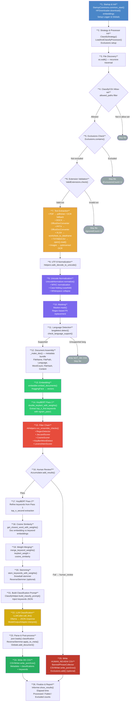

# DocClassify.py Pipeline Flow

```mermaid
flowchart TD
    A["**1. Startup & Init**\nStartupCommons.common_start()\nHFDownloader.download() embeddings\nSetup Logger & Globals"]
    B["**2. Strategy & Processor Init**\nClassifyStrategy()\nLoadAndClassifyProcessor()\nExclusions setup"]
    C["**3. File Discovery**\nos.walk() — recursive traversal"]
    D{"**4. ClassifyCSV Allow-set**\nallowed_paths filter"}
    E{"**5. Exclusions Check**\nExclusions.contains()"}
    F{"**6. Extension Validation**\nValidExtensions.check()"}
    G["**7. Text Extraction**\n• PDF → pdfminer / OCR fallback\n• DOCX → OfficeDocConverter\n• PPTX → OfficeDocConverter\n• XLSX → worksheet_to_dataframe\n• TXT/MD/CSV → open().read()\n• Images → pytesseract OCR"]
    H["**8. UTF-8 Normalization**\nHelpers.safe_decode_to_unicode()"]
    I["**9. Unicode Normalization**\nUnicodeNormalizer.normalize()\n• NFKC normalization\n• Case-folding (casefold)\n• Whitespace collapse"]
    J["**10. Masking**\nMasker.mask()\nRegex-based PII replacement"]
    K["**11. Language Detection**\nlangdetect.detect()\ncheck_language_support()"]
    L["**12. Document Assembly**\n_make_doc() — metadata bundle\nFileName, FilePath, Language,\nWordCount, FileHash, Content"]
    M["**13. Embedding**\nembedder.embed_documents()\nHuggingFace → vectors"]
    N["**14. KeyBERT Pass 1**\ndouble_keybert_with_weights()\nExtract top_n_first keywords\nwith ngram_pass1"]
    O["**15. Filter Chain**\nAIHelpers.run_ensemble_checks()\n• RegexDetector\n• JaccardScorer\n• CosineScorer\n• KeyBertWordDetect\n• LevenshteinScorer"]
    P{"**16. Human Review?**\nAccumulator.add_results()"}
    Q["**17. KeyBERT Pass 2**\nRefine keywords from Pass 1\ntop_n_second extraction"]
    R["**18. Cosine Similarity**\nget_closest_word_with_weights()\nDoc embedding vs keyword embeddings"]
    S["**19. Weight Merging**\nmerge_keyword_weights()\nkeybert_weight × cosine_similarity"]
    T["**20. Stemming**\nstem_keywords_with_weights()\nSnowball stemmer\nReverseStemmer (optional)"]
    U["**21. Build Classification Prompt**\nClassifyHelper.build_classify_prompt()\nInject keywords JSON"]
    V["**22. LLM Classification**\nLLMCaller.call_llm()\nOllama → JSON response\nModelOutputAdapter.interpret()"]
    W["**23. Parse & Post-process**\njson.loads() classification\nReverseStemmer.apply_to_meta()\nGlobals.add_document()"]
    X["**24. Write OK CSV**\nCSVWriter.write_json2csv()\nMetadata + classifications + keywords"]
    Y["**25. Write HUMAN_REVIEW CSV**\nBannedPhraseCollector\nCSVWriter.write_json2csv()\nExclusions.add() (optional)"]
    Z["**26. Finalize & Report**\nInformer.show_results()\nElapsed time\nProcessed / Failed / Excluded counts"]

    A --> B --> C --> D
    D -- "Not in allow-set" --> SKIP1(["Skip file"])
    D -- "Allowed" --> E
    E -- "Excluded" --> SKIP2(["Skip file\n(ExclusionsCount++)"])
    E -- "Not excluded" --> F
    F -- "Invalid ext" --> SKIP3(["Skip file\n(IgnoredCount++)"])
    F -- "Valid ext" --> G
    G --> H --> I --> J --> K
    K -- "Unsupported lang" --> SKIP4(["Write NOT_OK CSV\nSkip file"])
    K -- "Supported" --> L
    L --> M --> N --> O --> P
    P -- "Fail → human_review" --> Y
    P -- "Pass" --> Q --> R --> S --> T --> U --> V --> W --> X
    X --> Z
    Y --> Z

    style A fill:#4a86c8,color:#fff
    style G fill:#e8a838,color:#fff
    style I fill:#7b68ee,color:#fff
    style J fill:#7b68ee,color:#fff
    style N fill:#2ecc71,color:#fff
    style M fill:#2ecc71,color:#fff
    style O fill:#e74c3c,color:#fff
    style V fill:#d4ac0d,color:#fff
    style X fill:#27ae60,color:#fff
    style Y fill:#c0392b,color:#fff
    style SKIP1 fill:#95a5a6,color:#fff
    style SKIP2 fill:#95a5a6,color:#fff
    style SKIP3 fill:#95a5a6,color:#fff
    style SKIP4 fill:#95a5a6,color:#fff
```
