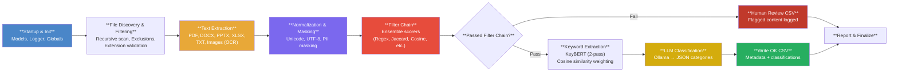

# DocClassify — Simplified Flow

```mermaid
flowchart LR
    A["**Startup & Init**\nModels, Logger, Globals"]
    B["**File Discovery & Filtering**\nRecursive scan, Exclusions,\nExtension validation"]
    C["**Text Extraction**\nPDF, DOCX, PPTX, XLSX,\nTXT, Images (OCR)"]
    D["**Normalization & Masking**\nUnicode, UTF-8, PII masking"]
    E["**Filter Chain**\nEnsemble scorers\n(Regex, Jaccard, Cosine, etc.)"]
    F{"**Passed Filter Chain?**"}
    G["**Keyword Extraction**\nKeyBERT (2-pass)\nCosine similarity weighting"]
    H["**LLM Classification**\nOllama → JSON categories"]
    I["**Write OK CSV**\nMetadata + classifications"]
    J["**Human Review CSV**\nFlagged content logged"]
    K["**Report & Finalize**"]

    A --> B --> C --> D --> E --> F
    F -- "Fail" --> J --> K
    F -- "Pass" --> G --> H --> I --> K

    style A fill:#4a86c8,color:#fff
    style C fill:#e8a838,color:#fff
    style D fill:#7b68ee,color:#fff
    style E fill:#e74c3c,color:#fff
    style H fill:#d4ac0d,color:#fff
    style I fill:#27ae60,color:#fff
    style J fill:#c0392b,color:#fff
```
