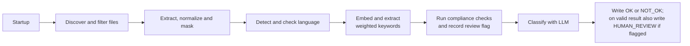

# DocClassify - Simplified Flow

```mermaid
flowchart LR
    A["Startup"] --> B["Discover and filter files"]
    B --> C["Extract, normalize and mask"]
    C --> D["Detect and check language"]
    D --> E["Embed and extract<br/>weighted keywords"]
    E --> F["Run compliance checks<br/>and record review flag"]
    F --> G["Classify with LLM"]
    G --> H["Write OK or NOT_OK;<br/>on valid result also write HUMAN_REVIEW if flagged"]
```
