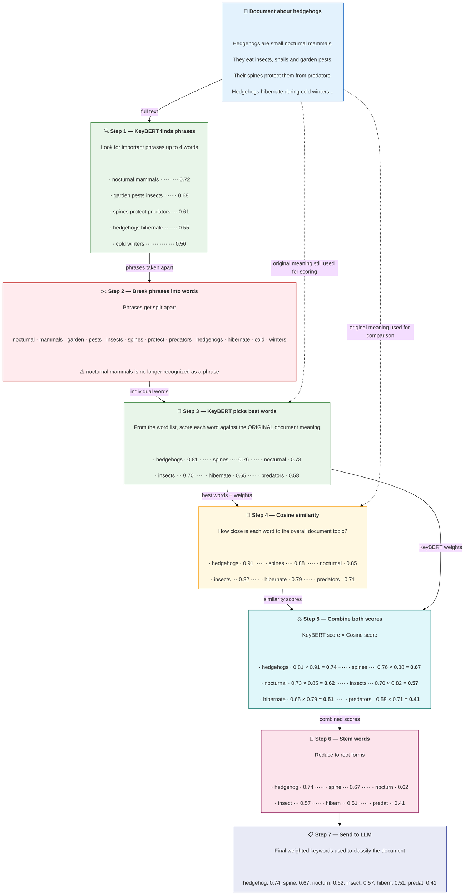

# KeyBERT Double-Pass & Cosine Similarity Pipeline

```mermaid
%%{init: {'theme': 'base', 'flowchart': {'useMaxWidth': false, 'htmlLabels': true, 'wrappingWidth': 9999, 'nodeSpacing': 30, 'rankSpacing': 40}} }%%
flowchart TD
DOC["🦔 <b>Document about hedgehogs</b>
<br/>
<br/>Hedgehogs are small nocturnal mammals.
<br/>They eat insects, snails and garden pests.
<br/>Their spines protect them from predators.
<br/>Hedgehogs hibernate during cold winters..."]

PASS1["🔍 <b>Step 1 — KeyBERT finds phrases</b>
<br/>Look for important phrases up to 4 words
<br/>
<br/>· nocturnal mammals ·········· 0.72
<br/>· garden pests insects ······· 0.68
<br/>· spines protect predators ··· 0.61
<br/>· hedgehogs hibernate ······· 0.55
<br/>· cold winters ················ 0.50"]

FLATTEN["✂️ <b>Step 2 — Break phrases into words</b>
<br/>Phrases get split apart
<br/>
<br/>nocturnal · mammals · garden · pests · insects · spines · protect · predators · hedgehogs · hibernate · cold · winters
<br/>
<br/>⚠️ nocturnal mammals is no longer recognized as a phrase"]

PASS2["🎯 <b>Step 3 — KeyBERT picks best words</b>
<br/>From the word list, score each word against the ORIGINAL document meaning
<br/>
<br/>· hedgehogs · 0.81 ····· · spines ···· 0.76 ····· · nocturnal · 0.73
<br/>· insects ··· 0.70 ····· · hibernate · 0.65 ····· · predators · 0.58"]

COSINE["📐 <b>Step 4 — Cosine similarity</b>
<br/>How close is each word to the overall document topic?
<br/>
<br/>· hedgehogs · 0.91 ····· · spines ···· 0.88 ····· · nocturnal · 0.85
<br/>· insects ··· 0.82 ····· · hibernate · 0.79 ····· · predators · 0.71"]

MERGE["⚖️ <b>Step 5 — Combine both scores</b>
<br/>KeyBERT score × Cosine score
<br/>
<br/>· hedgehogs · 0.81 × 0.91 = <b>0.74</b> ····· · spines ···· 0.76 × 0.88 = <b>0.67</b>
<br/>· nocturnal · 0.73 × 0.85 = <b>0.62</b> ····· · insects ··· 0.70 × 0.82 = <b>0.57</b>
<br/>· hibernate · 0.65 × 0.79 = <b>0.51</b> ····· · predators · 0.58 × 0.71 = <b>0.41</b>"]

STEM["🌿 <b>Step 6 — Stem words</b>
<br/>Reduce to root forms
<br/>
<br/>· hedgehog · 0.74 ····· · spine ··· 0.67 ····· · nocturn · 0.62
<br/>· insect ··· 0.57 ····· · hibern ·· 0.51 ····· · predat ·· 0.41"]

FINAL["📋 <b>Step 7 — Send to LLM</b>
<br/>Final weighted keywords used to classify the document
<br/>
<br/>hedgehog: 0.74, spine: 0.67, nocturn: 0.62, insect: 0.57, hibern: 0.51, predat: 0.41"]

DOC -->|"full text"| PASS1
PASS1 -->|"phrases taken apart"| FLATTEN
FLATTEN -->|"individual words"| PASS2
DOC -.->|"original meaning still used for scoring"| PASS2
PASS2 -->|"best words + weights"| COSINE
DOC -.->|"original meaning used for comparison"| COSINE
COSINE -->|"similarity scores"| MERGE
PASS2 -->|"KeyBERT weights"| MERGE
MERGE -->|"combined scores"| STEM
STEM --> FINAL

    style DOC fill:#e3f2fd,stroke:#1565c0,color:#333
    style PASS1 fill:#e8f5e9,stroke:#2e7d32,color:#333
    style FLATTEN fill:#ffebee,stroke:#c62828,color:#333
    style PASS2 fill:#e8f5e9,stroke:#2e7d32,color:#333
    style COSINE fill:#fff8e1,stroke:#f9a825,color:#333
    style MERGE fill:#e0f7fa,stroke:#00695c,color:#333
    style STEM fill:#fce4ec,stroke:#880e4f,color:#333
    style FINAL fill:#e8eaf6,stroke:#283593,color:#333
```
