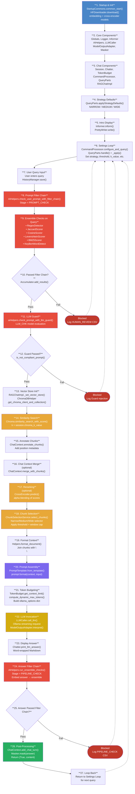

# RAGChat.py Pipeline Flow

```mermaid
flowchart TD
    A["**1. Startup & Init**\nStartupCommons.common_start()\nHFDownloader.download()\nembedding + cross-encoder models"]
    B["**2. Core Components**\nGlobals, Logger, Informer\nAIHelpers, LLMCaller\nModelOutputAdapter, Masker"]
    C["**3. Chat Components**\nSession, Chatter, TokenBudget\nCommandProcessor, QueryParts\nRAGChatImpl"]
    D["**4. Strategy Defaults**\nQueryParts.applyStrategyDefaults()\nNARROW / MEDIUM / WIDE"]
    E["**5. Intro Display**\nInformer.inform()\nPrettyWriter.write()"]

    F["**6. Settings Loop**\nCommandProcessor.configure_and_query()\nQueryParts.handle() + _apply()\nSet strategy, threshold, k_value, etc."]
    G["**7. User Query Input**\nUser enters query\nHistoryManager.save()"]

    H["**8. Prompt Filter Chain**\nAIHelpers.check_user_prompt_with_filter_chain()\nStage = PROMPT_CHECK"]
    I["**9. Ensemble Checks on Query**\n• RegexDetector\n• JaccardScorer\n• CosineScorer\n• LevenshteinScorer\n• BM25Scorer\n• KeyBertWordDetect"]
    J{"**10. Passed Filter Chain?**\nAccumulator.add_results()"}
    K["**11. LLM Guard**\naiHelpers.check_prompt_with_llm_guard()\nLLM_CHK model evaluation"]
    L{"**12. Guard Passed?**\nis_not_compliant_prompt()"}

    M["**13. Vector Store Init**\nRAGChatImpl._set_vector_store()\nChromaDBHelper\n.get_chroma_client_and_collection()"]
    N["**14. Similarity Search**\nChroma.similarity_search_with_score()\nk = session.chroma_k_value"]
    O["**15. Annotate Chunks**\nChatContext.annotate_chunks()\nAdd position metadata"]
    P["**16. Chat Context Merge**\n(optional)\nChatContext.merge_with_chunks()"]
    Q["**17. Reranking**\n(optional)\nCrossEncoder.predict()\nalpha blending of scores"]
    R["**18. Chunk Selection**\nChunkSelectionService.select_chunks()\nNarrow/Medium/Wide selector\nApply threshold + window cap"]
    S["**19. Format Context**\nHelpers.format_document()\nJoin chunks with \\n\\n"]

    T["**20. Prompt Assembly**\nPromptTemplate.from_template()\nprompt.format(context, input)"]
    U["**21. Token Budgeting**\nTokenBudget.get_context_limit()\ncompute_dynamic_max_tokens()\nBuild ollama_options dict"]
    V["**22. LLM Invocation**\nLLMCaller.call_llm()\nOllama streaming request\nModelOutputAdapter.interpret()"]
    W["**23. Display Answer**\nChatter.print_llm_answer()\nWord-wrapped Markdown"]

    X["**24. Answer Filter Chain**\nAIHelpers.run_ensemble_checks()\nStage = PIPELINE_CHECK\nEmbed answer → ensemble"]
    Y{"**25. Answer Passed Filter Chain?**"}

    Z["**26. Post-Processing**\nChatContext.add_chat_turn()\nMasker.mask(answer)\nReturn (True, content)"]
    AA["**27. Loop Back**\nReturn to Settings Loop\nfor next query"]

    BLOCK1(["Blocked\nLog HUMAN_REVIEW CSV"])
    BLOCK2(["Blocked\nLog Guard rejection"])
    BLOCK3(["Blocked\nLog PIPELINE_CHECK CSV"])

    A --> B --> C --> D --> E --> F --> G
    G --> H --> I --> J
    J -- "Fail" --> BLOCK1
    J -- "Pass" --> K --> L
    L -- "Fail" --> BLOCK2
    L -- "Pass" --> M --> N --> O --> P --> Q --> R --> S
    S --> T --> U --> V --> W --> X --> Y
    Y -- "Fail" --> BLOCK3
    Y -- "Pass" --> Z --> AA
    AA -.-> F
    BLOCK1 -.-> F
    BLOCK2 -.-> F
    BLOCK3 -.-> F

    style A fill:#4a86c8,color:#fff
    style H fill:#e74c3c,color:#fff
    style I fill:#e74c3c,color:#fff
    style K fill:#e74c3c,color:#fff
    style N fill:#e8a838,color:#fff
    style Q fill:#e8a838,color:#fff
    style R fill:#e8a838,color:#fff
    style T fill:#7b68ee,color:#fff
    style V fill:#d4ac0d,color:#fff
    style X fill:#e74c3c,color:#fff
    style Z fill:#27ae60,color:#fff
    style BLOCK1 fill:#c0392b,color:#fff
    style BLOCK2 fill:#c0392b,color:#fff
    style BLOCK3 fill:#c0392b,color:#fff
```
