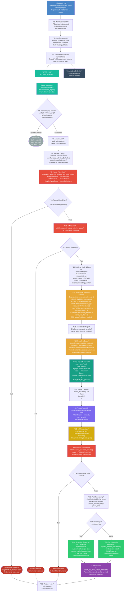

# RAGChatService.py Pipeline Flow

```mermaid
flowchart TD
    A["**1. Startup & Init**\nStartupCommons.common_start()\nFastAPI(lifespan)\nRegister auth middleware & routes"]
    B["**2. Model Downloads**\nHFDownloader.download()\nEmbedding + cross-encoder models"]
    C["**3. Core Components**\nGlobals, Logger, Informer\nQueryParts, AIHelpers\nRAGChatImpl, Chatter"]
    D["**4. Concurrency Setup**\nasyncio.Lock()\nThreadPoolExecutor(max_workers)\nuvicorn.run(host, port)"]

    E["**HTTP POST /v1/chat/completions**"]
    F["**5. Auth Middleware**\n_verifyBearerToken()\nhmac.compare_digest()\nBearer token validation"]

    G{"**6. Housekeeping Check**\n_isFollowUpRequest()?\n_isTagsRequest()?\n_isTitleRequest()?"}
    H(["Return fast:\n{follow_ups: []}\n{tags: [General]}\n{title: RAG Chat}"])

    I["**7. Acquire Lock**\nawait lock.acquire()\nCreate fresh Session()"]
    J["**8. Session Config**\nCollection from req.model\nqueryParts.applyStrategyDefaults()\n_applyRequestToSession()\n_buildQuery() from messages"]

    K["**9. Prompt Filter Chain**\nAIHelpers.check_user_prompt_with_filter_chain()\n• RegexDetector  • JaccardScorer\n• BM25Scorer     • CosineScorer\n• KeyBertWordDetect • LevenshteinScorer"]
    L{"**10. Passed Filter Chain?**\nAccumulator.add_results()"}

    M["**11. LLM Guard**\naiHelpers.check_prompt_with_llm_guard()\nLLM_CHK model evaluation"]
    N{"**12. Guard Passed?**"}

    O["**13. Retrieval Mode & Store Init**\nChromaDBHelper · BM25Retriever · GraphRetriever\nsearch_mode: VECTOR / BM25 / GRAPH / ALL\nChroma(embedding_function)"]
    P["**14. Multi-Store Retrieval**\n• Vector: Chroma.similarity_search_with_score()\n• BM25: BM25Retriever.query()\n• Graph: GraphRetriever.query()\n• Web: WebRetriever.query() (if web_search!='local_only')\n  + WebPreFilter.bm25_prefilter() (if bm25_pre_filter &gt; 0)\n  + WebPreFilter.cosine_prefilter() (if cosine_pre_filter &gt; 0)\nRRF fusion (multi-store modes)"]
    Q["**15. Annotate & Merge**\nChatContext.annotate_chunks()\nmerge_with_chunks() (optional)"]
    R["**16. Rerank & Select**\nCrossEncoder reranking (optional)\nmin-max + web_weight scaling\nweb docs scored on metadata[snippet]\nChunkSelectionService.select_chunks()\nThreshold + strategy window"]
    MMARK["**16a. Visual Marking** *(mark_text=True)*\n_mark_sources()\nHighlight chunks in source docs — in memory\nStores session.marked_documents\n+ chunk_texts_for_grounding"]
    S["**17. Format Context**\nformat_document() per chunk\nJoin with \\n\\n"]

    T["**18. Prompt Assembly**\nPromptTemplate.format(context, input)\nTokenBudget → num_ctx, num_predict\nBuild ollama_options"]
    U["**19. LLM Invocation**\nLLMCaller.call_llm()\nOllama streaming/non-streaming\nModelOutputAdapter.interpret()"]

    V["**20. Answer Filter Chain**\nAIHelpers.run_ensemble_checks()\nStage = PIPELINE_CHECK\nEmbed answer → ensemble"]
    W{"**21. Answer Passed Filter Chain?**"}

    X["**22. Post-Processing**\nChatContext.add_chat_turn()\nMasker.mask(answer)\nground_answer_md() *(mark_text)*"]

    Y{"**23. Streaming?**\nreq.stream flag"}
    Z["**24a. Streaming Response**\nSSE chunks via asyncio.Queue\non_chunk callback per token\nregister_marked_documents() → link SSE chunk\nOpenAI streaming format"]
    AA["**24b. Non-Streaming Response**\nregister_marked_documents() → link block appended\nJSONResponse\nOpenAI ChatCompletion format"]

    BB["**25. Algo Results**\n(if SHOW_CLI_LIKE_ALGO_RESULTS)\nAccumulator.format_results_as_md()\nAppend to response"]
    CC["**26. Release Lock**\nlock.release()\nReturn response"]

    BLOCK1(["Filter Chain Rejection\nLog HUMAN_REVIEW CSV\nReturn error response"])
    BLOCK2(["Guard Rejection\nReturn error response"])
    BLOCK3(["Answer Blocked\nReturn Filter Chain error"])

    DD["**/v1/models Endpoint**\nReturns available\ncollection names"]

    A --> B --> C --> D
    D --> E
    E --> F --> G
    G -- "Synthetic prompt" --> H
    G -- "Real query" --> I --> J
    J --> K --> L
    L -- "Fail" --> BLOCK1
    L -- "Pass" --> M --> N
    N -- "Fail" --> BLOCK2
    N -- "Pass" --> O --> P --> Q --> R --> MMARK --> S
    S --> T --> U --> V --> W
    W -- "Fail" --> BLOCK3
    W -- "Pass" --> X --> Y
    Y -- "True" --> Z --> BB
    Y -- "False" --> AA --> BB
    BB --> CC
    BLOCK1 --> CC
    BLOCK2 --> CC
    BLOCK3 --> CC

    D -.-> DD

    style A fill:#4a86c8,color:#fff
    style E fill:#1abc9c,color:#fff
    style F fill:#1abc9c,color:#fff
    style K fill:#e74c3c,color:#fff
    style M fill:#e74c3c,color:#fff
    style P fill:#e8a838,color:#fff
    style R fill:#e8a838,color:#fff
    style T fill:#7b68ee,color:#fff
    style U fill:#d4ac0d,color:#fff
    style V fill:#e74c3c,color:#fff
    style Z fill:#2ecc71,color:#fff
    style AA fill:#2ecc71,color:#fff
    style BB fill:#8e44ad,color:#fff
    style H fill:#95a5a6,color:#fff
    style BLOCK1 fill:#c0392b,color:#fff
    style BLOCK2 fill:#c0392b,color:#fff
    style BLOCK3 fill:#c0392b,color:#fff
    style DD fill:#34495e,color:#fff
    style MMARK fill:#16a085,color:#fff
```
