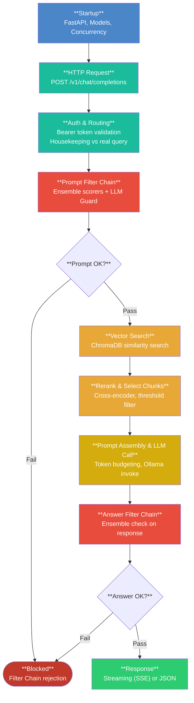

# RAGChatService — Simplified Flow

```mermaid
flowchart TD
    A["**Startup**\nFastAPI, Models, Concurrency"]
    B["**HTTP Request**\nPOST /v1/chat/completions"]
    C["**Auth & Routing**\nBearer token validation\nHousekeeping vs real query"]
    D["**Prompt Filter Chain**\nEnsemble scorers + LLM Guard"]
    E{"**Prompt OK?**"}
    F["**Vector Search**\nChromaDB similarity search"]
    G["**Rerank & Select Chunks**\nCross-encoder, threshold filter"]
    H["**Prompt Assembly & LLM Call**\nToken budgeting, Ollama invoke"]
    I["**Answer Filter Chain**\nEnsemble check on response"]
    J{"**Answer OK?**"}
    K["**Response**\nStreaming (SSE) or JSON"]
    BLOCK(["**Blocked**\nFilter Chain rejection"])

    A --> B --> C --> D --> E
    E -- "Fail" --> BLOCK
    E -- "Pass" --> F --> G --> H --> I --> J
    J -- "Fail" --> BLOCK
    J -- "Pass" --> K

    style A fill:#4a86c8,color:#fff
    style B fill:#1abc9c,color:#fff
    style C fill:#1abc9c,color:#fff
    style D fill:#e74c3c,color:#fff
    style F fill:#e8a838,color:#fff
    style G fill:#e8a838,color:#fff
    style H fill:#d4ac0d,color:#fff
    style I fill:#e74c3c,color:#fff
    style K fill:#2ecc71,color:#fff
    style BLOCK fill:#c0392b,color:#fff
```
y