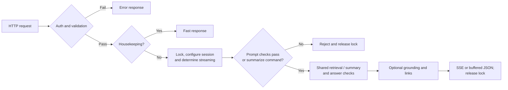

# RAGChatService - Simplified Flow

```mermaid
flowchart LR
    A["HTTP request"] --> B{"Auth and validation"}
    B -- Fail --> X["Error response"]
    B -- Pass --> C{"Housekeeping?"}
    C -- Yes --> Y["Fast response"]
    C -- No --> D["Lock, configure session<br/>and determine streaming"]
    D --> E{"Prompt checks pass<br/>or summarize command?"}
    E -- No --> Z["Reject and release lock"]
    E -- Yes --> F["Shared retrieval / summary<br/>and answer checks"]
    F --> G["Optional grounding and links"]
    G --> H["SSE or buffered JSON;<br/>release lock"]
```

Streaming may send tokens before answer checks finish; `mark_text` requests
use a buffered reply.
