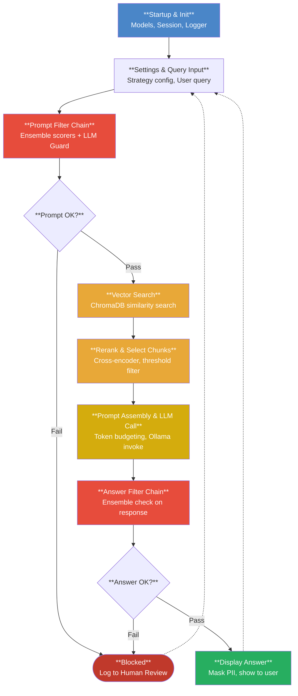

# RAGChat — Simplified Flow

```mermaid
flowchart TD
    A["**Startup & Init**\nModels, Session, Logger"]
    B["**Settings & Query Input**\nStrategy config, User query"]
    C["**Prompt Filter Chain**\nEnsemble scorers + LLM Guard"]
    D{"**Prompt OK?**"}
    E["**Vector Search**\nChromaDB similarity search"]
    F["**Rerank & Select Chunks**\nCross-encoder, threshold filter"]
    G["**Prompt Assembly & LLM Call**\nToken budgeting, Ollama invoke"]
    H["**Answer Filter Chain**\nEnsemble check on response"]
    I{"**Answer OK?**"}
    J["**Display Answer**\nMask PII, show to user"]
    BLOCK(["**Blocked**\nLog to Human Review"])

    A --> B --> C --> D
    D -- "Fail" --> BLOCK
    D -- "Pass" --> E --> F --> G --> H --> I
    I -- "Fail" --> BLOCK
    I -- "Pass" --> J
    J -.-> B
    BLOCK -.-> B

    style A fill:#4a86c8,color:#fff
    style C fill:#e74c3c,color:#fff
    style E fill:#e8a838,color:#fff
    style F fill:#e8a838,color:#fff
    style G fill:#d4ac0d,color:#fff
    style H fill:#e74c3c,color:#fff
    style J fill:#27ae60,color:#fff
    style BLOCK fill:#c0392b,color:#fff
```
