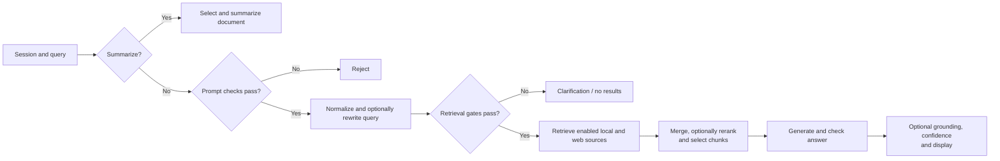

# RAGChat - Simplified Flow

```mermaid
flowchart LR
    A["Session and query"] --> B{"Summarize?"}
    B -- Yes --> S["Select and summarize document"]
    B -- No --> C{"Prompt checks pass?"}
    C -- No --> X["Reject"]
    C -- Yes --> D["Normalize and optionally rewrite query"]
    D --> E{"Retrieval gates pass?"}
    E -- No --> Y["Clarification / no results"]
    E -- Yes --> F["Retrieve enabled local and web sources"]
    F --> G["Merge, optionally rerank<br/>and select chunks"]
    G --> H["Generate and check answer"]
    H --> I["Optional grounding, confidence<br/>and display"]
```
