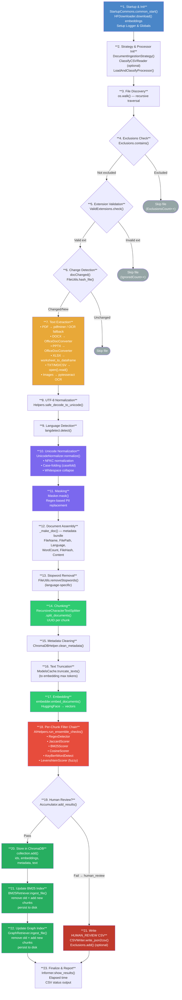

# RAGLoad.py Pipeline Flow

```mermaid
flowchart TD
    A["**1. Startup & Init**\nStartupCommons.common_start()\nHFDownloader.download() embeddings\nSetup Logger & Globals"]
    B["**2. Strategy & Processor Init**\nDocumentIngestionStrategy()\nClassifyCSVReader (optional)\nLoadAndClassifyProcessor()"]
    C["**3. File Discovery**\nos.walk() — recursive traversal"]
    D{"**4. Exclusions Check**\nExclusions.contains()"}
    E{"**5. Extension Validation**\nValidExtensions.check()"}
    F{"**6. Change Detection**\ndocChanged()\nFileUtils.hash_file()"}
    G["**7. Text Extraction**\n• PDF → pdfminer / OCR fallback\n• DOCX → OfficeDocConverter\n• PPTX → OfficeDocConverter\n• XLSX → worksheet_to_dataframe\n• TXT/MD/CSV → open().read()\n• Images → pytesseract OCR"]
    H["**8. UTF-8 Normalization**\nHelpers.safe_decode_to_unicode()"]
    I["**9. Language Detection**\nlangdetect.detect()"]
    J["**10. Unicode Normalization**\nUnicodeNormalizer.normalize()\n• NFKC normalization\n• Case-folding (casefold)\n• Whitespace collapse"]
    K["**11. Masking**\nMasker.mask()\nRegex-based PII replacement"]
    L["**12. Document Assembly**\n_make_doc() — metadata bundle\nFileName, FilePath, Language,\nWordCount, FileHash, Content"]
    M["**13. Stopword Removal**\nFileUtils.removeStopwords()\n(language-specific)"]
    N["**14. Chunking**\nRecursiveCharacterTextSplitter\n.split_documents()\nUUID per chunk"]
    O["**15. Metadata Cleaning**\nChromaDBHelper.clean_metadata()"]
    P["**16. Text Truncation**\nModelsCache.truncate_texts()\n(to embedding max tokens)"]
    Q["**17. Embedding**\nembedder.embed_documents()\nHuggingFace → vectors"]
    R["**18. Per-Chunk Filter Chain**\nAIHelpers.run_ensemble_checks()\n• RegexDetector\n• JaccardScorer\n• BM25Scorer\n• CosineScorer\n• KeyBertWordDetect\n• LevenshteinScorer (fuzzy)"]
    S{"**19. Human Review?**\nAccumulator.add_results()"}
    T["**20. Store in ChromaDB**\ncollection.add()\nids, embeddings, metadata, text"]
    U["**21. Write HUMAN_REVIEW CSV**\nCSVWriter.write_json2csv()\nExclusions.add() (optional)"]
    T2["**21. Update BM25 Index**\nBM25Retriever.ingest_file()\nremove old + add new chunks\npersist to disk"]
    T3["**22. Update Graph Index**\nGraphRetriever.ingest_file()\nremove old + add new chunks\npersist to disk"]
    V["**23. Finalize & Report**\nInformer.show_results()\nElapsed time\nCSV status output"]

    A --> B --> C --> D
    D -- "Excluded" --> SKIP1(["Skip file\n(ExclusionsCount++)"])
    D -- "Not excluded" --> E
    E -- "Invalid ext" --> SKIP2(["Skip file\n(IgnoredCount++)"])
    E -- "Valid ext" --> F
    F -- "Unchanged" --> SKIP3(["Skip file"])
    F -- "Changed/New" --> G
    G --> H --> I --> J --> K --> L
    L --> M --> N --> O --> P --> Q --> R --> S
    S -- "Pass" --> T
    S -- "Fail → human_review" --> U
    T --> T2 --> T3 --> V
    U --> V

    style A fill:#4a86c8,color:#fff
    style G fill:#e8a838,color:#fff
    style J fill:#7b68ee,color:#fff
    style K fill:#7b68ee,color:#fff
    style N fill:#2ecc71,color:#fff
    style Q fill:#2ecc71,color:#fff
    style R fill:#e74c3c,color:#fff
    style T fill:#27ae60,color:#fff
    style T2 fill:#27ae60,color:#fff
    style T3 fill:#27ae60,color:#fff
    style U fill:#c0392b,color:#fff
    style SKIP1 fill:#95a5a6,color:#fff
    style SKIP2 fill:#95a5a6,color:#fff
    style SKIP3 fill:#95a5a6,color:#fff
```
