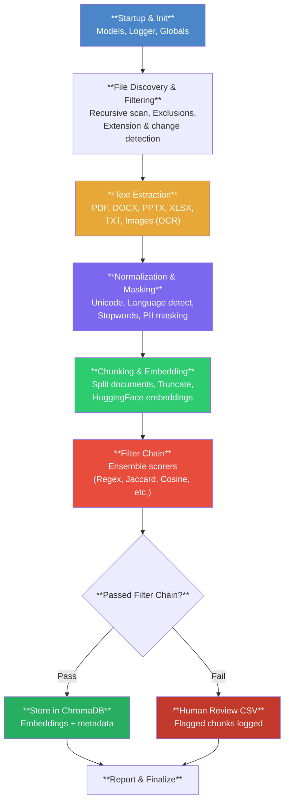

# RAGLoad — Simplified Flow

```mermaid
flowchart TD
    A["**Startup & Init**\nModels, Logger, Globals"]
    B["**File Discovery & Filtering**\nRecursive scan, Exclusions,\nExtension & change detection"]
    C["**Text Extraction**\nPDF, DOCX, PPTX, XLSX,\nTXT, Images (OCR)"]
    D["**Normalization & Masking**\nUnicode, Language detect,\nStopwords, PII masking"]
    E["**Chunking & Embedding**\nSplit documents, Truncate,\nHuggingFace embeddings"]
    F["**Filter Chain**\nEnsemble scorers\n(Regex, Jaccard, Cosine, etc.)"]
    G{"**Passed Filter Chain?**"}
    H["**Store in ChromaDB**\nEmbeddings + metadata"]
    I["**Human Review CSV**\nFlagged chunks logged"]
    J["**Report & Finalize**"]

    A --> B --> C --> D --> E --> F --> G
    G -- "Pass" --> H --> J
    G -- "Fail" --> I --> J

    style A fill:#4a86c8,color:#fff
    style C fill:#e8a838,color:#fff
    style D fill:#7b68ee,color:#fff
    style E fill:#2ecc71,color:#fff
    style F fill:#e74c3c,color:#fff
    style H fill:#27ae60,color:#fff
    style I fill:#c0392b,color:#fff
```
