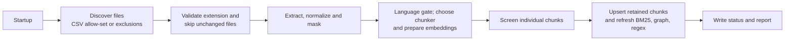

# RAGLoad - Simplified Flow

```mermaid
flowchart LR
    A["Startup"] --> B["Discover files<br/>CSV allow-set or exclusions"]
    B --> C["Validate extension and<br/>skip unchanged files"]
    C --> D["Extract, normalize and mask"]
    D --> E["Language gate; choose chunker<br/>and prepare embeddings"]
    E --> F["Screen individual chunks"]
    F --> G["Upsert retained chunks<br/>and refresh BM25, graph, regex"]
    G --> H["Write status and report"]
```
