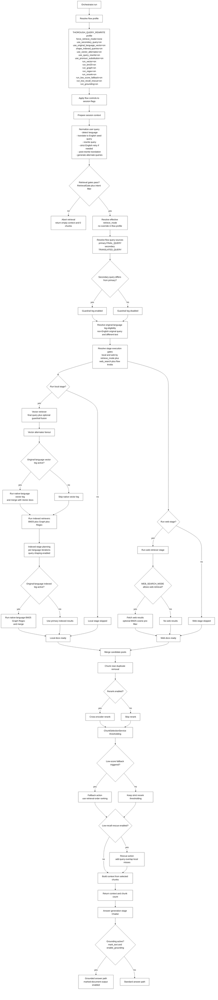

# THOROUGH_QUERY_REWRITE Orchestration Flow

```mermaid
%%{init: {'theme':'base','themeVariables':{'background':'#f5efe3','mainBkg':'#f5efe3','primaryColor':'#ffffff','secondaryColor':'#ffffff','tertiaryColor':'#ffffff','primaryTextColor':'#111111','lineColor':'#333333'}}}%%
flowchart TD
    A["Orchestrator.run"] --> B["Resolve flow profile"]
    B --> Cfg["THOROUGH_QUERY_REWRITE profile<br/>force_retrieve_mode=none<br/>use_secondary_query=on<br/>use_original_language_vector=on<br/>shape_indexed_queries=on<br/>use_vector_alternates=on<br/>use_query_rewrite=on<br/>use_pronoun_substitution=on<br/>run_vector=on<br/>run_bm25=on<br/>run_graph=on<br/>run_regex=on<br/>run_rerank=on<br/>run_low_score_fallback=on<br/>run_low_recall_rescue=on<br/>run_grounding=on"]

    Cfg --> C["Apply flow controls to session flags"]
    C --> D["Prepare session context"]

    D --> E["Normalize user query<br/>- detect language<br/>- translate to English seed query<br/>- rewrite query<br/>- strict English retry if needed<br/>- post-rewrite translation<br/>- generate alternate queries"]

    E --> F{"Retrieval gates pass?<br/>RetrievalGate plus intent filter"}
    F -- no --> Abort["Abort retrieval<br/>return empty context and 0 chunks"]
    F -- yes --> G["Resolve effective retrieve_mode<br/>no override in flow profile"]

    G --> H["Resolve flow query sources<br/>primary FINAL_QUERY<br/>secondary TRANSLATED_QUERY"]
    H --> I{"Secondary query differs from primary?"}
    I -- yes --> I1["Guardrail leg enabled"]
    I -- no --> I2["Guardrail leg disabled"]

    I1 --> J["Resolve original-language leg eligibility<br/>non-English original query and different text"]
    I2 --> J

    J --> K["Resolve stage execution gates<br/>local and web by retrieve_mode plus web_search plus flow knobs"]

    K --> L{"Run local stage?"}
    K --> M{"Run web stage?"}

    L -- yes --> L1["Vector retriever<br/>final query plus optional guardrail fusion"]
    L1 --> L2["Vector alternates fanout"]
    L2 --> L3{"Original-language vector leg active?"}
    L3 -- yes --> L4["Run native-language vector leg<br/>and merge with Vector docs"]
    L3 -- no --> L5["Skip native vector leg"]

    L4 --> L6["Run indexed retrievers<br/>BM25 plus Graph plus Regex"]
    L5 --> L6

    L6 --> L7["Indexed stage planning<br/>per-language iterations<br/>query shaping enabled"]
    L7 --> L8{"Original-language indexed leg active?"}
    L8 -- yes --> L9["Run native-language BM25 Graph Regex<br/>and merge"]
    L8 -- no --> L10["Use primary indexed results"]

    L9 --> LocalOut["Local docs ready"]
    L10 --> LocalOut
    L -- no --> LocalSkip["Local stage skipped"]
    LocalSkip --> LocalOut

    M -- yes --> W1["Run web retriever stage"]
    W1 --> W2{"WEB_SEARCH_MODE allows web retrieval?"}
    W2 -- yes --> W3["Fetch web results<br/>optional BM25 cosine pre-filter"]
    W2 -- no --> W4["No web results"]
    W3 --> WebOut["Web docs ready"]
    W4 --> WebOut
    M -- no --> WebSkip["Web stage skipped"]
    WebSkip --> WebOut

    LocalOut --> N["Merge candidate pools"]
    WebOut --> N

    N --> N1["Chunk near-duplicate removal"]
    N1 --> N2{"Rerank enabled?"}
    N2 -- yes --> N3["Cross-encoder rerank"]
    N2 -- no --> N4["Skip rerank"]

    N3 --> N5["ChunkSelectionService thresholding"]
    N4 --> N5

    N5 --> N6{"Low-score fallback triggered?"}
    N6 -- yes --> N7["Fallback action<br/>use retrieval-order ranking"]
    N6 -- no --> N8["Keep strict rerank thresholding"]

    N7 --> N9{"Low-recall rescue enabled?"}
    N8 --> N9
    N9 -- yes --> N10["Rescue action<br/>add query-overlap local misses"]
    N9 -- no --> O["Build context from selected chunks"]
    N10 --> O

    O --> P["Return context and chunk count"]

    P --> Q["Answer generation stage Chatter"]
    Q --> R{"Grounding active?<br/>mark_text and enable_grounding"}
    R -- yes --> S["Grounded answer path<br/>marked-document output enabled"]
    R -- no --> T["Standard answer path"]

    classDef default fill:#ffffff,stroke:#333333,color:#111111
```
