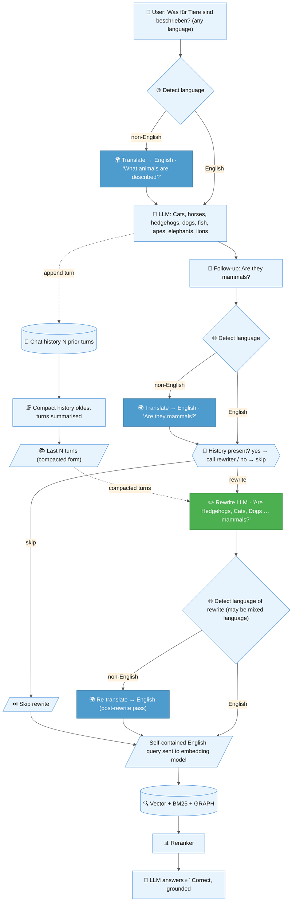

```mermaid
---
config:
  theme: base
  themeVariables:
    primaryColor: "#e8f4fd"
    primaryTextColor: "#1a1a1a"
    primaryBorderColor: "#4a90d9"
    lineColor: "#555555"
    secondaryColor: "#fff3e0"
    tertiaryColor: "#fce4ec"
  flowchart:
    padding: 15
---
flowchart TB
    B1["👤 User: Was für Tiere sind beschrieben? (any language)"]
    T1{"🌐 Detect language"}
    T2["🌍 Translate → English · 'What animals are described?'"]
    B2["🤖 LLM: Cats, horses, hedgehogs, dogs, fish, apes, elephants, lions"]
    B3["👤 Follow-up: Are they mammals?"]
    T3{"🌐 Detect language"}
    T4["🌍 Translate → English · 'Are they mammals?'"]
    H1[("💬 Chat history N prior turns")]
    HC["🗜️ Compact history oldest turns summarised"]
    HN[/"📚 Last N turns (compacted form)"/]
    G1{{"🚦 History present? yes → call rewriter / no → skip"}}
    SK[/"⏭️ Skip rewrite"/]
    B4["✏️ Rewrite LLM · 'Are Hedgehogs, Cats, Dogs … mammals?'"]
    T5{"🌐 Detect language of rewrite (may be mixed-language)"}
    T6["🌍 Re-translate → English (post-rewrite pass)"]
    B5[/"Self-contained English query sent to embedding model"/]
    B6[("🔍 Vector + BM25 + GRAPH")]
    B7["📊 Reranker"]
    B8["🤖 LLM answers ✅ Correct, grounded"]

    B1 --> T1
    T1 -- "non-English" --> T2 --> B2
    T1 -- "English" --> B2
    B2 --> B3 --> T3
    B2 -.->|"append turn"| H1
    H1 --> HC --> HN
    T3 -- "non-English" --> T4 --> G1
    T3 -- "English" --> G1
    HN -.->|"compacted turns"| B4
    G1 -- "rewrite" --> B4
    G1 -- "skip" --> SK
    B4 --> T5
    SK --> B5
    T5 -- "non-English" --> T6 --> B5
    T5 -- "English" --> B5
    B5 --> B6 --> B7 --> B8

    classDef blue fill:#4E9BCD,stroke:#2C6F9C,color:#fff
    classDef green fill:#4CAF50,stroke:#388E3C,color:#fff
    class T2,T4,T6 blue
    class B4 green
```
