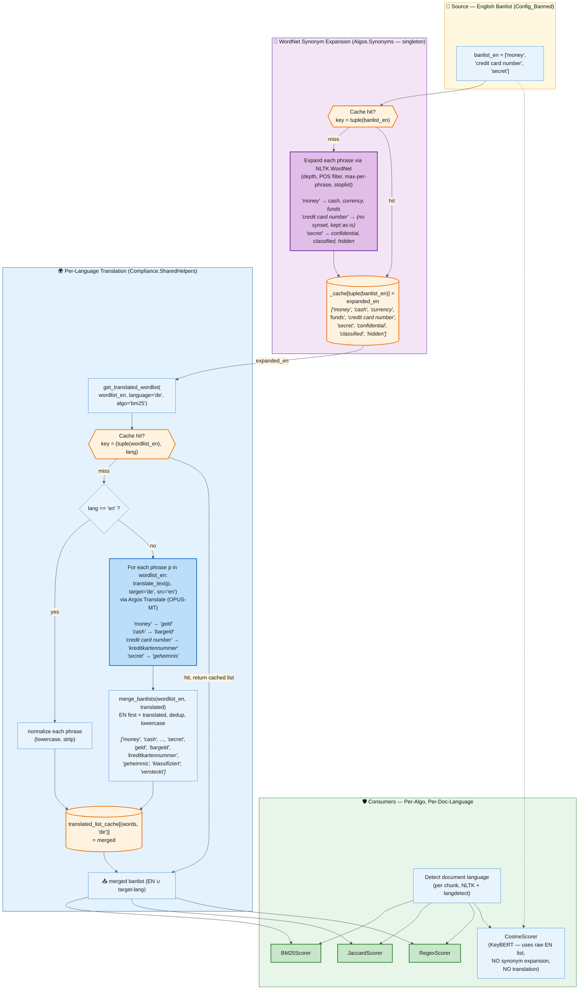

```mermaid
---
config:
  theme: base
  themeVariables:
    primaryColor: "#e8f4fd"
    primaryTextColor: "#1a1a1a"
    primaryBorderColor: "#4a90d9"
    lineColor: "#555555"
    secondaryColor: "#fff3e0"
    tertiaryColor: "#fce4ec"
  flowchart:
    padding: 15
---
flowchart TB
    classDef spacer fill:transparent,stroke:transparent,color:transparent;
    classDef cache fill:#fff3e0,stroke:#ef6c00,stroke-width:2px;
    classDef trans fill:#bbdefb,stroke:#1565c0,stroke-width:2px;
    classDef wn fill:#e1bee7,stroke:#6a1b9a,stroke-width:2px;
    classDef scorer fill:#c8e6c9,stroke:#2e7d32,stroke-width:2px;

    subgraph SRC["📜 Source — English Banlist (Config_Banned)"]
        S0[" "]:::spacer
        S1["banlist_en = ['money',<br/>'credit card number', 'secret']"]
        S0 ~~~ S1
    end

    subgraph WN["🧠 WordNet Synonym Expansion (Algos.Synonyms — singleton)"]
        direction TB
        W0[" "]:::spacer
        W1{{"Cache hit?<br/>key = tuple(banlist_en)"}}:::cache
        W2["Expand each phrase via NLTK WordNet<br/>(depth, POS filter, max-per-phrase, stoplist)<br/><br/><i>'money' → cash, currency, funds</i><br/><i>'credit card number' → (no synset, kept as-is)</i><br/><i>'secret' → confidential, classified, hidden</i>"]:::wn
        W3[("_cache[tuple(banlist_en)] = expanded_en<br/><i>['money', 'cash', 'currency',<br/>'funds', 'credit card number',<br/>'secret', 'confidential', 'classified', 'hidden']</i>")]:::cache
        W0 ~~~ W1
        W1 -- "miss" --> W2 --> W3
        W1 -- "hit" --> W3
    end

    subgraph TR["🌍 Per-Language Translation (Compliance.SharedHelpers)"]
        direction TB
        R0[" "]:::spacer
        R1["get_translated_wordlist(<br/>wordlist_en, language='de', algo='bm25')"]
        R2{{"Cache hit?<br/>key = (tuple(wordlist_en), lang)"}}:::cache
        R3{"lang == 'en' ?"}
        R4["normalize each phrase<br/>(lowercase, strip)"]
        R5["For each phrase p in wordlist_en:<br/>translate_text(p, target='de', src='en')<br/>via Argos Translate (OPUS-MT)<br/><br/><i>'money' → 'geld'</i><br/><i>'cash' → 'bargeld'</i><br/><i>'credit card number' → 'kreditkartennummer'</i><br/><i>'secret' → 'geheimnis'</i>"]:::trans
        R6["merge_banlists(wordlist_en, translated)<br/>EN first + translated, dedup, lowercase<br/><br/><i>['money', 'cash', ..., 'secret',<br/>'geld', 'bargeld', 'kreditkartennummer',<br/>'geheimnis', 'klassifiziert', 'versteckt']</i>"]
        R7[("translated_list_cache[(words, 'de')]<br/>= merged")]:::cache
        R0 ~~~ R1
        R1 --> R2
        R2 -- "miss" --> R3
        R2 -- "hit, return cached list" --> OUT
        R3 -- "yes" --> R4 --> R7
        R3 -- "no" --> R5 --> R6 --> R7
        R7 --> OUT["📤 merged banlist (EN ∪ target-lang)"]
    end

    subgraph CONS["🛡️ Consumers — Per-Algo, Per-Doc-Language"]
        direction TB
        C0[" "]:::spacer
        C1["Detect document language<br/>(per chunk, NLTK + langdetect)"]
        C2["BM25Scorer"]:::scorer
        C3["JaccardScorer"]:::scorer
        C4["RegexScorer"]:::scorer
        C5["CosineScorer<br/>(KeyBERT — uses raw EN list,<br/>NO synonym expansion,<br/>NO translation)"]
        C0 ~~~ C1
        C1 --> C2
        C1 --> C3
        C1 --> C4
        C1 --> C5
    end

    S1 --> W1
    W3 -- "expanded_en" --> R1
    OUT --> C2
    OUT --> C3
    OUT --> C4
    S1 -.-> C5

    %% styling
    style SRC fill:#fff8e1,stroke:#f9a825
    style WN fill:#f3e5f5,stroke:#6a1b9a
    style TR fill:#e3f2fd,stroke:#1565c0
    style CONS fill:#e8f5e9,stroke:#2e7d32
```
