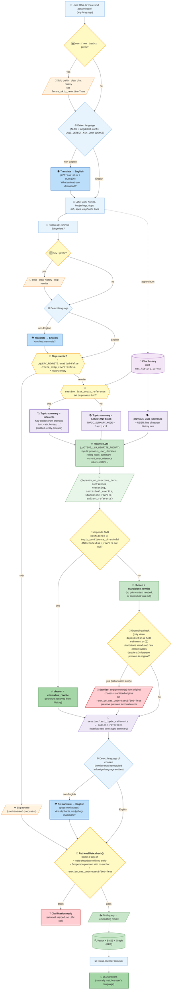

# Query Rewrite — Coreference Resolution Before Retrieval

```mermaid
---
config:
  theme: base
  themeVariables:
    primaryColor: "#e8f4fd"
    primaryTextColor: "#1a1a1a"
    primaryBorderColor: "#4a90d9"
    lineColor: "#555555"
    secondaryColor: "#fff3e0"
    tertiaryColor: "#fce4ec"
---
flowchart TB
    %% ---------- Turn 1: initial query ----------
    B1["👤 User: <i>Was für Tiere sind beschrieben?</i><br/>(any language)"]
    NS1{"🆕 <code>new:</code> / <code>new topic:</code> prefix?"}
    SW1[/"🧹 Strip prefix · clear chat history<br/>set <code>force_skip_rewrite=True</code>"/]
    T1{"🌐 Detect language<br/>(NLTK + langdetect, conf ≥ <code>LANG_DETECT_MIN_CONFIDENCE</code>)"}
    T2["🌍 <b>Translate → English</b><br/>(<code>HfTranslator</code> / m2m100)<br/><i>'What animals are described?'</i>"]
    B2["🤖 LLM: <i>Cats, horses, hedgehogs, dogs,<br/>fish, apes, elephants, lions</i>"]

    %% ---------- Turn 2: follow-up ----------
    B3["👤 Follow-up: <i>Sind sie Säugetiere?</i>"]
    NS2{"🆕 <code>new:</code> prefix?"}
    SW2[/"🧹 Strip · clear history · skip rewrite"/]
    T3{"🌐 Detect language"}
    T4["🌍 <b>Translate → English</b><br/><i>'Are they mammals?'</i>"]

    %% ---------- Rewrite gate ----------
    G1{{"🚦 <b>Skip rewrite?</b><br/>• <code>_QUERY_REWRITE.enabled=False</code><br/>• <code>force_skip_rewrite=True</code><br/>• history empty"}}
    SK[/"⏭️ Skip rewrite<br/>(use translated query as-is)"/]

    %% ---------- Topic-summary source ----------
    H1[("💬 <b>Chat history</b><br/>(last <code>max_history_turns</code>)")]
    REFP{{"🧷 <code>session.last_topic_referents</code><br/>set on previous turn?"}}
    REF["🏷️ <b>Topic summary = referents</b><br/><i>'Key entities from previous turn: cats, horses, ...'</i><br/>(distilled, entity-focused)"]
    HBLK["📚 <b>Topic summary = ASSISTANT block</b><br/><code>TOPIC_SUMMARY_MODE</code> = <code>last</code> | <code>all</code>"]
    PREV["🗣️ <b>previous_user_utterance</b><br/>= USER: line of newest history turn"]

    %% ---------- Rewriter LLM ----------
    B4["✏️ <b>Rewrite LLM</b> (<code>_ACTIVE_LLM_REWRITE_PROMPT</code>)<br/>inputs: previous_user_utterance · rolling_topic_summary · current_user_utterance<br/>returns JSON →"]
    JSON[/"📄 <code>{depends_on_previous_turn, confidence,<br/>reasoning, contextual_rewrite,<br/>standalone_rewrite, salient_referents}</code>"/]

    %% ---------- Decision logic ----------
    DEC{"🧭 <code>depends</code> AND<br/><code>confidence ≥ topic_confidence_threshold</code><br/>AND <code>contextual_rewrite</code> not null?"}
    PICKC["✅ <b>chosen = contextual_rewrite</b><br/>(pronouns resolved from history)"]
    PICKS["📝 <b>chosen = standalone_rewrite</b><br/>(no prior context needed,<br/>or contextual was null)"]

    %% ---------- Grounding check (failure path) ----------
    GRD{"🔬 Grounding check<br/>(only when <code>depends=False</code> AND <code>referents=[]</code>)<br/>standalone introduced new content words<br/>despite a 3rd-person pronoun in original?"}
    SAN[/"🧽 <b>Sanitize:</b> strip pronoun(s) from original<br/>chosen = sanitized original<br/>set <code>rewrite_was_underspecified=True</code><br/>preserve previous turn's referents"/]

    %% ---------- Persist referents ----------
    SAVE[/"💾 <code>session.last_topic_referents ← salient_referents</code><br/>(used as next turn's topic summary)"/]

    %% ---------- Post-rewrite re-translation ----------
    T5{"🌐 Detect language of <code>chosen</code><br/>(rewriter may have pulled in foreign-language entities)"}
    T6["🌍 <b>Re-translate → English</b><br/>(post-rewrite pass)<br/><i>'Are elephants, hedgehogs mammals?'</i>"]

    %% ---------- RetrievalGate ----------
    GATE{"🛑 <b>RetrievalGate.check()</b><br/>blocks if any of:<br/>• meta-descriptor with no entity<br/>• 3rd-person pronoun with no anchor<br/>• <code>rewrite_was_underspecified=True</code>"}
    CLAR["❔ <b>Clarification reply</b><br/>(retrieval skipped, no LLM call)"]

    %% ---------- Retrieval ----------
    B5[/"📤 Final query → embedding model"/]
    B6[("🔍 Vector + BM25 + Graph (RRF)")]
    B7["📊 Cross-encoder reranker"]
    B8["🤖 LLM answers<br/>(naturally matches user's language)"]

    %% ---------- Edges ----------
    B1 --> NS1
    NS1 -- "yes" --> SW1 --> T1
    NS1 -- "no"  --> T1
    T1 -- "non-English" --> T2 --> B2
    T1 -- "English" --> B2

    B2 -.->|"append turn"| H1
    B2 --> B3 --> NS2
    NS2 -- "yes" --> SW2 --> T3
    NS2 -- "no"  --> T3
    T3 -- "non-English" --> T4 --> G1
    T3 -- "English" --> G1

    G1 -- "skip" --> SK --> GATE
    G1 -- "rewrite" --> REFP
    H1 --> REFP
    H1 --> PREV
    REFP -- "yes" --> REF --> B4
    REFP -- "no"  --> HBLK --> B4
    PREV --> B4
    B4 --> JSON --> DEC
    DEC -- "yes" --> PICKC --> SAVE
    DEC -- "no"  --> PICKS --> GRD
    GRD -- "yes (hallucinated entity)" --> SAN --> SAVE
    GRD -- "no"  --> SAVE
    SAVE --> T5
    T5 -- "non-English" --> T6 --> GATE
    T5 -- "English" --> GATE

    GATE -- "block" --> CLAR
    GATE -- "pass"  --> B5 --> B6 --> B7 --> B8

    %% ---------- Styles ----------
    style T2 fill:#bbdefb,stroke:#1565c0,stroke-width:2px
    style T4 fill:#bbdefb,stroke:#1565c0,stroke-width:2px
    style T6 fill:#bbdefb,stroke:#1565c0,stroke-width:2px
    style NS1 fill:#fff9c4,stroke:#f9a825,stroke-width:2px
    style NS2 fill:#fff9c4,stroke:#f9a825,stroke-width:2px
    style SW1 fill:#fff3e0,stroke:#ef6c00
    style SW2 fill:#fff3e0,stroke:#ef6c00
    style G1 fill:#fff9c4,stroke:#f9a825,stroke-width:2px
    style SK fill:#fff3e0,stroke:#ef6c00
    style H1 fill:#f3e5f5,stroke:#6a1b9a
    style REFP fill:#fff9c4,stroke:#f9a825,stroke-width:2px
    style REF fill:#ede7f6,stroke:#5e35b1,stroke-width:2px
    style HBLK fill:#ede7f6,stroke:#5e35b1
    style PREV fill:#ede7f6,stroke:#5e35b1
    style B4 fill:#c8e6c9,stroke:#2e7d32,stroke-width:2px
    style JSON fill:#e8f5e9,stroke:#2e7d32
    style DEC fill:#fff9c4,stroke:#f9a825,stroke-width:2px
    style PICKC fill:#a5d6a7,stroke:#2e7d32
    style PICKS fill:#c8e6c9,stroke:#2e7d32
    style GRD fill:#fff9c4,stroke:#f9a825,stroke-width:2px
    style SAN fill:#ffcdd2,stroke:#c62828,stroke-width:2px
    style SAVE fill:#ede7f6,stroke:#5e35b1
    style GATE fill:#fff9c4,stroke:#f9a825,stroke-width:2px
    style CLAR fill:#ffcdd2,stroke:#c62828,stroke-width:2px
    style B5 fill:#c8e6c9,stroke:#2e7d32
    style B6 fill:#c8e6c9,stroke:#2e7d32
    style B8 fill:#a5d6a7,stroke:#2e7d32,stroke-width:2px
```
