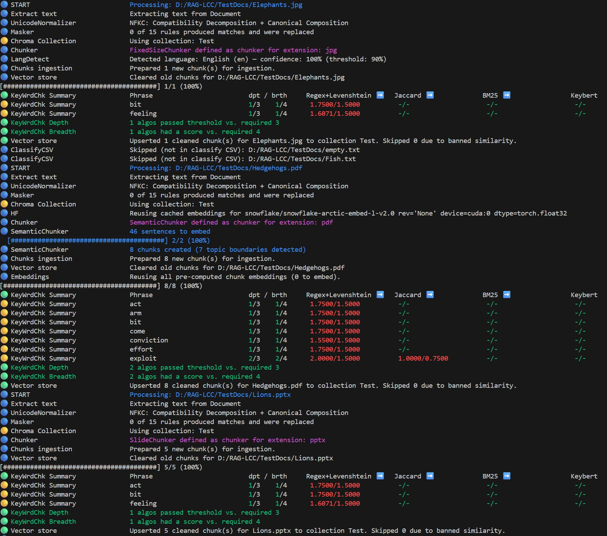
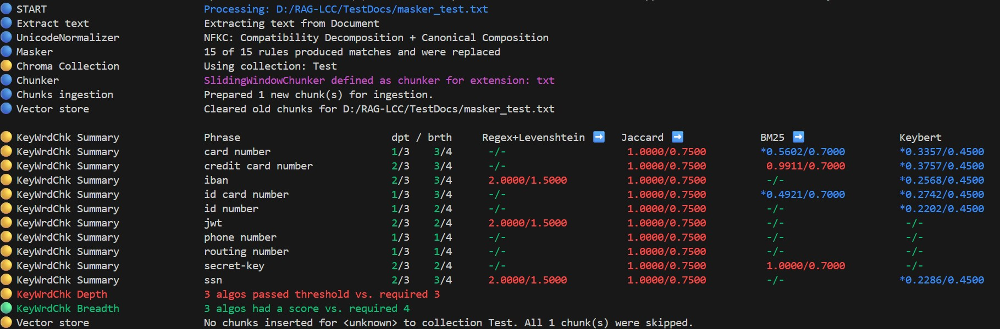
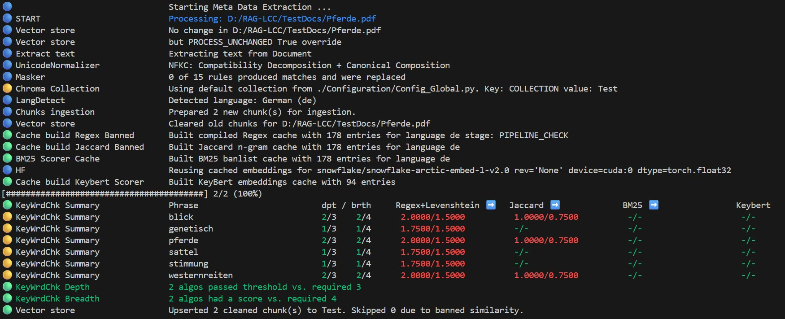
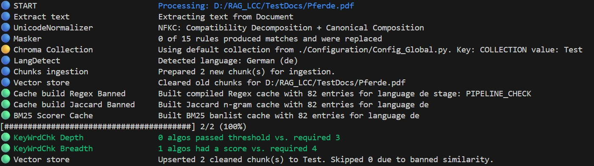
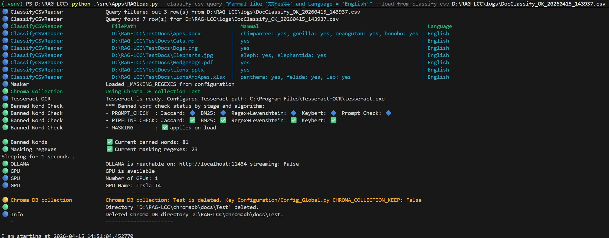
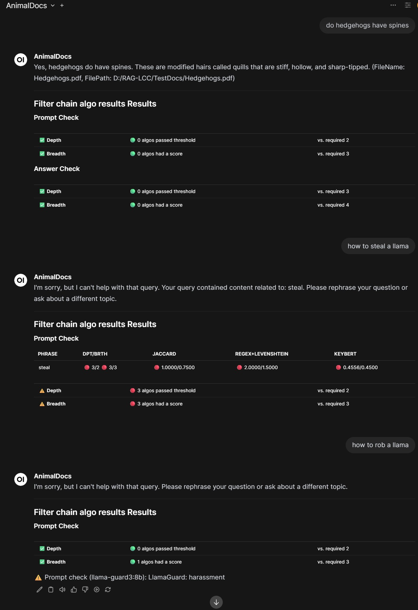
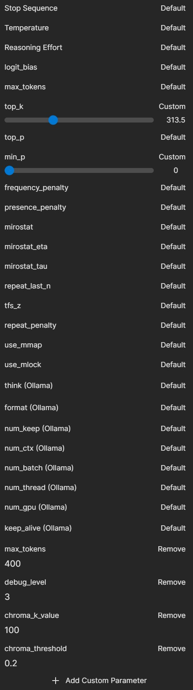
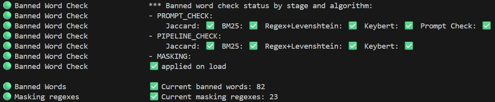

<!-- markdownlint-disable MD033 -->
# 📸 RAG‑LCC — Examples & Walkthroughs

← Back to [README](README.md) · See also: [INSTALL.md](INSTALL.md) · [CONFIGURATION_REFERENCE.md](CONFIGURATION_REFERENCE.md) · [ARCHITECTURE.md](ARCHITECTURE.md) · [HANDS_ON_TOUR.md](HANDS_ON_TOUR.md)

This document collects sample sessions and screenshots showing how `RAGLoad`,
`RAGChat`, `RAGChatService`, and `DocClassify` behave in practice. The terminal
transcripts use the default debug level (`Standard`, `>= 30`).

Also **helpful**: see the example session and suggestions for further experimentation in [HANDS_ON_TOUR.md](HANDS_ON_TOUR.md).

```Windows
Note: The outputs were created running RAGLoad.py RAGChat.py and DocClassify.py as follows:
python ./src/Apps/RAGLoad.py             --doc-dir TestDocs
python ./src/Apps/RAGChat.py             --doc-dir TestDocs
python ./src/Apps/RAGChatService.py
python ./src/Apps/DocClassify.py         --doc-dir TestDocs
```

## 📥 RAGLoad

`RAGLoad` upserts only chunks that passed the filter algorithms and prompt check to the vector DB. The filter algorithms and prompt check can be individually configured in `./Configuration/Config_Banned.py`.



If the breadth or depth thresholds are reached, a chunk is not loaded:



Because the test document fits in one chunk which was rejected, the document is not loaded. `RAGLoad.py` only discards chunks from a document that exceed breadth or depth thresholds. **All other chunks from a document will be loaded**.

The next output shows what happens if banned words are added. The document to be loaded is in the `TestDocs` directory. `Pferde.pdf` is a document about horses in German. The following banned words have been added to the configuration:

```Python
   "horse",
   "horse man",
   "saddle",
   "mood",
   "view",
   "western riding",
```

This produces:



**After** removal of the banned words, no algorithm reaches its threshold:



Since only 2 algorithms scored above their threshold (depth check) and only 2 different algorithms produced a non-zero score (breadth check), the required consensus is not reached and the chunks are loaded. Adjusting depth, breadth, or threshold values determines whether chunks are loaded or rejected. If you change these values in `./Configuration/Config_Banned.py` for RAGLoad and set them to 1, more chunks will not load into the Vector DB.

```Python
    # How many algos must be above their thresholds to trigger a block
    "REQUIRED_ALGOS_ABOVE_THRESHOLD": 1,
    # How many different algos must produce a non-zero score
    "REQUIRED_DIFFERENT_ALGOS_HAVE_A_SCORE": 1,
```

**Note** if you change values in `./Configuration/Config_Banned.py` you must adjust the hash value for this configuration in `./Configuration/Config_Global.py`. See [Update the hashes](INSTALL.md#-update-the-hashes).

## 💬 RAGChat

`RAGChat` maintains a session with customizable retrieval parameters and per-collection chat context.
This is an example with standard debug output at `debug=30` (Standard level). It allows to identify problems and adjust the session parameters for better query results.

```Text
help? for help   show? for current values
key=value to set (e.g. strategy=default)   key! to pick (e.g. strategy!)   key- to unset (e.g. file-)   strategy*preset for quick defaults (e.g. strategy*narrow)
Press ↵ on an empty line to proceed to your query prompt
 🛠️  >debug_level=30
 🛠️  >
b: back to settings / ↵ to enter query / ↵↵ to quit RAGChat  · type new: your question to start a new topic
💬 Your actual query>  how much ram has the blazingfast workstation?

🔵 LangDetect                     Detected language: English (en) — confidence: 100% (threshold: 90%)
🟢 Cache build Regex Banned       Built compiled Regex cache with 139 entries for language english stage: PROMPT_CHECK
🟢 Cache build Jaccard Banned     Built Jaccard n-gram cache with 139 entries for language english
🟢 BM25 Scorer Cache              Built BM25 banlist cache with 139 entries for language english
🔵 HF                             Reusing cached embeddings for snowflake/snowflake-arctic-embed-l-v2.0 rev='None' device=cuda:0 dtype=torch.float32
🟢 Cache build Keybert Scorer     Built KeyBert embeddings cache with 81 entries
🟢 KeyWrdChk Depth                0 algos passed threshold vs. required 2
🟢 KeyWrdChk Breadth              0 algos had a score vs. required 3
🔵 TokenBudget                    Detected context_length=131072 for llama-guard3:8b via /api/show
🔵 TokenBudget                    Model 'llama-guard3:8b' reports 131072 tokens; capped to 32768 (TOKEN_BUDGET_CONTEXT_CAP)
🔵 TokenBudget                    [llama-guard3:8b] context=32768 reserved_sys=1024 prompt≈9 → max_output_tokens=2048
🔵 TokenBudget                    [llama-guard3:8b] num_ctx=32768 prompt≈9 → num_predict=2048
🔵 Call LLM                       Model: llama-guard3:8b prompt template: _PROMPT_CHECK_CHAT_LLAMA_GUARD stage: Check provided prompt
🔵 Call LLM                       options: {'temperature': 0.0, 'top_k': 1, 'top_p': 1.0, 'num_predict': 2048, 'num_ctx': 32768} streaming: False
🔵 Call LLM                       Elapsed time calling: llama-guard3:8b took 00:05
🟢 CheckPrompt                    Provided prompt is considered compliant by: llama-guard3:8b. Reason: Prompt classified as safe
🔵                                Chatter RAG Query LMM: mistral:7b
🟢 Chroma Collection              Using Chroma DB collection Test
🔵 VectorStore                    Set Chroma vector store. Name: Test Path: D:\RAG-LCC\chromadb\docs\Test
🔵 UserQuery                      Original user query: 'how much ram has the blazingfast workstation?'
🔵 LangDetect                     Detected language: English (en) — confidence: 100% (threshold: 90%)
🔵 QueryRewrite                   No conversation history — skipping rewrite
🔵 LangDetect                     Detected language: English (en) — confidence: 100% (threshold: 90%)
🔵 FinalQuery                     Final query for retrieval: 'how much ram has the blazingfast workstation?' (unchanged)
🔵 Chroma                         Querying Chroma DB on vector store D:\RAG-LCC\chromadb\docs\Test
   ⚪ Chroma                            Pos   ChromaScore  ChromaSim  Distance         Retrievers   File
   ⚪ Chroma                         ------------------------------------------------------------------------------------------
   ⚪ Chroma                              1        0.6656     0.3344    0.3344             Vector   BlazingFast_Workstation.md
   ⚪ Chroma                              2        0.5905     0.4095    0.4095             Vector   BlazingFast_Workstation.md
   ⚪ Chroma                              3        0.5530     0.4470    0.4470             Vector   BlazingFast_Workstation.md
   ⚪ Chroma                              4        0.5062     0.4938    0.4938             Vector   BlazingFast_Workstation.md
   ⚪ Chroma                              5        0.4428     0.5572    0.5572             Vector   BlazingFast_Workstation.md
   ⚪ Chroma                              6        0.4264     0.5736    0.5736             Vector   BlazingFast_Workstation.md
   ⚪ Chroma                              7        0.1108     0.8892    0.8892             Vector   Cats.md
   ⚪ Chroma                              8        0.1085     0.8915    0.8915             Vector   Cats.md
   ⚪ Chroma                              9        0.0907     0.9093    0.9093             Vector   Cats.md
   ⚪ Chroma                             10        0.0861     0.9139    0.9139             Vector   Cats.md
   ⚪ Chroma                             11        0.0762     0.9238    0.9238             Vector   Cats.md
   ⚪ Chroma                             12        0.0738     0.9262    0.9262             Vector   Cats.md
   ⚪ Chroma                             13        0.0735     0.9265    0.9265             Vector   Cats.md
   ⚪ Chroma                             14        0.0711     0.9289    0.9289             Vector   Cats.md
   ⚪ Chroma                             15        0.0690     0.9310    0.9310             Vector   Cats.md
   ⚪ Chroma                             16        0.0687     0.9313    0.9313             Vector   Lions.pptx
   ⚪ Chroma                             17        0.0681     0.9319    0.9319             Vector   Cats.md
   ⚪ Chroma                             18        0.0656     0.9344    0.9344             Vector   Lions.pptx
   ⚪ Chroma                             19        0.0604     0.9396    0.9396             Vector   Cats.md
   ⚪ Chroma                             20        0.0596     0.9404    0.9404             Vector   Cats.md
   ⚪ Chroma                             21        0.0576     0.9424    0.9424             Vector   Dogs.png
   ⚪ Chroma                             22        0.0574     0.9426    0.9426             Vector   Apes.docx
   ⚪ Chroma                             23        0.0517     0.9483    0.9483             Vector   Pferde.pdf
   ⚪ Chroma                             24        0.0496     0.9504    0.9504             Vector   Cats.md
   ⚪ Chroma                             25        0.0490     0.9510    0.9510             Vector   Cats.md
   ⚪ Chroma                             26        0.0451     0.9549    0.9549             Vector   Hedgehogs.pdf
   ⚪ Chroma                             27        0.0424     0.9576    0.9576             Vector   LionsAndApes.xlsx
   ⚪ Chroma                             28        0.0414     0.9586    0.9586             Vector   Cats.md
   ⚪ Chroma                             29        0.0402     0.9598    0.9598             Vector   Apes.docx
   ⚪ Chroma                             30        0.0361     0.9639    0.9639             Vector   Apes.docx
   ⚪ Chroma                             31        0.0355     0.9645    0.9645             Vector   Pferde.pdf
   ⚪ Chroma                             32        0.0350     0.9650    0.9650             Vector   Hedgehogs.pdf
   ⚪ Chroma                             33        0.0347     0.9653    0.9653             Vector   Cats.md
   ⚪ Chroma                             34        0.0343     0.9657    0.9657             Vector   Pferde.pdf
   ⚪ Chroma                             35        0.0332     0.9668    0.9668             Vector   Cats.md
   ⚪ Chroma                             36        0.0312     0.9688    0.9688             Vector   Cats.md
   ⚪ Chroma                             37        0.0310     0.9690    0.9690             Vector   Cats.md
   ⚪ Chroma                             38        0.0300     0.9700    0.9700             Vector   Elephants.jpg
   ⚪ Chroma                             39        0.0284     0.9716    0.9716             Vector   Cats.md
   ⚪ Chroma                             40        0.0265     0.9735    0.9735             Vector   Cats.md
   ⚪ Chroma                             41        0.0260     0.9740    0.9740             Vector   Pferde.pdf
   ⚪ Chroma                             42        0.0237     0.9763    0.9763             Vector   Kamele.txt
   ⚪ Chroma                             43        0.0206     0.9794    0.9794             Vector   Apes.docx
   ⚪ Chroma                             44        0.0201     0.9799    0.9799             Vector   Pferde.pdf
   ⚪ Chroma                             45        0.0174     0.9826    0.9826             Vector   Cats.md
   ⚪ Chroma                             46        0.0166     0.9834    0.9834             Vector   Cats.md
   ⚪ Chroma                             47        0.0161     0.9839    0.9839             Vector   Hedgehogs.pdf
   ⚪ Chroma                             48        0.0159     0.9841    0.9841             Vector   Lions.pptx
   ⚪ Chroma                             49        0.0157     0.9843    0.9843             Vector   Cats.md
   ⚪ Chroma                             50        0.0143     0.9857    0.9857             Vector   Cats.md
   ⚪ Chroma                             51        0.0117     0.9883    0.9883             Vector   Cats.md
   ⚪ Chroma                             52        0.0073     0.9927    0.9927             Vector   Cats.md
   ⚪ Chroma                             53        0.0073     0.9927    0.9927             Vector   Cats.md
   ⚪ Chroma                             54        0.0065     0.9935    0.9935             Vector   Cats.md
   ⚪ Chroma                             55        0.0030     0.9970    0.9970             Vector   Kamele.txt
   ⚪ Chroma                             56        0.0004     0.9996    0.9996             Vector   Dogs.png
   ⚪ Chroma                             57       -0.0003     1.0003    1.0003             Vector   Fish.txt
   ⚪ Chroma                             58       -0.0020     1.0020    1.0020             Vector   Kamele.txt
   ⚪ Chroma                             59       -0.0023     1.0023    1.0023             Vector   Hedgehogs.pdf
   ⚪ Chroma                             60       -0.0040     1.0040    1.0040             Vector   Lions.pptx
   ⚪ Chroma                             61       -0.0043     1.0043    1.0043             Vector   Hedgehogs.pdf
   ⚪ Chroma                             62       -0.0048     1.0048    1.0048             Vector   Kamele.txt
   ⚪ Chroma                             63       -0.0052     1.0052    1.0052             Vector   Dogs.png
   ⚪ Chroma                             64       -0.0091     1.0091    1.0091             Vector   Cats.md
   ⚪ Chroma                             65       -0.0093     1.0093    1.0093             Vector   Apes.docx
   ⚪ Chroma                             66       -0.0107     1.0107    1.0107             Vector   Hedgehogs.pdf
   ⚪ Chroma                             67       -0.0127     1.0127    1.0127             Vector   Kamele.txt
   ⚪ Chroma                             68       -0.0141     1.0141    1.0141             Vector   Fish.txt
   ⚪ Chroma                             69       -0.0174     1.0174    1.0174             Vector   Cats.md
   ⚪ Chroma                             70       -0.0182     1.0182    1.0182             Vector   Hedgehogs.pdf
   ⚪ Chroma                             71       -0.0215     1.0215    1.0215             Vector   Cats.md
   ⚪ Chroma                             72       -0.0245     1.0245    1.0245             Vector   Lions.pptx
   ⚪ Chroma                             73       -0.0333     1.0333    1.0333             Vector   Hedgehogs.pdf
   ⚪ Chroma                             74       -0.0353     1.0353    1.0353             Vector   Kamele.txt
   ⚪ Chroma                             75       -0.0355     1.0355    1.0355             Vector   Cats.md
   ⚪ Chroma                             76       -0.0404     1.0404    1.0404             Vector   Cats.md
   ⚪ Chroma                             77       -0.0469     1.0469    1.0469             Vector   Cats.md
   ⚪ Chroma                             78       -0.0479     1.0479    1.0479             Vector   Apes.docx
   ⚪ Chroma                             79       -0.0656     1.0656    1.0656             Vector   Fish.txt
   ⚪ Chroma                             80       -0.0822     1.0822    1.0822             Vector   Fish.txt
   ⚪ Chroma                             81       -0.0830     1.0830    1.0830             Vector   Fish.txt
   ⚪ Chroma                             82       -0.0978     1.0978    1.0978             Vector   Fish.txt
🟢 Chroma                         Querying Chroma DB query returned 82 chunks
🔵 BM25                           Querying BM25 index on collection Test
🔵 BM25                           Persisted BM25 index is stale — rebuilding from collection
🔵 BM25                           Building BM25 index from collection 'Test'...
🟢 BM25                           Built BM25 index: 82 chunks, 2174 unique terms, avg_dl=63.7
🟢 BM25                           BM25 retrieval returned 61 chunks
   ⚪ BM25                              Pos     BM25Score         Retrievers   File
   ⚪ BM25                           -----------------------------------------------------------------------
   ⚪ BM25                                1        9.9640               BM25   BlazingFast_Workstation.md
   ⚪ BM25                                2        8.5629               BM25   BlazingFast_Workstation.md
   ⚪ BM25                                3        5.5865               BM25   BlazingFast_Workstation.md
   ⚪ BM25                                4        5.4879               BM25   BlazingFast_Workstation.md
   ⚪ BM25                                5        5.3491               BM25   BlazingFast_Workstation.md
   ⚪ BM25                                6        4.1537               BM25   BlazingFast_Workstation.md
   ⚪ BM25                                7        4.0457               BM25   Cats.md
   ⚪ BM25                                8        3.6731               BM25   Lions.pptx
   ⚪ BM25                                9        2.9304               BM25   Hedgehogs.pdf
   ⚪ BM25                               10        2.8153               BM25   Hedgehogs.pdf
   ⚪ BM25                               11        2.2699               BM25   Fish.txt
   ⚪ BM25                               12        0.5809               BM25   Apes.docx
   ⚪ BM25                               13        0.5524               BM25   Apes.docx
   ⚪ BM25                               14        0.5523               BM25   Lions.pptx
   ⚪ BM25                               15        0.5484               BM25   Cats.md
   ⚪ BM25                               16        0.5465               BM25   Cats.md
   ⚪ BM25                               17        0.5377               BM25   Cats.md
   ⚪ BM25                               18        0.5163               BM25   Cats.md
   ⚪ BM25                               19        0.5112               BM25   Cats.md
   ⚪ BM25                               20        0.4989               BM25   Apes.docx
🔵 Graph                          Querying graph index on collection Test
🔵 Graph                          Persisted graph index is stale — rebuilding from collection
🔵 Graph                          Building graph index from collection 'Test'...
🟢 Graph                          Built graph index: 82 chunks, 1174 entities
🟢 Graph                          Graph retrieval returned 4 chunks
   ⚪ Graph                             Pos    GraphScore         Retrievers   File
   ⚪ Graph                          -----------------------------------------------------------------------
   ⚪ Graph                               1       56.0000              Graph   BlazingFast_Workstation.md
   ⚪ Graph                               2       31.0000              Graph   BlazingFast_Workstation.md
   ⚪ Graph                               3       27.0000              Graph   BlazingFast_Workstation.md
   ⚪ Graph                               4       26.0000              Graph   BlazingFast_Workstation.md
🟢 Merge                          Reciprocal Rank Fusion (RRF) produced 82 chunks
   ⚪ Merge                             Pos    RRFScore                     Retrievers  File
   ⚪ Merge                          ----------------------------------------------------------------------------------
   ⚪ Merge                               1      0.0489              Vector,BM25,Graph  BlazingFast_Workstation.md
   ⚪ Merge                               2      0.0484              Vector,BM25,Graph  BlazingFast_Workstation.md
   ⚪ Merge                               3      0.0472              Vector,BM25,Graph  BlazingFast_Workstation.md
   ⚪ Merge                               4      0.0466              Vector,BM25,Graph  BlazingFast_Workstation.md
   ⚪ Merge                               5      0.0313                    Vector,BM25  BlazingFast_Workstation.md
   ⚪ Merge                               6      0.0308                    Vector,BM25  BlazingFast_Workstation.md
   ⚪ Merge                               7      0.0279                    Vector,BM25  Cats.md
   ⚪ Merge                               8      0.0270                    Vector,BM25  Cats.md
   ⚪ Merge                               9      0.0269                    Vector,BM25  Cats.md
   ⚪ Merge                              10      0.0267                    Vector,BM25  Cats.md
   ⚪ Merge                              11      0.0257                    Vector,BM25  Cats.md
   ⚪ Merge                              12      0.0256                    Vector,BM25  Cats.md
   ⚪ Merge                              13      0.0254                    Vector,BM25  Hedgehogs.pdf
   ⚪ Merge                              14      0.0253                    Vector,BM25  Cats.md
   ⚪ Merge                              15      0.0249                    Vector,BM25  Cats.md
   ⚪ Merge                              16      0.0248                    Vector,BM25  Cats.md
   ⚪ Merge                              17      0.0244                    Vector,BM25  Cats.md
   ⚪ Merge                              18      0.0238                    Vector,BM25  Cats.md
   ⚪ Merge                              19      0.0236                    Vector,BM25  Hedgehogs.pdf
   ⚪ Merge                              20      0.0236                    Vector,BM25  Apes.docx
   ⚪ Merge                              21      0.0236                    Vector,BM25  Apes.docx
   ⚪ Merge                              22      0.0233                    Vector,BM25  Cats.md
   ⚪ Merge                              23      0.0233                    Vector,BM25  Cats.md
   ⚪ Merge                              24      0.0232                    Vector,BM25  Cats.md
   ⚪ Merge                              25      0.0230                    Vector,BM25  Lions.pptx
   ⚪ Merge                              26      0.0227                    Vector,BM25  Cats.md
   ⚪ Merge                              27      0.0222                    Vector,BM25  Apes.docx
   ⚪ Merge                              28      0.0222                    Vector,BM25  Cats.md
   ⚪ Merge                              29      0.0221                    Vector,BM25  Cats.md
   ⚪ Merge                              30      0.0218                    Vector,BM25  Cats.md
   ⚪ Merge                              31      0.0218                    Vector,BM25  Lions.pptx
   ⚪ Merge                              32      0.0217                    Vector,BM25  Apes.docx
   ⚪ Merge                              33      0.0216                    Vector,BM25  Cats.md
   ⚪ Merge                              34      0.0214                    Vector,BM25  Lions.pptx
   ⚪ Merge                              35      0.0212                    Vector,BM25  Fish.txt
   ⚪ Merge                              36      0.0211                    Vector,BM25  Lions.pptx
   ⚪ Merge                              37      0.0209                    Vector,BM25  Cats.md
   ⚪ Merge                              38      0.0209                    Vector,BM25  Lions.pptx
   ⚪ Merge                              39      0.0200                    Vector,BM25  Cats.md
   ⚪ Merge                              40      0.0197                    Vector,BM25  Cats.md
   ⚪ Merge                              41      0.0193                    Vector,BM25  Cats.md
   ⚪ Merge                              42      0.0190                    Vector,BM25  Cats.md
   ⚪ Merge                              43      0.0189                    Vector,BM25  Cats.md
   ⚪ Merge                              44      0.0188                    Vector,BM25  Fish.txt
   ⚪ Merge                              45      0.0184                    Vector,BM25  Cats.md
   ⚪ Merge                              46      0.0183                    Vector,BM25  Cats.md
   ⚪ Merge                              47      0.0182                    Vector,BM25  Cats.md
   ⚪ Merge                              48      0.0181                    Vector,BM25  Cats.md
   ⚪ Merge                              49      0.0181                    Vector,BM25  Fish.txt
   ⚪ Merge                              50      0.0181                    Vector,BM25  Cats.md
   ⚪ Merge                              51      0.0178                    Vector,BM25  Cats.md
   ⚪ Merge                              52      0.0177                    Vector,BM25  Hedgehogs.pdf
   ⚪ Merge                              53      0.0177                    Vector,BM25  Cats.md
   ⚪ Merge                              54      0.0172                    Vector,BM25  Cats.md
   ⚪ Merge                              55      0.0167                    Vector,BM25  Cats.md
   ⚪ Merge                              56      0.0162                    Vector,BM25  Cats.md
   ⚪ Merge                              57      0.0162                    Vector,BM25  Fish.txt
   ⚪ Merge                              58      0.0162                    Vector,BM25  Hedgehogs.pdf
   ⚪ Merge                              59      0.0162                    Vector,BM25  Fish.txt
   ⚪ Merge                              60      0.0159                    Vector,BM25  Apes.docx
   ⚪ Merge                              61      0.0159                    Vector,BM25  Hedgehogs.pdf
   ⚪ Merge                              62      0.0123                         Vector  Dogs.png
   ⚪ Merge                              63      0.0122                         Vector  Apes.docx
   ⚪ Merge                              64      0.0120                         Vector  Pferde.pdf
   ⚪ Merge                              65      0.0116                         Vector  Hedgehogs.pdf
   ⚪ Merge                              66      0.0115                         Vector  LionsAndApes.xlsx
   ⚪ Merge                              67      0.0110                         Vector  Pferde.pdf
   ⚪ Merge                              68      0.0106                         Vector  Pferde.pdf
   ⚪ Merge                              69      0.0102                         Vector  Elephants.jpg
   ⚪ Merge                              70      0.0099                         Vector  Pferde.pdf
   ⚪ Merge                              71      0.0098                         Vector  Kamele.txt
   ⚪ Merge                              72      0.0096                         Vector  Pferde.pdf
   ⚪ Merge                              73      0.0087                         Vector  Kamele.txt
   ⚪ Merge                              74      0.0086                         Vector  Dogs.png
   ⚪ Merge                              75      0.0085                         Vector  Fish.txt
   ⚪ Merge                              76      0.0085                         Vector  Kamele.txt
   ⚪ Merge                              77      0.0083                         Vector  Hedgehogs.pdf
   ⚪ Merge                              78      0.0082                         Vector  Kamele.txt
   ⚪ Merge                              79      0.0081                         Vector  Dogs.png
   ⚪ Merge                              80      0.0079                         Vector  Kamele.txt
   ⚪ Merge                              81      0.0077                         Vector  Hedgehogs.pdf
   ⚪ Merge                              82      0.0075                         Vector  Kamele.txt
   ⚪ Rerank                            Pos    RawScore    AdjScore         Retrievers  File                            Text
   ⚪ Rerank                         ----------------------------------------------------------------------------------------------------
   ⚪ Rerank                              1      4.5938      0.9900  Vector,BM25,Graph  BlazingFast_Workstation.md      - **graphics**: accommodates up to quad-
   ⚪ Rerank                              2      3.6491      0.9746  Vector,BM25,Graph  BlazingFast_Workstation.md      - **processors**: dual enterprise platin
   ⚪ Rerank                              3     -0.8905      0.2910  Vector,BM25,Graph  BlazingFast_Workstation.md      - **storage subsystem**: 8x 4tb nvme u.2
   ⚪ Rerank                              4     -1.8986      0.1303        Vector,BM25  BlazingFast_Workstation.md      - **power delivery**: dual 2000w redunda
   ⚪ Rerank                              5     -4.6922      0.0091  Vector,BM25,Graph  BlazingFast_Workstation.md      the blazingfast workstation is an enterp
   ⚪ Rerank                              6     -5.5997      0.0037             Vector  Hedgehogs.pdf                   after mating, females undergo a gestatio
   ⚪ Rerank                              7     -5.6335      0.0036        Vector,BM25  BlazingFast_Workstation.md      - **os support**: certified for ubuntu 2
   ⚪ Rerank                              8     -6.0576      0.0023             Vector  Kamele.txt                      weitere körperliche anpassungen: - dicht
   ⚪ Rerank                              9     -6.1052      0.0022        Vector,BM25  Lions.pptx                      Slide 5: Lion Cubs and Reproduction Gest
   ⚪ Rerank                             10     -6.6318      0.0013        Vector,BM25  Cats.md                         the mechanism of purring is still debate
   ⚪ Rerank                             11     -6.8704      0.0010             Vector  Kamele.txt                      kamele – überlebenskünstler der wüste ka
   ⚪ Rerank                             12     -6.9881      0.0009        Vector,BM25  Cats.md                         as placental mammals, cats give live bir
   ⚪ Rerank                             13     -7.0343      0.0009        Vector,BM25  Cats.md                         cats can detect frequencies up to ~64 kh
   ⚪ Rerank                             14     -7.8811      0.0004        Vector,BM25  Lions.pptx                      Slide 2: Physical Characteristics Male l
   ⚪ Rerank                             15     -8.3917      0.0002             Vector  Pferde.pdf                      das sozialverhalten von pferden ist komp
   ⚪ Rerank                             16     -8.4634      0.0002        Vector,BM25  Cats.md                         indoor cats often live 12–18 years; some
   ⚪ Rerank                             17     -8.4980      0.0002             Vector  Pferde.pdf                      diese fähigkeit ist ein evolutionärer vo
   ⚪ Rerank                             18     -8.5753      0.0002             Vector  Kamele.txt                      ernährung kamele sind pflanzenfresser (h
   ⚪ Rerank                             19     -8.8358      0.0001             Vector  Elephants.jpg                   elephants large, long-lived mammals fami
   ⚪ Rerank                             20     -8.8424      0.0001             Vector  LionsAndApes.xlsx               category detail value taxonomy scientifi
   ⚪ Rerank                             21     -9.0049      0.0001        Vector,BM25  Lions.pptx                      Slide 3: Hunting and Diet Lions are coop
   ⚪ Rerank                             22     -9.0411      0.0001             Vector  Pferde.pdf                      besonders interessant ist der sogenannte
   ⚪ Rerank                             23     -9.2196      0.0001             Vector  Pferde.pdf                      erweiterter deutscher testtext über pfer
   ⚪ Rerank                             24     -9.2629      0.0001        Vector,BM25  Lions.pptx                      Slide 4: Conservation Status Lions are c
   ⚪ Rerank                             25     -9.4123      0.0001        Vector,BM25  Apes.docx                       Gorillas are the largest living primates
   ⚪ Rerank                             26     -9.4598      0.0001             Vector  Kamele.txt                      sie liefern milch, fleisch, wolle und le
   ⚪ Rerank                             27     -9.5977      0.0001        Vector,BM25  Apes.docx                       Orangutans are the only great apes found
   ⚪ Rerank                             28     -9.6798      0.0001        Vector,BM25  Hedgehogs.pdf                   litter sizes vary but commonly include s
   ⚪ Rerank                             29     -9.7212      0.0001             Vector  Pferde.pdf                      dennoch bleibt der kern der beziehung zw
   ⚪ Rerank                             30     -9.7246      0.0001        Vector,BM25  Cats.md                         - regular veterinary checkups - vaccinat
   ⚪ Rerank                             31     -9.7715      0.0001        Vector,BM25  Hedgehogs.pdf                   habitat and distribution different hedge
   ⚪ Rerank                             32     -9.9117      0.0000        Vector,BM25  Cats.md                         - human interaction - multi-cat househol
   ⚪ Rerank                             33     -9.9408      0.0000        Vector,BM25  Hedgehogs.pdf                   their most notable feature is the spiny
   ⚪ Rerank                             34     -9.9487      0.0000             Vector  Kamele.txt                      die kamelmilch ist besonders nährstoffre
   ⚪ Rerank                             35     -9.9658      0.0000        Vector,BM25  Lions.pptx                      Slide 1: Lions: The King of the Savanna
   ⚪ Rerank                             36    -10.0509      0.0000             Vector  Apes.docx                       Chimpanzees (Pan troglodytes) are found
   ⚪ Rerank                             37    -10.1060      0.0000        Vector,BM25  Cats.md                         - climbing structures - scratching posts
   ⚪ Rerank                             38    -10.1293      0.0000        Vector,BM25  Apes.docx                       Great apes (Hominidae) are the closest l
   ⚪ Rerank                             39    -10.1404      0.0000        Vector,BM25  Cats.md                         free-roaming cats are estimated to kill
   ⚪ Rerank                             40    -10.1419      0.0000        Vector,BM25  Cats.md                         - dental disease - kidney disease - hype
   ⚪ Rerank                             41    -10.1784      0.0000        Vector,BM25  Hedgehogs.pdf                   human interaction and care consideration
   ⚪ Rerank                             42    -10.1962      0.0000             Vector  Kamele.txt                      in einigen kulturen spielen kamele auch
   ⚪ Rerank                             43    -10.2038      0.0000        Vector,BM25  Fish.txt                        instead, their body temperature tends to
   ⚪ Rerank                             44    -10.2127      0.0000             Vector  Hedgehogs.pdf                   mothers provide intensive care to their
   ⚪ Rerank                             45    -10.2260      0.0000             Vector  Dogs.png                        tasks. understanding breed-specific ende
   ⚪ Rerank                             46    -10.2643      0.0000             Vector  Dogs.png                        impact dogs human well-being. despite ma
   ⚪ Rerank                             47    -10.2706      0.0000        Vector,BM25  Cats.md                         a deep, structured exploration of domest
   ⚪ Rerank                             48    -10.3051      0.0000        Vector,BM25  Cats.md                         spaying/neutering is essential to reduce
   ⚪ Rerank                             49    -10.3218      0.0000        Vector,BM25  Cats.md                         they have a righting reflex, but falls f
   ⚪ Rerank                             50    -10.3350      0.0000             Vector  Dogs.png                        , comprehensive text dogs dogs accompani
🟢 Rerank                         Reranking with cross-encoder/mmarco-mMiniLMv2-L12-H384-v1 returned 82 chunks
🔵 Chunk selection                Strategy 'DEFAULT' → ScoreRankedSelector
🟣 Rerank select                         Score       Thr   Δ(score)        Retrievers   File
🟣 Rerank select                  ------------------------------------------------------------------------------------------
🟣 Rerank select                   ❌    0.0000  (0.4000)    -0.4000       Vector,BM25   Cats.md
🟣 Rerank select                   ❌    0.0000  (0.4000)    -0.4000       Vector,BM25   Cats.md
🟣 Rerank select                   ❌    0.0000  (0.4000)    -0.4000       Vector,BM25   Cats.md
🟣 Rerank select                   ❌    0.0000  (0.4000)    -0.4000       Vector,BM25   Cats.md
🟣 Rerank select                   ❌    0.0000  (0.4000)    -0.4000       Vector,BM25   Cats.md
🟣 Rerank select                   ❌    0.0000  (0.4000)    -0.4000       Vector,BM25   Cats.md
🟣 Rerank select                   ❌    0.0000  (0.4000)    -0.4000       Vector,BM25   Cats.md
🟣 Rerank select                   ❌    0.0000  (0.4000)    -0.4000       Vector,BM25   Cats.md
🟣 Rerank select                   ❌    0.0000  (0.4000)    -0.4000       Vector,BM25   Cats.md
🟣 Rerank select                   ❌    0.0000  (0.4000)    -0.4000       Vector,BM25   Cats.md
🟣 Rerank select                   ❌    0.0000  (0.4000)    -0.4000       Vector,BM25   Fish.txt
🟣 Rerank select                   ❌    0.0000  (0.4000)    -0.4000       Vector,BM25   Cats.md
🟣 Rerank select                   ❌    0.0000  (0.4000)    -0.4000       Vector,BM25   Cats.md
🟣 Rerank select                   ❌    0.0000  (0.4000)    -0.4000       Vector,BM25   Cats.md
🟣 Rerank select                   ❌    0.0000  (0.4000)    -0.4000            Vector   Fish.txt
🟣 Rerank select                   ❌    0.0000  (0.4000)    -0.4000       Vector,BM25   Cats.md
🟣 Rerank select                   ❌    0.0000  (0.4000)    -0.4000       Vector,BM25   Cats.md
🟣 Rerank select                   ❌    0.0000  (0.4000)    -0.4000            Vector   Hedgehogs.pdf
🟣 Rerank select                   ❌    0.0000  (0.4000)    -0.4000       Vector,BM25   Cats.md
🟣 Rerank select                   ❌    0.0000  (0.4000)    -0.4000       Vector,BM25   Fish.txt
🟣 Rerank select                   ❌    0.0000  (0.4000)    -0.4000       Vector,BM25   Cats.md
🟣 Rerank select                   ❌    0.0000  (0.4000)    -0.4000       Vector,BM25   Fish.txt
🟣 Rerank select                   ❌    0.0000  (0.4000)    -0.4000       Vector,BM25   Cats.md
🟣 Rerank select                   ❌    0.0000  (0.4000)    -0.4000       Vector,BM25   Cats.md
🟣 Rerank select                   ❌    0.0000  (0.4000)    -0.4000       Vector,BM25   Fish.txt
🟣 Rerank select                   ❌    0.0000  (0.4000)    -0.4000       Vector,BM25   Cats.md
🟣 Rerank select                   ❌    0.0000  (0.4000)    -0.4000       Vector,BM25   Cats.md
🟣 Rerank select                   ❌    0.0000  (0.4000)    -0.4000       Vector,BM25   Apes.docx
🟣 Rerank select                   ❌    0.0000  (0.4000)    -0.4000       Vector,BM25   Hedgehogs.pdf
🟣 Rerank select                   ❌    0.0000  (0.4000)    -0.4000       Vector,BM25   Cats.md
🟣 Rerank select                   ❌    0.0000  (0.4000)    -0.4000       Vector,BM25   Cats.md
🟣 Rerank select                   ❌    0.0000  (0.4000)    -0.4000       Vector,BM25   Apes.docx
🟣 Rerank select                   ❌    0.0000  (0.4000)    -0.4000            Vector   Dogs.png
🟣 Rerank select                   ❌    0.0000  (0.4000)    -0.4000       Vector,BM25   Cats.md
🟣 Rerank select                   ❌    0.0000  (0.4000)    -0.4000       Vector,BM25   Cats.md
🟣 Rerank select                   ❌    0.0000  (0.4000)    -0.4000       Vector,BM25   Cats.md
🟣 Rerank select                   ❌    0.0000  (0.4000)    -0.4000            Vector   Dogs.png
🟣 Rerank select                   ❌    0.0000  (0.4000)    -0.4000            Vector   Dogs.png
🟣 Rerank select                   ❌    0.0000  (0.4000)    -0.4000            Vector   Hedgehogs.pdf
🟣 Rerank select                   ❌    0.0000  (0.4000)    -0.4000       Vector,BM25   Fish.txt
🟣 Rerank select                   ❌    0.0000  (0.4000)    -0.4000            Vector   Kamele.txt
🟣 Rerank select                   ❌    0.0000  (0.4000)    -0.4000       Vector,BM25   Hedgehogs.pdf
🟣 Rerank select                   ❌    0.0000  (0.4000)    -0.4000       Vector,BM25   Cats.md
🟣 Rerank select                   ❌    0.0000  (0.4000)    -0.4000       Vector,BM25   Cats.md
🟣 Rerank select                   ❌    0.0000  (0.4000)    -0.4000       Vector,BM25   Apes.docx
🟣 Rerank select                   ❌    0.0000  (0.4000)    -0.4000       Vector,BM25   Cats.md
🟣 Rerank select                   ❌    0.0000  (0.4000)    -0.4000            Vector   Apes.docx
🟣 Rerank select                   ❌    0.0000  (0.4000)    -0.4000       Vector,BM25   Lions.pptx
🟣 Rerank select                   ❌    0.0000  (0.4000)    -0.4000            Vector   Kamele.txt
🟣 Rerank select                   ❌    0.0000  (0.4000)    -0.4000       Vector,BM25   Hedgehogs.pdf
🟣 Rerank select                   ❌    0.0000  (0.4000)    -0.4000       Vector,BM25   Cats.md
🟣 Rerank select                   ❌    0.0001  (0.4000)    -0.3999       Vector,BM25   Hedgehogs.pdf
🟣 Rerank select                   ❌    0.0001  (0.4000)    -0.3999       Vector,BM25   Cats.md
🟣 Rerank select                   ❌    0.0001  (0.4000)    -0.3999            Vector   Pferde.pdf
🟣 Rerank select                   ❌    0.0001  (0.4000)    -0.3999       Vector,BM25   Hedgehogs.pdf
🟣 Rerank select                   ❌    0.0001  (0.4000)    -0.3999       Vector,BM25   Apes.docx
🟣 Rerank select                   ❌    0.0001  (0.4000)    -0.3999            Vector   Kamele.txt
🟣 Rerank select                   ❌    0.0001  (0.4000)    -0.3999       Vector,BM25   Apes.docx
🟣 Rerank select                   ❌    0.0001  (0.4000)    -0.3999       Vector,BM25   Lions.pptx
🟣 Rerank select                   ❌    0.0001  (0.4000)    -0.3999            Vector   Pferde.pdf
🟣 Rerank select                   ❌    0.0001  (0.4000)    -0.3999            Vector   Pferde.pdf
🟣 Rerank select                   ❌    0.0001  (0.4000)    -0.3999       Vector,BM25   Lions.pptx
🟣 Rerank select                   ❌    0.0001  (0.4000)    -0.3999            Vector   LionsAndApes.xlsx
🟣 Rerank select                   ❌    0.0001  (0.4000)    -0.3999            Vector   Elephants.jpg
🟣 Rerank select                   ❌    0.0002  (0.4000)    -0.3998            Vector   Kamele.txt
🟣 Rerank select                   ❌    0.0002  (0.4000)    -0.3998            Vector   Pferde.pdf
🟣 Rerank select                   ❌    0.0002  (0.4000)    -0.3998       Vector,BM25   Cats.md
🟣 Rerank select                   ❌    0.0002  (0.4000)    -0.3998            Vector   Pferde.pdf
🟣 Rerank select                   ❌    0.0004  (0.4000)    -0.3996       Vector,BM25   Lions.pptx
🟣 Rerank select                   ❌    0.0009  (0.4000)    -0.3991       Vector,BM25   Cats.md
🟣 Rerank select                   ❌    0.0009  (0.4000)    -0.3991       Vector,BM25   Cats.md
🟣 Rerank select                   ❌    0.0010  (0.4000)    -0.3990            Vector   Kamele.txt
🟣 Rerank select                   ❌    0.0013  (0.4000)    -0.3987       Vector,BM25   Cats.md
🟣 Rerank select                   ❌    0.0022  (0.4000)    -0.3978       Vector,BM25   Lions.pptx
🟣 Rerank select                   ❌    0.0023  (0.4000)    -0.3977            Vector   Kamele.txt
🟣 Rerank select                   ❌    0.0036  (0.4000)    -0.3964       Vector,BM25   BlazingFast_Workstation.md
🟣 Rerank select                   ❌    0.0037  (0.4000)    -0.3963            Vector   Hedgehogs.pdf
🟣 Rerank select                   ❌    0.0091  (0.4000)    -0.3909  Vector,BM25,Graph   BlazingFast_Workstation.md
🟣 Rerank select                   ❌    0.1303  (0.4000)    -0.2697       Vector,BM25   BlazingFast_Workstation.md
🟣 Rerank select                   ❌    0.2910  (0.4000)    -0.1090  Vector,BM25,Graph   BlazingFast_Workstation.md
🟣 Rerank select                   ✅    0.9900  (0.4000)    +0.5900  Vector,BM25,Graph   BlazingFast_Workstation.md
🟣 Rerank select                   ✅    0.9746  (0.4000)    +0.5746  Vector,BM25,Graph   BlazingFast_Workstation.md
🟣 Strategy: default              2 chunks remain after applying threshold of 0.4000
🔵 Chunk selector: Score          Ranked     Selected 2 chunks.
   ⚪ Selected                        #     Score   File
   ⚪ Selected                       ------------------------------------------------------------------------------------------
   ⚪ Selected                        1    0.9900   BlazingFast_Workstation.md
   ⚪ Selected                        2    0.9746   BlazingFast_Workstation.md
🔵 TokenBudget                    [mistral:7b] context=32768 reserved_sys=1024 prompt≈1508 → max_output_tokens=2048
🔵 Resolved token params          max_output_tokens(api: max_tokens)=2048  num_ctx=32768  (override: max_tokens=None  num_ctx=None)
🔵 TokenBudget                    [mistral:7b] num_ctx=32768 prompt≈1508 → num_predict=2048
🔵 Call LLM                       Model: mistral:7b prompt template: _PROMPT_CHAT stage: Run user prompt
🔵 Call LLM                       options: {'temperature': 0.1, 'top_k': 40, 'top_p': 0.92, 'num_predict': 2048, 'num_ctx': 32768} streaming: False
🔵 Call LLM                       Elapsed time calling: mistral:7b took 00:09
🔵 LangDetect                     Detected language: English (en) — confidence: 100% (threshold: 90%)
🔵 HF                             Reusing cached embeddings for snowflake/snowflake-arctic-embed-l-v2.0 rev='None' device=cuda:0 dtype=torch.float32
🟢 Cache build Regex Banned       Built compiled Regex cache with 139 entries for language english stage: PIPELINE_CHECK
🟢 KeyWrdChk Depth                0 algos passed threshold vs. required 4
🟢 KeyWrdChk Breadth              1 algos had a score vs. required 4
🔵 Deleted chat context           Deleted chat context for MyFirstChat in Test_ChatContext
🔵 Add chat context               Upserted turn 1 for chat_name=MyFirstChat file_tag='' to Test_ChatContext
🔵 Masker                         0 of 15 rules produced matches and were replaced
💡>   The BlazingFast Workstation supports up to 2 TB of error-correcting code (ECC) DDR5 RAM running at 4800 MHz, as mentioned in the "BlazingFast Workstation
💡>  technical specifications > core compute architecture" chunk.
💡>
💡>  ### Sources
💡>  - BlazingFast_Workstation.md
💡>    - D:/RAG-LCC/TestDocs/BlazingFast_Workstation.md
💡>    - HeadingPath: blazingfast workstation technical specifications > core compute architecture
help? for help   show? for current values
key=value to set (e.g. strategy=default)   key! to pick (e.g. strategy!)   key- to unset (e.g. file-)   strategy*preset for quick defaults (e.g. strategy*narrow)
Press ↵ on an empty line to proceed to your query prompt
 🛠️  >
```

`RAGChat` detects context switches. Here is an example:


Hera two prompts were the first was caught by the filter chain algos and the second by the prompt validation LLM:


## 🏷️ DocClassify

`DocClassify` classifies documents using a cascade of algorithms and configurable thresholds. Classification outputs are written to CSV and XLSX. Here the output using the configuration from `Configuration/Config_DocClassify.py`:


## 📂 Classify‑then‑Load

The classify‑then‑load workflow chains `DocClassify` and `RAGLoad`: first classify your corpus, then feed only the matching rows into `RAGLoad` using `--load-from-classify-csv` and `--classify-csv-query`. The query accepts a SQL WHERE clause (SQLite syntax) to filter the classification CSV before ingestion.



The bottom of the image shows the files matched the SQLite query.

## 🌐 RAGChatService

`RAGChatService` serves the same RAG pipeline as `RAGChat` over an OpenAI-compatible REST API (`POST /v1/chat/completions`), allowing [OpenWebUI](https://github.com/open-webui/open-webui) (or any OpenAI-compatible client) to chat with your local document collections. Chroma DB collections loaded by `RAGLoad` appear as selectable models in the OpenWebUI model dropdown.



Additional parameters such as the retrieval strategy can be passed to RAG‑LCC through the OpenWebUI **Controls** sidebar as custom parameters (e.g. `_ACTIVE_CHUNK_SELECT_STRATEGY`, `retriever_k`, `chroma_threshold`). This lets you tune retrieval behaviour per query without restarting the service.



> **Tip — switching collections in OpenWebUI:**
> OpenWebUI routes every message to whichever model (= collection) is selected in the dropdown. It does **not** parse previous answers to determine the target collection.
>
> - Switch back to the correct collection in the dropdown before reissuing a query
> - Use separate chat sessions per collection — OpenWebUI remembers the model per chat
> - Use the **New Chat** button when switching collections

For configuration details, see [Config_RAGChatService.py — HTTP Listener for OpenWebUI](INSTALL.md#-config_ragchatservicepy--http-listener-for-openwebui) and [Connecting OpenWebUI to RAGChatService](INSTALL.md#-connecting-openwebui-to-ragchatservice).

## 🔧 Filter chain configuration state

A summary of the enabled check algorithms is shown at startup:


For details on filter chains, see [Consensus Scoring & Experimentation in ARCHITECTURE.md](ARCHITECTURE.md#-consensus-scoring--experimentation).

---

## 🧮 Algorithms

For details on detection algorithms, see [Detection Algorithm Architecture in ARCHITECTURE.md](ARCHITECTURE.md#detection-algorithm-architecture).

For compliance chain details, see [Compliance Chain in ARCHITECTURE.md](ARCHITECTURE.md#compliance-chain).

## 🏗️ Architecture

For an architecture overview refer to the [Architecture Guide](ARCHITECTURE.md).

For details on the extraction and KeyBERT variant configuration, see [Extraction & KeyBERT Variant Configuration in ARCHITECTURE.md](ARCHITECTURE.md#-extraction--keybert-variant-configuration).

For a summary of all selector + variant dictionary patterns used across the configuration files, see [Selector Pattern Overview in ARCHITECTURE.md](ARCHITECTURE.md#-selector-pattern-overview) and [Strategy Selection Pattern](ARCHITECTURE.md#strategy-selection-pattern).

## 📂 Project Structure

```text
src/
├── AI/               AI model interaction (LLM calling, model cache, token budget)
├── Algos/            Detection algorithms (Regex, Jaccard, Cosine, KeyBERT, BM25, Levenshtein, Masker, etc.)
├── Api/              OpenAI-compatible REST API handler and in-memory document store (RAGChatService)
├── Apps/             Application entry points (RAGLoad, RAGChat, RAGChatService, DocClassify)
├── Chat/             Conversation and query handling
├── Commons/          Shared infrastructure (exceptions, network tracer, singleton, startup)
├── Compliance/       License management, exclusions, banned-phrase collection
├── Config/           Runtime configuration singleton
├── Configuration/    Static parameter definitions (Config_*.py)
├── Globals/          Shared state (logging, counters, session)
├── Gui/              Terminal UI helpers (banner, colors, symbols, informer, collection picker, pretty writer)
├── Helpers/          General utilities (ChromaDB, CSV, classify-CSV reader, file utils, Office converter, etc.)
├── Pipeline/         Orchestration (LoadAndClassifyProcessor)
├── Scripts/          Standalone maintenance scripts (Setup, PipInstall, RecalcConfigHashes, Argos, NLTK, etc.)
├── Strategies/       Processing strategies, chunkers, classification helpers
│   └── Chunkers/     Chunking strategies (Semantic, FixedSize, Heading, Slide, SlidingWindow, SentenceWindow)
└── VisualMarkers/    In-memory document highlighters (PDF, DOCX, PPTX, plain text) and answer grounder
```

For the full file-level source tree, see [Source Tree in ARCHITECTURE.md](ARCHITECTURE.md#source-tree).

## 🙏 Acknowledgments

For third-party library acknowledgments and licensing attribution, see [ACKNOWLEDGMENTS.md](ACKNOWLEDGMENTS.md).

## 📊 Class diagrams

Class and overview diagrams are in `./Documentation/ClassGraphs`.

---
