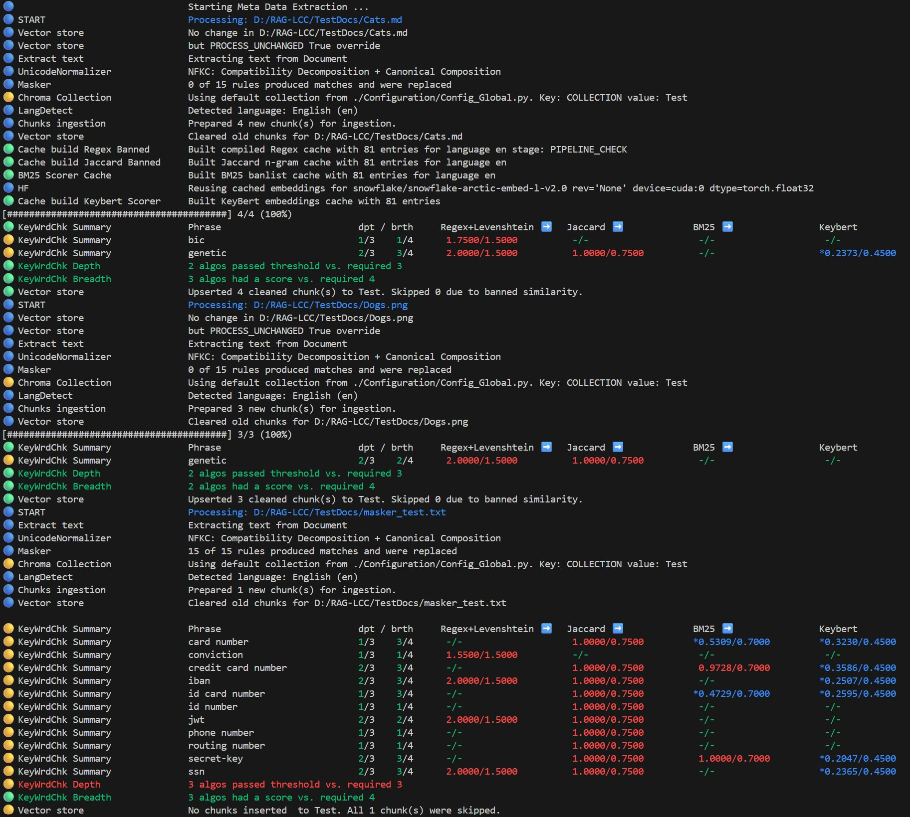
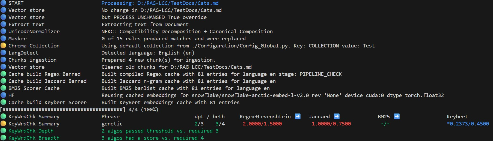
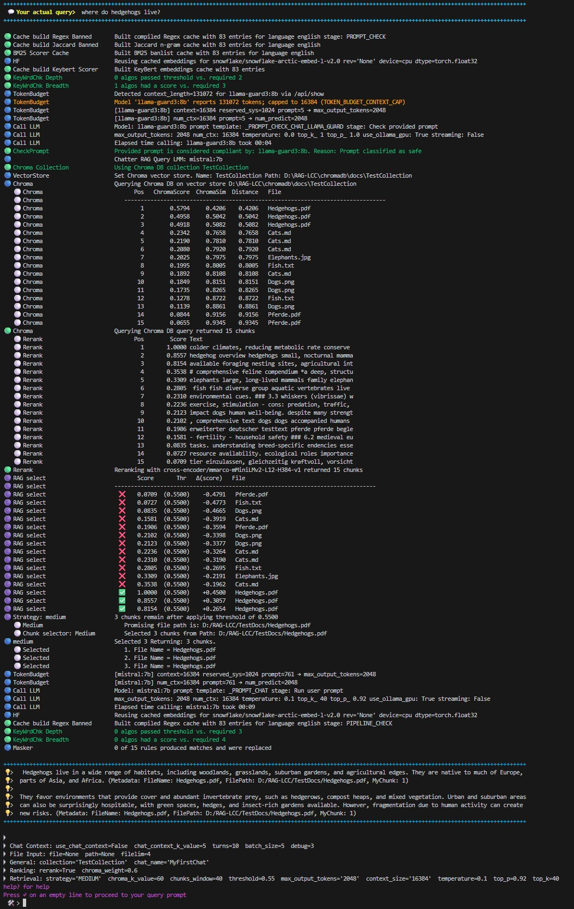
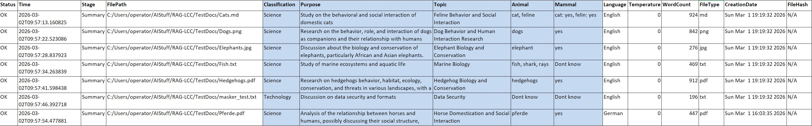
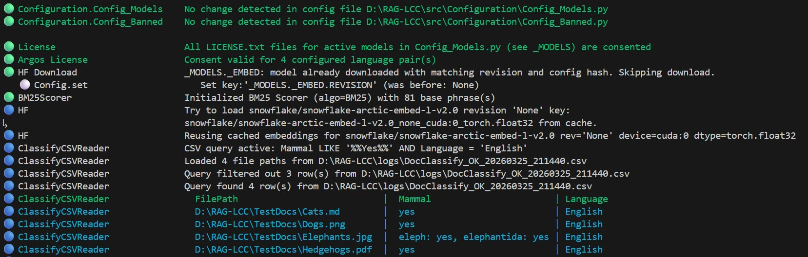

<!-- markdownlint-disable MD033 -->
# Local Corpus & Classification (RAG-LCC)

<p align="center">
  
</p>
<p align="center"><em>Hedgehog created with Copilot AI</em></p>

<p align="center">
  🔬 <strong>Retrieval-Augmented Generation (Local Corpus & Classification)</strong>
</p>

<p align="center">
  <b>RAG‑LCC</b><br>
  A modular, offline‑first research framework for local document ingestion,
  hybrid retrieval, and operator‑controlled content inspection.
  <br><br>
  Designed for experimentation with Retrieval‑Augmented Generation (RAG) techniques,
  including Query‑Driven Document Routing, staged retrieval pipelines,
  and configurable detection heuristics.
</p>

---

## Overview

**RAG‑LCC** (Local Corpus & Classification) is an experimental research environment focused on:

- **Local and offline‑first operation**
Local and offline‑capable operation
After the initial setup phase, the system can operate locally without requiring continuous network access, depending on your configuration and environment.

- **Configurable ingestion and detection pipelines**
  Apply custom heuristics, filters, and classifiers during document processing.

- **Query‑Driven Document Routing**
  The system can classify and select relevant documents *based on the user’s prompt*.
  Then load those documents into a local vector store for downstream retrieval.

- **Hybrid Retrieval Stack**
  Combine filter algorithms, LLM prompt checking, dense embeddings, rerankers inside a unified chain.

- **Operator‑Visible and Operator‑Controlled**
  Every step in the pipeline is transparent, adjustable, and intended for iterative experimentation.

This project is intended for **research, prototyping, and educational use**.
It does **not** claim performance guarantees, production readiness, or novel scientific breakthroughs.
Instead, it provides a flexible sandbox to explore retrieval strategies and classification workflows in a controlled local environment.
</p>

<p align="center">
  <code>RAGLoad</code> · Document Ingestion &nbsp;|&nbsp;
  <code>RAGChat</code> · Retrieval & Chat &nbsp;|&nbsp;
  <code>DocClassify</code> · Batch Classification
</p>

<p align="center">
  For the definition of <em>"Compliance"</em> as used in this project, see
  <a href="LEGAL.md#-definition--compliance-rag-lcc"><code>LEGAL.md</code></a>.
</p>

## ✨ High‑Level Features

- Classify‑then‑Load Workflow — optionally filter `DocClassify` results with SQL WHERE queries before ingestion
- Local document ingestion into ChromaDB
- Retrieval‑Augmented Generation (RAG)
- Configurable multi‑algorithm filter chains
- Prompt and output validation using LLMs
- Human‑review workflows via CSV/XLSX logs
- Local‑only operation by default

All outputs and classifications are heuristic and probabilistic.

---

## 🔗 Filter Chain (Detection Pipeline)

The framework includes configurable filter chains that apply algorithms such as:

- Jaccard similarity
- BM25 scoring
- Regex + Levenshtein matching
- KeyBERT keyword extraction
- Optional embedding‑based similarity

Algorithms contribute independent scores which are evaluated using **consensus rules**
(depth and breadth thresholds).

Detection results:

- do **not** constitute legal or regulatory determinations
- do **not** guarantee prevention or correctness
- must always be reviewed by a human before action

---

## 📂 Classify‑then‑Load Workflow

`RAGLoad` can optionally consume the classification output produced by
`DocClassify` so that **only documents classified as relevant** are ingested
into the vector store.

When a classify CSV path is provided, `RAGLoad` reads the classification
CSV that `DocClassify` wrote and limits ingestion to the file paths
listed therein. An optional SQL WHERE clause (`CLASSIFY_CSV_QUERY`) can
further narrow the allow‑set by filtering the CSV rows through an
in‑memory SQLite table — for example, ingesting only documents where
`Animal LIKE '%cat%'` or `Mammal LIKE '%Yes%' AND Language = 'English'`.

## �📋 Human Review and Logs

Documents flagged by detection pipelines are logged to `.csv` and
`.xlsx` files for **human review**.

Audit and log files:

- are provided for experimental and diagnostic purposes only
- are not guaranteed to be complete or tamper‑proof
- must not be relied upon as legally authoritative records

---

## 🏠 Local Operation and Internet Access

RAG‑LCC is designed to run **locally**.

- Internet access is **disabled by default**
- Network access must be explicitly enabled by the operator
- No telemetry is collected

Actual behavior depends on configuration, environment, and third‑party components.

---

## 🔁 Incremental Processing and Human‑Review Exclusions

RAG‑LCC supports optional efficiency and review‑awareness features:

- **Skip unchanged documents** — files whose content hash has not changed since the last run can be detected and skipped automatically.
- **Exclude flagged documents** — files previously flagged for human review can be excluded from further processing.

---

## 🔍 Network Activity Observation (Optional)

RAG‑LCC includes an optional Python‑level socket activity tracer that can log certain DNS
and connection attempts when explicitly enabled.

This mechanism:

- may assist in observing some Python‑level network activity
- does **not** guarantee full visibility
- does **not** prevent network access
- is **not a security control**

See `SECURITY.md` for details and limitations.

---

## 📖 Documentation

- Architecture overview: `ARCHITECTURE.md`
- Legal and governance notes: `LEGAL.md`
- Security considerations: `SECURITY.md`
- Hands‑on examples: `HANDS_ON_TOUR.md`

---

## 📄 Text Extraction

The framework extracts text from common file types and applies Unicode normalization and masking to the extracted text before downstream processing.

## 📎 Microsoft Office document extraction

Text from Office formats (.doc(x), .ppt(x), .xls(x)) is extracted if a local Office installation is available. See [Office Document Extraction](#-office-document-extraction) for configuration options.

> **Note:** Microsoft Office is **not** included with or distributed by RAG‑LCC. Users must obtain and license Microsoft Office independently. The Python bridge library `pywin32` (included in the project's dependency list) provides COM automation access to a locally installed Office suite but does not replace or include Office itself.

---

## 💾 Caching

For details, see [Caching in ARCHITECTURE.md](ARCHITECTURE.md#caching).

---

## 🌐 Translation

Banned-word lists can be translated to the document language for detection using [Argos Translate](https://www.argosopentech.com/) (local, offline neural machine translation).
For details see [6. Install Argos Translate](#-6-install-argos-translate).

---

## 🔄 Reverse Stemming

Extracted classification keys can be reverse-stemmed optionally (best effort).

---

## 📜 Model and License Consent

RAG‑LCC does **not** bundle or redistribute:

- LLMs
- embedding models
- cross‑encoders
- translation packages
- OCR engines

All models and dependencies are obtained independently by the operator.

Where applicable, RAG‑LCC includes **consent workflows** that record that a license text
was fetched and acknowledged.

**Important:**
RAG‑LCC does **not** verify the legal validity, completeness, or applicability of any
license text and does **not** guarantee that recorded consent is sufficient for any
particular use case or jurisdiction.

---

## 📦 Third‑Party Dependencies

All third‑party software is obtained directly from upstream sources.

RAG‑LCC:

- does not control dependency code or supply chains
- does not audit third‑party security
- does not guarantee license compatibility

Operators are solely responsible for reviewing, accepting, and complying with all
third‑party licenses and obligations.

---

## ⚙️ Configuration and Experimentation

RAG‑LCC exposes extensive configuration options, including:

- algorithm selection and thresholds
- retrieval strategies
- chunking parameters
- model selection
- masking rules

Configuration defaults reflect values used in this repository for experimentation and
are **not recommendations** for any specific environment or risk profile.

---

## RAG‑LCC — Disclaimer

### ⚠️ Experimental Research Framework

RAG‑LCC is an **experimental research framework** intended solely for **laboratory use, evaluation, and learning**.
It is **not** production software and must **not** be used in operational, regulated, safety‑critical, or compliance‑critical environments.

### 🚫 No Support, No Warranty, No SLA

This project is provided **as‑is** with **no**:

- support or assistance
- issue response or troubleshooting
- bug fixes, patches, or security updates
- maintenance or compatibility commitments
- service‑level objectives or availability guarantees

No warranty—express or implied—is provided regarding correctness, completeness, security, reliability, or fitness for any purpose.

### 🔐 Legal, Regulatory, and Security Responsibility

All **legal**, **regulatory**, **operational**, and **security** risks arising from the use of this software are assumed entirely by the **operator**.

This project is **not** a legal, security, governance, or compliance solution.
Nothing in the source code, documentation, examples, or logs should be interpreted as legal or security advice.

For definitions, constraints, and further detail, review:

- [LEGAL.md](LEGAL.md)
- [SECURITY.md](SECURITY.md)

### 🎯 Intended Use

RAG‑LCC is intended for:

- local experimentation with RAG pipelines
- research into filter chains and scoring
- teaching and learning RAG architectures
- development and testing of custom detection algorithms

It is **not** intended for end users, enterprises, or regulated operational deployment.

### 📉 Limitations

Detection and validation mechanisms in this framework are **probabilistic**.
False positives and false negatives **will** occur.

Scope includes:
*document ingestion, prompt validation, document classification, and LLM output validation as defined in* `./src/Configuration/Config_*.py`.

### ⚠️ Final Notice

Use of RAG‑LCC is entirely **at the operator’s own risk**.
Nothing in this repository guarantees correctness, safety, regulatory conformity, or suitability for any specific environment or risk profile.

## 📸 Examples

Also **helpful**: see the example session and suggestions for further experimentation in [HANDS_ON_TOUR.md](HANDS_ON_TOUR.md).

```Windows
Note: The outputs were created running RAGLoad.py RAGChat.py and DocClassify.py as follows:
python ./src/Apps/RAGLoad.py      --doc-dir TestDocs
python ./src/Apps/RAGChat.py      --doc-dir TestDocs
python ./src/Apps/DocClassify.py  --doc-dir TestDocs
```

### 📥 RAGLoad

`RAGLoad` upserts only chunks that passed the filter algorithms and prompt check to the vector DB. The filter algorithms and prompt check can be individually configured in `./Configuration/Config_Banned.py`.



Note that "bic" has been listed for the Cats.md. This word has been found by the fuzzy regex search. You could set `FUZZY_REGEX_EVAL_AFTER_HARD` to False in `./Configuration/Config_Banned.py` for RAGLoad and "bic" would not be matched.



The next output shows what happens if banned words are added. The document to be loaded is in the `TestDocs` directory. `Pferde.pdf` is a document about horses in German. The following banned words have been added to the configuration:

```Python
   "horse",
   "horse man",
   "saddle",
   "mood",
   "view",
   "western riding",
```

This produces:


**After** removal of the banned words, no algorithm reaches its threshold:


Since only 2 algorithms scored above their threshold (depth check) and only 2 different algorithms produced a non-zero score (breadth check), the required consensus is not reached and the chunks are loaded. Adjusting depth, breadth, or threshold values determines whether chunks are loaded or rejected. If you change these values in `./Configuration/Config_Banned.py` for RAGLoad and set them to 1, more chunks will not load into the Vector DB.

```Python
    # How many algos must be above their thresholds to trigger a block
    "REQUIRED_ALGOS_ABOVE_THRESHOLD": 1,
    # How many different algos must produce a non-zero score
    "REQUIRED_DIFFERENT_ALGOS_HAVE_A_SCORE": 1,
```

**Note** if you change values in `./Configuration/Config_Banned.py` you must adjust the hash value for this configuration in `./Configuration/Config_Global.py`. See [Update the hashes](#-update-the-hashes).

### 💬 RAGChat

`RAGChat` maintains a session with customizable retrieval parameters and per-collection chat context.
The example of passed filter also shows how the chunks for the context were selected from the Chroma DB. This information may be useful for experimentation and parameter tuning.



And here two prompts were the first was caught by the filter chain algos and the second by the prompt validation LLM:


### 🏷️ DocClassify

`DocClassify` classifies documents using a cascade of algorithms and configurable thresholds. Classification outputs are written to CSV and XLSX. Here the output using the configuration from `Configuration/Config_DocClassify.py`:



### � Classify‑then‑Load

The classify‑then‑load workflow chains `DocClassify` and `RAGLoad`: first classify your corpus, then feed only the matching rows into `RAGLoad` using `--load-from-classify-csv` and `--classify-csv-query`. The query accepts a SQL WHERE clause (SQLite syntax) to filter the classification CSV before ingestion.


The bottom of the image shows the files matched the SQLite query.

### �🔧 Filter chain configuration state

A summary of the enabled check algorithms is shown at startup:


For details on filter chains, see [Consensus Scoring & Experimentation in ARCHITECTURE.md](ARCHITECTURE.md#consensus-scoring--experimentation).

---

### 🧮 Algorithms

For details on detection algorithms, see [Detection Algorithm Architecture in ARCHITECTURE.md](ARCHITECTURE.md#detection-algorithm-architecture).

For compliance chain details, see [Compliance Chain in ARCHITECTURE.md](ARCHITECTURE.md#compliance-chain).

### 🏗️ Architecture

For an architecture overview refer to the [Architecture Guide](ARCHITECTURE.md).

For details on the extraction and KeyBERT variant configuration, see [Extraction & KeyBERT Variant Configuration in ARCHITECTURE.md](ARCHITECTURE.md#extraction--keybert-variant-configuration).

For a summary of all selector + variant dictionary patterns used across the configuration files, see [Selector Pattern Overview in ARCHITECTURE.md](ARCHITECTURE.md#️-selector-pattern-overview).

### 📂 Project Structure

```text
src/
├── AI/               AI model interaction (LLM calling, model cache, token budget)
├── Algos/            Detection algorithms (Regex, Jaccard, Cosine, KeyBERT, BM25, Levenshtein, Masker, etc.)
├── Apps/             Application entry points (RAGLoad, RAGChat, DocClassify)
├── Chat/             Conversation and query handling
├── Commons/          Shared infrastructure (exceptions, network tracer, singleton, startup)
├── Compliance/       License management, exclusions, banned-phrase collection
├── Config/           Runtime configuration singleton
├── Configuration/    Static parameter definitions (Config_*.py)
├── Globals/          Shared state (logging, counters, session)
├── Gui/              Terminal UI helpers (banner, colors, symbols, informer, collection picker, pretty writer)
├── Helpers/          General utilities (ChromaDB, CSV, classify-CSV reader, file utils, Office converter, etc.)
├── Pipeline/         Orchestration (LoadAndClassifyProcessor)
├── Scripts/          Standalone maintenance scripts (Argos package management)
└── Strategies/       Processing strategies + classification/chunking helpers
```

For the full file-level source tree, see [Source Tree in ARCHITECTURE.md](ARCHITECTURE.md#source-tree).

### 🙏 Acknowledgments

For third-party library acknowledgments and licensing attribution, see [ACKNOWLEDGMENTS.md](ACKNOWLEDGMENTS.md).

### 📊 Class diagrams

Class and overview diagrams are in `./Documentation/ClassGraphs`.

---

## 🚀 Quickstart Guide for RAG-LCC

This guide helps you set up RAG-LCC, an **experimental lab environment**.

### 📋 Prerequisites

- **Python 3.13** (developed and tested with 3.13; minimum 3.10)
- Memory and disk resources appropriate for the example models
- Optional GPU for faster inference (see [GPU Setup](#-gpu-setup) below)
- Optional: Visual Studio Code (used during development)
- Tested and developed on Windows 11

### ✅ 1. Pre-install Checklist

Complete these steps before running any install command.

#### ⚖️ Review third-party licenses

Inspect `./3rdPartyLicenses` and obtain any required approvals before installing dependencies.

### 📦 2. Clone and Setup

> **Important:** RAG-LCC must be installed in its own dedicated directory. Do not clone it into an existing project folder or a shared location. The application uses its installation directory as a trust boundary — file and directory deletions (e.g. ChromaDB collection removal) are restricted to paths inside the project root. Placing RAG-LCC inside another project's tree may cause unintended interactions.

```bash
# Clone repository (replace with your repository URL)
git clone https://github.com/HarinezumIgel/RAG-LCC.git
cd RAG-LCC
# Create and activate a virtual environment
python -m venv .venv
# Unix
source .venv/bin/activate
# Windows PowerShell
.venv\Scripts\Activate.ps1
```

#### ✅ Verify file signatures

Run the signature verification script to confirm that shipped files have not been tampered with. The public key is in `verify_sign/`.

```powershell
.\scripts_posh\VerifySignature.ps1 -InputDir .
```

### 📥 3. Install Dependencies

The `./Req_From_DEV` folder contains `requirements_final.txt` and a list of required modules. Consult [3rdPartyLicenses](3rdPartyLicenses/Licenses.md) for an overview of development environment licenses.

```bash
# Install dependencies only after you have reviewed the license files
pip install -r Req_From_DEV/requirements_final.txt
```

If pip reports a **dependency conflict** (`ResolutionImpossible`), the most common cause is a package pinned to an exact version whose dependencies clash with another pinned package. Open `Req_From_DEV/requirements_final.txt`, find the offending pin(s) and either loosen them to a minimum range (e.g. `langchain-huggingface>=1.0.1`) or remove the line(s) entirely so pip can resolve compatible versions automatically. Then re-run the install command above.

### ⚖️ 4. Post-install license review

To generate a new third-party license report based upon your **actual** `.venv` run in powershell:

```powershell
.\scripts_posh\Show3rdPartyLicenses.ps1 -ProjectPath . -VenvName <your venv> -ContainingLicenseDirectoryName <directory for license summary files>
```

You may need to install pip-licenses first.

View the generated Licenses.* file, available as .md, .json, .spdx.

### 🤖 5. Install Ollama (Required for Local LLMs)

RAG-LCC supports local LLMs via Ollama. Install Ollama from: <https://ollama.com>
Ollama is licensed under the [MIT License](https://github.com/ollama/ollama/blob/main/LICENSE).

## 📋 Model permission requirement

Some models are distributed under licenses that require you to accept the
license terms before use (for example, Meta's Llama Community License for the
Llama LLM and Llama Guard model).
Ollama does **not** enforce a gating step, so `ollama pull` will succeed
without prior approval; however, **by downloading and using the model you are
still bound by the model owner's license terms**.

## ✅ Required: model license consent

RAG-LCC does not download LLMs. On startup `RAGLoad.py`, `RAGChat.py` and `DocClassify.py` check whether the licenses belonging to the models used in `./Configuration/Config_Models.py` have been accepted.
RAG-LCC asks you whether it may temporarily allow internet access to fetch the licenses. Then you are guided through the license consent loop. The fetched licenses and operator consent are stored in `./ModelGovernance/licenses`. Operators can monitor network activity using the built-in [Socket-Level Network Tracing](#-socket-level-network-tracing).

Hugging Face models (embedder and cross-encoder) follow a separate consent-based download flow. See [Hugging Face Models (Embedder + Cross-Encoder)](#-hugging-face-models-embedder--cross-encoder) for details on when and how these models are downloaded.

## 📥 Install the models in Ollama

Pull the models referenced in your configuration (example). By downloading and using these models, you are bound by the model owner's license terms.

```shell
ollama pull mistral:7b
ollama pull llama3.1:8b
ollama pull llama-guard3:8b
```

### 🌍 6. Install Argos Translate

RAG-LCC supports optional local translation of banned phrases from English to the detected document language using Argos Translate.

- Argos License is here: <https://github.com/argosopentech/argos-translate?tab=MIT-1-ov-file>
- Stanza License is here: <https://github.com/stanfordnlp/stanza?tab=Apache-2.0-1-ov-file>
- To enable this feature please refer to: <https://www.argosopentech.com>

```shell
pip install argostranslate
```

**Important:** When `ARGOS_STANZA_DOWNLOAD` is `"0"` (default used in this repository), the Argos Translate language packages for the languages expected in your documents must be **pre-installed** before processing. If a document's language is not installed, translation is skipped, a warning is issued, and the compliance pipeline falls back to English-normalized patterns. When `ARGOS_STANZA_DOWNLOAD` is `"1"`, stanza may download missing tokenizer models at runtime, so pre-installation is not strictly required — but a warning is still issued if no matching translation pair is found.

#### Controlling behaviour for unsupported languages

The config key **`UNSUPPORTED_LANGUAGE_ACTION`** (in `Config_Global.py`) determines
what happens when a document’s detected language is not installed:

| Value           | Behaviour                                                                 |
|-----------------|---------------------------------------------------------------------------|
| `FALLBACK_EN`   | *(default)* Process silently with English-only banlists                   |
| `NOT_OK`        | Reject the document -- write to NOT_OK CSV, skip all further processing   |

Install language packages using the provided helper script:

```powershell
# Install Argos Translate language packages.
# Languages to install are defined in Config_Global.py ARGOS_LANGUAGES slot
# Each package bundles the required stanza tokenizer models.
# The script shows what will be installed and asks for confirmation before proceeding.
python src\Scripts\ArgosTranslatePackages.py install

# Remove all installed Argos Translate language packages.
# The script shows what will be removed and asks for confirmation before proceeding.
python src\Scripts\ArgosTranslatePackages.py remove
```

Enable the languages you need, see [Translation configuration (Argos)](#-translation-configuration-argos).

For license consent details, see [Argos](#-argos).

Each Argos Translate language package bundles the stanza tokenizer models it needs (stored inside the package directory, e.g. `~/.local/share/argos-translate/packages/<pkg>/stanza/`). Without the correct language packages installed, translation is skipped at runtime and non-English documents fall back to English-normalized patterns (e.g. German "Pferde" would not match the banned word "horse"). The remove command uninstalls all Argos packages and their bundled stanza models.

The setting in ./Configuration/Config_Internet_Env.py forces local translation:

```Python
# ARGOS_MODEL_PROVIDER: Force Argos to use local package-based translation
# and avoid remote provider paths (LibreTranslate/OpenAI).
os.environ["ARGOS_MODEL_PROVIDER"] = "OPENNMT"
```

```Python
# ARGOS_CHUNK_TYPE: Select the sentence boundary detection (SBD) backend
# used by Argos Translate before translating.
# "SPACY"  = use SpaCy sentencizer (works offline, default used in this repository).
# "STANZA" = use stanza Pipeline (broken offline in argos-translate ≥1.11,
#            see argosopentech/argos-translate#385 / #512).
# "MINISBD" / "ARGOSTRANSLATE" / "DEFAULT" = other options.
os.environ["ARGOS_CHUNK_TYPE"] = "SPACY"
```

> **Note:** You may see the warning `Language en package default expects mwt, which has been added` during translation. This is a harmless informational message from **Stanza** (the NLP tokenizer used internally by Argos Translate). It means the English language model expects a Multi-Word Token (MWT) processor and Stanza added it automatically. No action is required.

### 📝 7. NLTK Stopwords (Text Preprocessing)

Install NLTK:
NLTK license is here: <https://raw.githubusercontent.com/nltk/nltk/refs/heads/develop/LICENSE.txt>

```shell
pip install nltk
```

Download the stopwords corpus manually:

```python
import nltk
nltk.download("stopwords")
```

If `NLTK_STOPWORDS_DOWNLOAD` in `Configuration/Config_Internet_Env.py` is set to `"1"` and a stopword list for a newly detected language is missing, RAG‑LCC will download the required NLTK stopword corpus.
If downloads are disabled (default used in this repository `"0"`), the system falls back to an empty stopword list.

Adjust the NLTK data path in `Configuration/Config_Global.py` if needed:

```python
_CUSTOM_NLTK_DATA_DIRECTORY = (
    _ABSOLUTE_PATH + r"\AppData\Roaming\nltk_data\corpora\stopwords"
)
```

### 👁️ 8. Installing OCR Support (Tesseract)

RAG‑LCC uses [Tesseract OCR](https://github.com/tesseract-ocr/tesseract) ([Apache-2.0 License](https://github.com/tesseract-ocr/tesseract/blob/main/LICENSE)) to extract text from non plain text files. The Python wrapper [pytesseract](https://github.com/madmaze/pytesseract) is also licensed under [Apache-2.0](3rdPartyLicenses/Licenses.md#pytesseract-0313).

> **Note:** Tesseract OCR is **not** included with or distributed by RAG‑LCC. Operators must obtain and install the Tesseract engine independently. By downloading and using Tesseract, operators are bound by its license terms.

You must install the Tesseract engine separately:

Windows
Download the official installer:
<https://github.com/UB-Mannheim/tesseract/wiki> ([Apache-2.0 License](https://github.com/UB-Mannheim/tesseract/blob/main/LICENSE))

Then adjust in ./Configuration/Config_Global.py, eg:

```python
_TESSERACT_PATH = r"C:\Program Files\Tesseract-OCR\tesseract.exe"
```

### 🎮 GPU Setup

If your machine has an NVIDIA GPU and you want to use it for inference:

1. Install the [NVIDIA CUDA Toolkit](https://developer.nvidia.com/cuda-downloads) ([EULA](https://docs.nvidia.com/cuda/eula/index.html)) matching your GPU driver.
2. Install the CUDA-enabled PyTorch wheels **inside your virtual environment**:

   ```bash
   pip install torch torchvision torchaudio --index-url https://download.pytorch.org/whl/cu121
   ```

   Adjust the `cu121` suffix to match your installed CUDA version.
3. Set `USE_CPU = False` and `EMBEDDER_BITS = 16` or `EMBEDDER_BITS = 32` in your configuration.

> **Note:** The NVIDIA CUDA Toolkit is **not** included with or distributed by RAG‑LCC. Operators must obtain and install it independently. By downloading and using the CUDA Toolkit, operators accept NVIDIA's [EULA](https://docs.nvidia.com/cuda/eula/index.html). PyTorch is licensed under the [BSD-style license](https://github.com/pytorch/pytorch/blob/main/LICENSE).

If `USE_CPU` is `False` but no functional GPU is detected (possible drivers/runtime not installed in the venv), the application will automatically fall back to CPU with 32-bit precision and display a warning.

## 👀 Review the example config files

Please read `Configuration/Config_Models.py` before enabling internet access or accepting model licenses.

### 📋 If ok, copy example configs into place

Manually copy the example configuration files into the `Configuration/` folder.

```powershell
copy ./Examples/Example_Config_Banned.py ./src/Configuration/Config_Banned.py
copy ./Examples/Example_Config_Models.py ./src/Configuration/Config_Models.py
```

Open `Configuration/Config_Banned.py` and `Configuration/Config_Models.py` and configure the settings according to your needs.

### 🧪 9. Run the tests

You may need to install [pytest](https://docs.pytest.org/en/latest/) ([MIT License](3rdPartyLicenses/Licenses.md#pytest-902)) first.

```python

pip install pytest
python .\tests\RunTests.py
```

### ⚙️ 10. Adjust Configuration

### 🤖 LLM, Embedder and Cross Encoder

For details on how model implementations are selected, see [Model Implementation Selectors in ARCHITECTURE.md](ARCHITECTURE.md#model-implementation-selectors).

### 🔌 Define Ollama endpoint

```python
# If Ollama runs on a non-default URL/port, adjust
_OLLAMA_BASE_URL = "http://localhost:11434/api/generate"
```

## 🌍 About internet

See [Internet Access](#-internet-access) for details on how internet connectivity is configured and controlled.

## 🔑 Initial consent workflow

You will be guided through a two-step process which ensures that you:

1. Confirm changes to Config_Models.py and Config_Banned.py. See [Update the hashes](#-update-the-hashes).
2. Consent to the licenses belonging to the models used in Models.py, see [License consent](#-license-consent).
Both are recorded so in future runs these steps are skipped unless you make changes

## ▶️ Start RAGLoad.py

```python
./src/apps/RAGLoad.py
```

The expected configuration hashes are displayed:

## 🔒 Update the hashes

- `_MODELS_CONFIG_HASH = "<new_hash>"`   — update after editing Configuration/Config_Models.py
- `_BANNED_CONFIG_HASH = "<new_hash>"`   — update after editing Configuration/Config_Banned.py

After any change in these 2 files the new required hash is displayed at startup of RAGLoad, RAGChat or DocClassify.

## ▶️ Start RAGLoad.py again

```python
./src/apps/RAGLoad.py
```

If you see a `RequestsDependencyWarning` see [Troubleshooting](#-troubleshooting).

## 📝 License consent

You are asked to consent to the licenses for the models defined in `Config_Models.py`. With the default used in this repository  `LICENSE_DOWNLOAD = "0"`, RAG‑LCC prompts you with `[y/N]` on each individual license download. You can also set `LICENSE_DOWNLOAD` to `"1"` in `Config_Internet_Env.py` to skip the per-fetch prompt if this is acceptable for your environment and policies.

This step is repeated for each of the 8 models defined in the `_MODELS` configuration in `Config_Models.py`. Once consented, license consent is only re-requested if a local license file is missing, the config hash changes, or — when `LICENSE_DOWNLOAD` is enabled — a changed remote license text or TLS certificate is detected.

```text
🟡 License                        mistral._LLM: missing license or metadata
🟡 License                        License consent required
Press Enter to accept as-is or type your email/ID to override: y
🔵 License                        Mistral 7B: fetching LICENSE from https://huggingface.co/datasets/choosealicense/licenses/resolve/main/markdown/apache-2.0.md
🔵 License                        >>>> Internet connection is set to 'None'
🔵 License                        >>>> Do you allow to online fetch license for  [Mistral 7B] from URL:
↳                                 https://huggingface.co/datasets/choosealicense/licenses/resolve/main/markdown/apache-2.0.md

>>>>  [y/N] y
🔵 License                        Fetching license online from: https://huggingface.co/datasets/choosealicense/licenses/resolve/main/markdown/apache-2.0.md

🔵 License                        First time online fetch: [mistral._LLM] [Mistral 7B]

=​=====================================================================
  Model License Consent  (first online fetch)
  Section: mistral._LLM  /  Mistral 7B
=​=====================================================================

Press Enter to review the license ...
```

## 🌐 Internet Access

Internet access is configured in `Configuration/Config_Internet_Env.py`.

| Environment Variable | default used in this repository | Purpose |
| --- | --- | --- |
| `LICENSE_DOWNLOAD` | `"0"` | Allow online fetch of model license files defined in `Config_Models.py`. When `"0"`, the Compliance module prompts for per-fetch consent. |
| `NLTK_STOPWORDS_DOWNLOAD` | `"0"` | Allow download of missing NLTK stopwords corpus. When `"0"`, the system falls back to an empty stopword list. |
| `RAG_LCC_NW_TRACE` | `"0"` | Socket-level network tracing (debug). |
| `RAG_LCC_STACK_TRACE` | `"0"` | Stack traces on errors. |
| `HF_HUB_OFFLINE` | `"1"` | Disable Hugging Face Hub downloads when `"1"`. |
| `TRANSFORMERS_OFFLINE` | `"1"` | Disable transformers library hub access when `"1"`. |
| `HF_DATASETS_OFFLINE` | `"1"` | Disable HF datasets hub access when `"1"`. |
| `ARGOS_STANZA_DOWNLOAD` | `"0"` | Control stanza network access for Argos Translate. When `"0"`, stanza is blocked from downloading — only pre-installed packages are used. When `"1"`, stanza may download missing tokenizer models at runtime. Requires prior license acceptance via `python src\Scripts\ArgosTranslatePackages.py install`. |
| `ARGOS_MODEL_PROVIDER` | `"OPENNMT"` | Force Argos Translate to use local packages only. |
| `ARGOS_CHUNK_TYPE` | "SPACY" | ARGOS_CHUNK_TYPE: Select the sentence boundary detection (SBD) backend |

For convenience, these values are displayed at startup.

```text
🔵 Environment variable           HF_HUB_OFFLINE=1
🔵 Environment variable           HF_DATASETS_OFFLINE=1
...
```

### 🔌 Socket-Level Network Tracing

When `RAG_LCC_NW_TRACE` is set to `"1"`, RAG-LCC monkey-patches Python's `socket.connect` and `socket.getaddrinfo` at startup via `NetworkTracer`. Every DNS resolution and outgoing TCP connection is logged to the console with a timestamp, the destination host/port, resolved IP addresses (forward DNS) or hostname (reverse DNS), and a filtered stack trace showing only project frames (site-packages are excluded). This may assist operators in observing certain Python‑level network activity and associated code paths, but does not guarantee completeness or accuracy. Set `RAG_LCC_STACK_TRACE` to `"1"` alongside it to also get full Python stack traces on errors.

### 🤗 Hugging Face Models (Embedder + Cross-Encoder)

If you enable HF_HUB_OFFLINE="0" and accept the model licenses, RAG-LCC will download the required Hugging Face models (embedder, cross encoder). In this case, a download consent is requested. Consent is recorded in the `ModelGovernance/consents` directory.

If internet is not reachable or HF_HUB_OFFLINE="1" you must install the HF models manually in the local HF cache.

In both cases, make sure the `_HF_HOME` and `_HF_HUB_CACHE` are set correctly:

```python
_HF_HOME = os.path.join(os.path.expanduser("~"), ".cache", "huggingface")
_HF_HUB_CACHE = os.path.join(_HF_HOME, "hub")
```

- If HF_HUB_OFFLINE="0", you are asked to give consent for the model download. Here the embedding model download.

```text
>>>> Missing model [Snowflake Arctic Embed L v2.0]

>>>> MODEL: snowflake/snowflake-arctic-embed-l-v2.0
>>>> REVISION: None
>>>> SOURCE: https://huggingface.co/Snowflake/snowflake-arctic-embed-l-v2.0


>>>> Do you accept downloading model [Snowflake Arctic Embed L v2.0]?

Proceed? [y/N]
```

Same for remaining models.

- If internet access is disabled, you get:

🔴 INTERNET ACCESS DISABLED       Model 'snowflake/snowflake-arctic-embed-l-v2.0' (revision 'None') was not found in the local cache. Searched cache:
↳                                 C:\Users\pfm\.cache\huggingface\hub Internet access is disabled (HF_HUB_OFFLINE="1"). Enable internet or place the model in
↳                                 the cache directory. (Probably change internet access flags in Configuration/Config_Internet_Env.py)

> **Note:** After completing these steps, internet access is typically no longer required,
> subject to configuration and third‑party behavior.

## 🌍 Argos

When language packages are pre-installed with the install script (`python src\Scripts\ArgosTranslatePackages.py install`), the script requires license consent for Argos Translate before downloading any packages. The consent is recorded in `ModelGovernance/consents/argos_translate/`.

When `ARGOS_STANZA_DOWNLOAD` is set to `"1"` in `Config_Internet_Env.py`, the Argos Translate license consent is also verified at runtime — similar to the LLM and HuggingFace model consent flow. If the license has not been accepted, execution is stopped and the operator is prompted to run the install script to complete the consent.

## 🏃 First run with data

### 📥 Load documents

Use the provided test documents in the `./TestDocs` directory. Load them into the Test Chroma DB collection.

```Windows
python .\src\Apps\RAGLoad.py --doc-dir TestDocs --collection Test
or, since `Config_Global.py` defines  `DOC_DIR` as "TestDocs" and `COLLECTION` as "Test"
python .\src\Apps\RAGLoad.py
```

### 💬 Chat with the documents in the Test Collection

```Windows
python .\src\Apps\RAGChat.py --collection Test
or, since `Config_Global.py` defines `COLLECTION` as "Test"
python .\src\Apps\RAGChat.py
```

### 🏷️ Classify the documents in the TestDocs folder

```Windows
python .\src\Apps\DocClassify.py --doc-dir TestDocs
or, since `Config_Global.py` defines `DOC_DIR` as "TestDocs"
python .\src\Apps\DocClassify.py
```

The classification results can be viewed in the file ./logs/DocClassify_OK*
See also the hints that are displayed by `DocClassify.py` on completion.

For hands-on examples, see [Change provided example prompt in HANDS_ON_TOUR.md](HANDS_ON_TOUR.md#change-provided-example-prompt).

### 📂 Load classified documents into the vector database

After classifying documents with `DocClassify`, you can feed only the approved files
into `RAGLoad` by pointing it at a classification CSV. Pass
`--load-from-classify-csv` with the CSV filename (resolved relative to the `logs/`
directory) or an absolute path:

```Windows
python .\src\Apps\RAGLoad.py --load-from-classify-csv DocClassify_OK_20260325_141005.csv
```

To further narrow ingestion to only rows whose classification columns match a
condition, add `--classify-csv-query` with a SQL WHERE clause. The CSV is loaded
into an in-memory SQLite table, so standard SQLite syntax is supported (`LIKE`,
`AND`, `OR`, `NOT LIKE`, `=`, `!=`, `IN`, etc.):

```Windows
python .\src\Apps\RAGLoad.py --load-from-classify-csv DocClassify_OK_20260325_141005.csv --classify-csv-query "Mammal LIKE '%%Yes%%'"
```

```Windows
python .\src\Apps\RAGLoad.py --load-from-classify-csv DocClassify_OK_20260325_141005.csv --classify-csv-query "Mammal LIKE '%%Yes%%' AND Language = 'English'"
```

The same settings can be made permanent in `Config_RAGLoad.py`:

```python
LOAD_FROM_CLASSIFY_CSV = "DocClassify_OK_20260325_141005.csv"
CLASSIFY_CSV_QUERY = "Mammal LIKE '%Yes%'"  # optional
```

When the classify‑then‑load filter is active, only file paths present in the CSV
are ingested; all other files in `DOC_DIR` are skipped. When a
`CLASSIFY_CSV_QUERY` is set, rows that do not satisfy the SQL condition are excluded
before the allow-set is built. Exclusion checks (`USE_EXCLUSIONS`) are bypassed
automatically because `DocClassify` already evaluated them during its run.

If the CSV file is not found, `RAGLoad` raises a `ClassifyCSVNotFoundError` and
stops immediately.

## 📚 Configuration Reference

### 📑 Lookup order

RAG-LCC uses seven configuration files, all located under `src/Configuration/`. They are loaded in a fixed precedence order (highest wins):
1-4 are loaded as Python modules and therefore require valid Python syntax. `Config_Internet_Env` contains environment variables only.

1. **App-specific** — `Config_RAGChat.py`, `Config_RAGLoad.py`, or `Config_DocClassify.py`
2. **Config_Banned.py** — detection algorithms, thresholds, banned words, masking rules
3. **Config_Models.py** — embedding, cross-encoder, and LLM model definitions
4. **Config_Global.py** — shared defaults (paths, hardware, ChromaDB, token budget, debug)

**Config_Internet_Env.py** — internet access, network tracing, and offline toggles (see [Internet Access](#-internet-access))

Rules:

- Keys starting with `_` are internal and **cannot** be overridden via CLI arguments.
- Keys starting with `$` are indirect lookups (the value names another config key).
- Top-level settings must be **UPPERCASE**.
- CLI overrides apply only to `Config_Global.py` and the **app-specific** config (`Config_RAGChat.py`, `Config_RAGLoad.py`, or `Config_DocClassify.py`). Keys in `Config_Models.py` and `Config_Banned.py` are **not** exposed as CLI arguments.

### 🌐 1. Config_Global.py — Shared Defaults

#### 💻 Hardware and Device

| Key | Default used in this repository | Purpose |
| --- | --- | --- |
| `USE_CPU` | `False` | Force CPU-only mode. Set `EMBEDDER_BITS = 32` when enabled. |
| `EMBEDDER_BITS` | `32` | Quantisation for embeddings. Use `32` on CPU; `16` on GPU (requires `accelerate`). |
| `USE_OLLAMA_GPU` | `True` | Let Ollama use the GPU for inference. |

#### 📁 Paths

| Key | Default used in this repository | Purpose |
| --- | --- | --- |
| `DOC_DIR` | `<project>/TestDocs` | Root folder for documents to load or classify. Searched recursively (subdirectories are included). |
| `_EXCLUSIONS_DIR` | `<project>/Exclusions` | Directory for per-collection exclusion CSVs. |
| `_CHROMA_DB_DIR` | `<project>/chromadb/docs` | ChromaDB persistent storage. |
| `_TESSERACT_PATH` | `C:\Program Files\Tesseract-OCR\tesseract.exe` | Tesseract binary for OCR text extraction. |

#### 🦙 Ollama

| Key | Default used in this repository | Purpose |
| --- | --- | --- |
| `_OLLAMA_BASE_URL` | `http://localhost:11434/api/generate` | Ollama endpoint. Change only when the server runs on a different host/port. |
| `OLLAMA_STREAMING_REQ` | `False` | Enable streamed responses from Ollama. |
| `REQUEST_TIMEOUT` | `600` | Seconds to wait for an Ollama response before timing out. |

#### 🎫 Token Budget

These three settings control the dynamic `max_output_tokens` calculation (see [Token Budget in ARCHITECTURE.md](ARCHITECTURE.md#token-budget) for the full formula):

| Key | Default used in this repository | Purpose |
| --- | --- | --- |
| `TOKEN_BUDGET_CONTEXT_CAP` | `16384` | Hardware cap. If Ollama reports a larger context window, this value is used instead. |
| `TOKEN_BUDGET_RESERVED_OUTPUT` | `2048` | Upper bound of tokens reserved for the model reply. |
| `TOKEN_BUDGET_RESERVED_SYSTEM` | `1024` | Tokens reserved for the system/instruction preamble. |

#### 🗄️ ChromaDB and Chunking

| Key | Default used in this repository | Purpose |
| --- | --- | --- |
| `CHROMA_COLLECTION_KEEP` | `True` | `True` = preserve existing collection on startup. `False` = wipe and recreate. Applies to `RAGLoad.py` **only** |
| `COLLECTION` | `"Test"` | Active ChromaDB collection name. Override with `--collection` on the CLI. |

The chunking parameters are on purpose in `Config_Global.py` so RAGLoad and RAGChat both refer to these settings ([Lookup order](#-lookup-order)) because they must be **identical** for both programs.
Switching between variants requires dropping and reloading the collection
(`CHROMA_COLLECTION_KEEP = False`) because HNSW parameters are immutable
after creation.

```python
_ACTIVE_CHROMA_EMBED_AND_RETRIEVE_PARAMS_CONFIG = "THOROUGH"   # selector: "THOROUGH" or "COMPACT"

_CHROMA_EMBED_AND_RETRIEVE_PARAMS = {
    "THOROUGH": {
        "CHUNK_SIZE": 256,            # Tokens per chunk
        "CHUNK_OVERLAP": 32,          # Overlap between consecutive chunks (10-20 % of CHUNK_SIZE)
        "NEIGHBORS_ON_LOAD": 512,     # HNSW neighbours explored at index time (RAGLoad)
        "NEIGHBORS_RETRIEVE": 512,    # HNSW neighbours explored at query time (RAGChat)
    },
    "COMPACT": {
        "CHUNK_SIZE": 128,
        "CHUNK_OVERLAP": 16,
        "NEIGHBORS_ON_LOAD": 64,
        "NEIGHBORS_RETRIEVE": 64,
    },
}
```

> **Note:** The following chunk sizes were observed during experimentation:

- technical papers: 256-512
- short articles: 128-256
- long documents: 512-1024.

#### 📎 Office Document Extraction

```python
_OFFICE_DOC_EXTRACTION = {
    "Word": False,
    "Power Point": False,
    "Excel": False,
}
```

Set a value to `False` if the corresponding Microsoft Office component is not installed.

Microsoft Office is a separately licensed product and is **not** provided by RAG‑LCC.

#### ⛔ Exclusion

These settings control whether excluded files are skipped during processing. For the full design, see [Exclusion + Incremental Hash Check in ARCHITECTURE.md](ARCHITECTURE.md#exclusion--incremental-hash-check-skip-unchanged-files).

| Key | Default used in this repository | Purpose |
| --- | --- | --- |
| `USE_EXCLUSIONS` | `False` | Skip files listed in the per-collection exclusion CSV. Excluded files are those flagged for human review. `RAGLoad` and `DocClassify`. |

#### 🐛 Debug Levels

```python
DEBUG_LEVEL = 3 # Default used in this repository
```

| Level | Label | What it shows |
| --- | --- | --- |
| 0 | None | Silent |
| 1 | Basic | High-level progress |
| 3 | Default | Default used in this repository; includes compliance decisions |
| 4 | Alogs | Algorithm internals |
| 50 | Components | Argos Translate, transformers |
| 60 | Chat Prompt | Chat Prompt |
| 70 | Extracted Content | Full extracted text per document |
| 80 | Ollama response | Raw LLM response bodies |
| 100 | Streaming request output | Token-by-token streaming output |

- `URL_DEBUG` (`False`) enables `urllib` HTTP debug output.
- `HF_DEBUG` (`False`) enables Hugging Face debug logging.

#### 🔧 Fix JSON LLM reply

For individual configuration switches such as `TRY_FIX_JSON_LLM_REPLY` (automatic JSON repair for LLM responses), see [JSON Repair for LLM Replies in ARCHITECTURE.md](ARCHITECTURE.md#json-repair-for-llm-replies).

#### 📟 Terminal

| Key | Default used in this repository | Purpose |
| --- | --- | --- |
| `TERMINAL_LINE_SIZE` | `160` | Line width used when formatting output. |

### 🤖 2. Config_Models.py — Model Definitions

This file defines every model used by RAG-LCC. After editing it, update `_MODELS_CONFIG_HASH` in `Config_Global.py` (the new hash is printed at startup). For details on how model implementations are selected, see [Model Implementation Selectors in ARCHITECTURE.md](ARCHITECTURE.md#model-implementation-selectors).

#### 🔩 Implementation Selectors

`Config_Models.py` uses a two-level dictionary `_MODELS[<impl>][<role>]` to resolve model configurations. Five top-level selector variables choose which implementation (impl key) to use for each model role:

```python
_LLM_CHK = "llama_guard"  # impl for _LLM_CHK role. llama_guard, llama, mistral
_LLM     = "mistral"      # impl for _LLM role. mistral, llama
_EMBED   = "snowflake"    # impl for _EMBED role
_CROSS   = "mmarco"       # impl for _CROSS role
_OLLAMA  = "ollama"       # impl for _OLLAMA role
```

| Selector | Default used in this repository | Resolves to | Allowed values |
| --- | --- | --- | --- |
| `_EMBED` | `"snowflake"` | `_MODELS["snowflake"]["_EMBED"]` | `snowflake` |
| `_CROSS` | `"mmarco"` | `_MODELS["mmarco"]["_CROSS"]` | `mmarco` |
| `_LLM` | `"mistral"` | `_MODELS["mistral"]["_LLM"]` | `mistral`, `llama` |
| `_LLM_CHK` | `"llama_guard"` | `_MODELS["llama_guard"]["_LLM_CHK"]` | `llama_guard`, `llama`, `mistral` |
| `_OLLAMA` | `"ollama"` | `_MODELS["ollama"]["_OLLAMA"]` | `ollama` |

To switch models, change the selector value to another key that carries a matching role entry in `_MODELS`.

#### 🧲 Embedding Model (`_MODELS["snowflake"]["_EMBED"]`)

Creates vector representations for semantic search. Used during RAGLoad (once per document), DocClassify (once per document), and RAGChat (every query). The impl key is selected by `_EMBED = "snowflake"`.

```python
"snowflake": {
    "_EMBED": {
        "MODEL": "snowflake/snowflake-arctic-embed-l-v2.0",
        "LICENSE": "Apache-2.0",
        ...
    },
},
```

### 🔄 _LLM/_LLM_CHK Model Combinations

`Config_Models.py` includes configuration entries for the following LLMs. The `_LLM` and `_LLM_CHK` variables select which model implementation is used for general LLM queries and compliance checking, respectively. The table below lists all supported combinations:

| `_LLM` | `_LLM_CHK` | LLM Model | Compliance Model | Notes |
| --- | --- | --- | --- | --- |
| `mistral` | `llama_guard` | Mistral 7B | Llama Guard 3 | Default configuration used in this repository. General-purpose LLM + dedicated guard model. |
| `mistral` | `llama` | Mistral 7B | Llama 3.1 8B | General-purpose LLM + Llama as compliance checker. |
| `mistral` | `mistral` | Mistral 7B | Mistral 7B | Same model for both roles. |
| `llama` | `llama_guard` | Llama 3.1 8B | Llama Guard 3 | Llama for generation + dedicated guard model. |
| `llama` | `llama` | Llama 3.1 8B | Llama 3.1 8B | Same model for both roles. |
| `llama` | `mistral` | Llama 3.1 8B | Mistral 7B | Llama for generation + Mistral as compliance checker. |

> **Note:** `llama_guard` is only valid for `_LLM_CHK` — it is a dedicated safety model and cannot serve the `_LLM` (generation) role. For details on the model selector mechanism, see [Model Implementation Selectors in ARCHITECTURE.md](ARCHITECTURE.md#model-implementation-selectors).
>
> **Attribution:** Llama 3.1 and Llama Guard 3 — Built with Meta Llama 3. Licensed under the Llama 3.1 Community License Agreement, Copyright © Meta Platforms, Inc. All Rights Reserved. By downloading and using these models, operators are bound by the model license terms.
>
> **Operator responsibility:** Each model has its own license. The operator is responsible for reviewing, accepting, and complying with the license terms of every model used. RAG-LCC does not warrant that any model is suitable for a particular purpose. See [License Consent](#-license-consent) and [Model permission requirement](#-model-permission-requirement).

---

#### 🔀 Cross-Encoder Model (`_MODELS["mmarco"]["_CROSS"]`)

Re-ranks search results retrieved from ChromaDB to improve relevance ordering. The impl key is selected by `_CROSS = "mmarco"`. Used by `RAGChat.py`.

```python
"mmarco": {
    "_CROSS": {
        "MODEL": "cross-encoder/mmarco-mMiniLMv2-L12-H384-v1",
        "LICENSE": "Apache-2.0",
        ...
    },
},
```

#### 🧠 Inference LLM (`_MODELS["mistral"]["_LLM"]`)

Generates responses (RAGChat) or classification labels (DocClassify). Runs locally via Ollama. The impl key is selected by `_LLM = "mistral"` (default used in this repository) or `_LLM = "llama"`.

```python
"mistral": {
    "_LLM": {
        "MODEL": "mistral:7b",
        "PROMPT_CHAT": "_PROMPT_CHAT",
        "PROMPT_CLASSIFY": "_PROMPT_CLASSIFY_MISTRAL",
        ...
    },
},
```

To switch models, change the `_LLM` selector variable in `Config_Models.py` (e.g. `_LLM = "llama"` resolves to `_MODELS["llama"]["_LLM"]` for Llama 3.1 8B). See the [_LLM/_LLM_CHK Model Combinations](#-_llm_llm_chk-model-combinations) table above for all supported values.

#### 🛡️ Compliance-Check LLM (`_MODELS["llama_guard"]["_LLM_CHK"]`)

A separate LLM used to validate prompts and outputs against compliance rules. Defaults to Llama Guard 3. The impl key is selected by `_LLM_CHK = "llama_guard"` (default used in this repository), `_LLM_CHK = "llama"`, or `_LLM_CHK = "mistral"`.

```python
"llama_guard": {
    "_LLM_CHK": {
        "MODEL": "llama-guard3:8b",
        "PROMPT_CHAT": "_PROMPT_CHECK_CHAT_LLAMA_GUARD",
        "PROMPT_CLASSIFY": "_PROMPT_CHECK_CLASSIFY_LLAMA_GUARD",
        ...
    },
},
```

#### ℹ️ Ollama Provider Metadata (`_MODELS["ollama"]["_OLLAMA"]`)

Records the Ollama provider details (URL, license). Not a model itself. The impl key is selected by `_OLLAMA = "ollama"`.

> **Important:** RAG-LCC does **not** download Ollama LLM models. You must install Ollama and pull models yourself, eg. `ollama pull mistral:7b`.

### 💬 3. Config_RAGChat.py — Retrieval and Response

#### 🎯 Chunk Selection Strategy

```python
CHUNK_SELECT_STRATEGY = "MEDIUM"   # One of: "NARROW", "MEDIUM", "WIDE", "ULTRA_WIDE"
```

Each strategy is a complete parameter set defined in `_STRATEGIES`. The key differences:

| Strategy | `chunks_window` | `chroma_k_value` | `threshold` | `max_output_tokens` | `filelim` | Use case |
| --- | --- | --- | --- | --- | --- | --- |
| NARROW | 20 | 160 | 0.75 | 8 192 | 0 | Precise, answer-focused |
| MEDIUM | 40 | 60 | 0.55 | 14 366 | 4 | Balanced (default used in this repository) |
| WIDE | 100 | 160 | 0.40 | 14 366 | 0 | Exploratory, high recall |
| ULTRA_WIDE | 1 500 | 3 000 | 0.20 | 14 366 | 0 | Exhaustive / debugging |

Strategy parameters explained:

| Parameter | Purpose |
| --- | --- |
| `chunks_window` | How many surrounding chunks to include around each hit. |
| `chroma_k_value` | Number of vector candidates fetched before cross-encoder reranking. |
| `threshold` | Minimum reranker score to keep a chunk. Higher = stricter. |
| `max_output_tokens` | Output token ceiling for this strategy (may be further reduced by the token budget). |
| `temperature` | LLM sampling temperature. Lower = more deterministic. |
| `top_k` | Limit sampling to the top-k most likely next tokens. |
| `top_p` | Nucleus sampling probability threshold. |
| `rerank` | `1` = enable cross-encoder reranking (used by default). |
| `chroma_weight` | Blend weight between vector similarity and reranker score (0-1). |
| `filelim` | Maximum contributing files. `0` = unlimited. |
| `collection` | ChromaDB collection. `"$COLLECTION"` resolves the global `COLLECTION` key. |
| `use_chat_context` | Include previous conversation turns in the prompt. |
| `chat_context_k_value` | Number of past turns to include when `use_chat_context` is `True`. |
| `turns` | Maximum conversation history depth. |
| `batch_size` | Parallel retrieval batch size. |
| `debug_level` | Per-strategy debug verbosity override. |

#### 💾 Chat and Settings History

Chat and settings history are stored in the `history/` directory. The fallback chat identifier is `_DEFAULT_CHAT_NAME = "MyFirstChat"`. Two history files are created:

- `<collection>_<chat name>_Query.txt`
- `<collection>_<chat name>_Settings.txt`

### 📥 4. Config_RAGLoad.py — Document Ingestion

This is the simplest app-specific config:

| Key | Default used in this repository | Purpose |
| --- | --- | --- |
| `_FRIENDLY_NAME` | `"RAGLoad"` | Internal identifier (do not change). |
| `_SEPARATORS` | `["\n", " ", "."]` | Text splitter separators in priority order. |
| `_CLASSIFICATION_KEYS` | `["Status", "Time", "Stage", ...]` | Columns written to the compliance CSV during ingestion. |
| `_KEY_BERT.TOP_N_FIRST` | `100` | Keywords from the first KeyBERT pass. |
| `_KEY_BERT.TOP_N_SECOND` | `60` | Keywords from the second KeyBERT pass. |

#### 🔍 Classify‑then‑Load

When a classify CSV path is provided, `RAGLoad` reads the classification CSV produced by a prior `DocClassify` run and limits ingestion to the file paths listed therein. All other files in `DOC_DIR` are skipped.

| Key | Default used in this repository | Purpose |
| --- | --- | --- |
| `LOAD_FROM_CLASSIFY_CSV` | `""` | Path to a `DocClassify` CSV. Accepts a filename (resolved relative to the `logs/` directory) or an absolute path. When non-empty, only documents listed in the CSV are ingested. |
| `CLASSIFY_CSV_QUERY` | `""` | Optional SQL WHERE clause applied to the loaded CSV rows. The CSV is loaded into an in-memory SQLite table; only rows satisfying the expression are included. Supports `LIKE`, `AND`, `OR`, `NOT LIKE`, `=`, `!=`, `IN`, etc. Example: `"Mammal LIKE '%Yes%' AND Language = 'English'"`. |

CLI example:

```bash
python src/Apps/RAGLoad.py --load-from-classify-csv DocClassify_OK_20260317_111105.csv
```

With a query filter:

```bash
python src/Apps/RAGLoad.py --load-from-classify-csv DocClassify_OK_20260317_111105.csv --classify-csv-query "Mammal LIKE '%Yes%'"
```

When the classify‑then‑load filter is active, exclusion checks (`USE_EXCLUSIONS`) are bypassed because `DocClassify` already evaluated exclusions during its run.

Classification results are heuristic and probabilistic — false positives and false negatives will occur. The classify‑then‑load filter does not add, verify, or guarantee any legal, regulatory, or compliance status of the ingested documents.

#### 🔄 Incremental Hash Check

| Key | Default used in this repository | Purpose |
| --- | --- | --- |
| `_PROCESS_IF_UNCHANGED` | `True` | Re-process files even when their hash has not changed. Set to `False` to skip unchanged files. File hash is stored in Chroma DB. |

### 🏷️ 5. Config_DocClassify.py — Document Classification

#### 🧩 Extraction Model Parameters (LLM)

Controlled by `_ACTIVE_EXTRACTION_CONFIG` (default used in this repository `"STRICT"`). Each variant is a nested dict inside `_EXTRACTION_MODEL_PARAMS`:

```python
_ACTIVE_EXTRACTION_CONFIG = "STRICT"   # Options: "STRICT", "BALANCED", "RECALL"
_EXTRACTION_MODEL_PARAMS: dict[str, dict[str, float | int]] = {
    # ==========================
    # Variant: STRICT
    # ==========================
    # Intended for highly constrained extraction scenarios where the model
    # is expected to abstain when confidence is low.
    "STRICT": {
        "TEMPERATURE_EXT": 0.0,  # Minimal sampling variability (backend-dependent)
        "TOP_K_EXT": 1,  # Very small candidate set
        "TOP_P_EXT": 1.0,  # Neutral nucleus value to avoid interaction effects
    },

    # ==========================
    # Variant: BALANCED
    # ==========================
    # Intended for cases where extremely tight constraints lead to unstable
    # formatting or incomplete outputs.
    "BALANCED": {
        "TEMPERATURE_EXT": 0.0,
        "TOP_K_EXT": 10,  # Small but non-minimal candidate pool
        "TOP_P_EXT": 0.85,  # Restricts low-probability tokens
    },

    # ==========================
    # Variant: RECALL
    # ==========================
    # Intended for scenarios requiring broader token exploration while still
    # remaining within a constrained sampling regime.
    "RECALL": {
        "TEMPERATURE_EXT": 0.1,  # Slightly increased variability
        "TOP_K_EXT": 40,
        "TOP_P_EXT": 0.92,
    },
}

```

#### 🔑 KeyBERT Keyword Extraction

Controlled by `_ACTIVE_KEYBERT_CONFIG` (default used in this repository `"STRICT"`). Each variant is a nested dict inside `_KEY_BERT`:

```python
_ACTIVE_KEYBERT_CONFIG = "STRICT"      # Options: "STRICT", "BALANCED", "RECALL"

_KEY_BERT: dict[str, dict[str, int | tuple[int, int]]] = {
    # ==========================
    # Variant: STRICT
    # ==========================
    # Intended for low-noise extraction pipelines where candidate volume
    # should be tightly controlled.
    "STRICT": {
        "TOP_N_FIRST": 60,  # Limited phrase candidate set
        "TOP_N_SECOND": 30,  # Restricted unigram list
        "NGRAM_PASS1": (1, 4),  # Constrains phrase length
        "NGRAM_PASS2": (1, 1),  # Unigrams only
    },

    # ==========================
    # Variant: BALANCED
    # ==========================
    # Intended for moderate expansion of candidate space while retaining
    # some control over noise.
    "BALANCED": {
        "TOP_N_FIRST": 80,
        "TOP_N_SECOND": 50,
        "NGRAM_PASS1": (1, 5),
        "NGRAM_PASS2": (1, 1),
    },

    # ==========================
    # Variant: RECALL
    # ==========================
    # Intended for broader candidate generation, with the expectation that
    # downstream filtering or scoring will be applied.
    "RECALL": {
        "TOP_N_FIRST": 150,
        "TOP_N_SECOND": 100,
        "NGRAM_PASS1": (1, 6),
        "NGRAM_PASS2": (1, 1),
    },
}
```

The two selectors are independent — you can mix variants (e.g. `STRICT` extraction with `BALANCED` KeyBERT). `Config_RAGChat.py` and `Config_RAGLoad.py` use a **flat** `_KEY_BERT` dict (no variant nesting); `Helpers._get_keybert_config()` detects the layout automatically.

#### 🏷️ Classification Keys

`_YOUR_CLASSIFICATION_KEYS` defines which fields the LLM must return in its JSON response. The default set used in this repository is:

```python
_YOUR_CLASSIFICATION_KEYS = [
    "Classification",   # Category labels
    "Purpose",          # Brief summary
    "Topic",            # Short topic phrase
    "Animal",           # What animals are discussed
    "Mammal",           # Is the animal a mammal
    "Language",         # Detected language
]
```

> **Important:** If you change these keys, you must also update the classification prompt templates (`_PROMPT_CLASSIFY_MISTRAL`, `_PROMPT_CLASSIFY_LLAMA`) so the LLM is instructed to return the matching key names in its JSON response.

`_CLASSIFICATION_KEYS` is the full column list written to CSV and includes both system columns (`Status`, `Time`, `FilePath`, etc.) and the user-defined keys above.

`CLASSIFICATION_WORD_CNT` is automatically derived from `len(_YOUR_CLASSIFICATION_KEYS)`. `SUMMARY_SENTENCE_CNT` default used in this repositoy is `10`.

`REVERSE_STEMMING = True` post-processes classification values to replace stems with their most matching original surface word.

#### 📝 Prompt Templates

Two prompt templates are included — `_PROMPT_CLASSIFY_MISTRAL` and `_PROMPT_CLASSIFY_LLAMA`. Both instruct the LLM to return a single JSON object with the keys listed in `_YOUR_CLASSIFICATION_KEYS`. Edit the prompt text and key list together to add or remove classification fields.

For a hands-on example, see [Change provided example prompt in HANDS_ON_TOUR.md](HANDS_ON_TOUR.md#change-provided-example-prompt).

### 🚧 6. Config_Banned.py — Detection, Thresholds, and Masking

After editing `Config_Banned.py` update `_BANNED_CONFIG_HASH` in `Config_Global.py`.

#### 🧮 Detection Algorithms

Five algorithms are available:

| Constant | Algorithm | Description |
| --- | --- | --- |
| `_JACCARD` | Jaccard | Character n-gram overlap similarity. |
| `_BM25` | BM25 | Term-frequency / inverse-document-frequency scoring. |
| `_REGEX` | Regex+Levenshtein | Two-step pattern matching: strict word-boundary match first, then optional fuzzy anchored match with Levenshtein edit-distance scoring. |
| `_KEYBERT` | KeyBERT | Keyword-based semantic detection. |
| `_COSINE` | Cosine | Embedding-based semantic similarity (disabled because Cosine and Keybert scorers produce similar values. Having both in the pipeline would put too much emphasis on cosine similarity). |

`_DEFAULT_ALGOS` selects which algorithms are active by default used in this repository:

```python
_DEFAULT_ALGOS = [_JACCARD, _BM25, _REGEX, _KEYBERT]
```

#### 📋 Per-App Detection Profiles

Detection is configured per application inside `_BANNED_DETECT[_DETECTION_CONFIG]`. Each app (RAGLoad, RAGChat, DocClassify) has three sections:

- **MASKING** — whether to redact matched spans before processing (`APPLY_MASKING`).
- **PROMPT_CHECK** — whether to run an LLM-based compliance check on the prompt (`Check`), and with which LLM parameters.
- **PIPELINE_CHECK** — the retrieval/content pipeline with per-algorithm thresholds.

Example: RAGLoad disables prompt checking (`"Check": False`) but enables masking and pipeline checks. RAGChat enables all three.

#### 📊 Algorithm Thresholds

Each algorithm entry in the `PIPELINE` dict has:

| Key | Purpose |
| --- | --- |
| `THRESHOLD` | Primary trigger threshold. |
| `THRESHOLD_MIN` | Noise floor — only scores above this value are kept; anything below is discarded as noise. |

Algorithm-specific parameters:

- **Jaccard**: `CHAR_NGRAM_RANGE` — character n-gram range for similarity (default used in this repository `(4, 6)`).
- **BM25**: `TERM_FREQ_SATURATION` (k1), `LENGTH_NORMALIZATION` (b), `MIN_OVERLAP`, `MIN_RAW_SCORE`, `NORM_PERCENTILE`.
- **Regex**: Two-step matching controlled by three scoring keys. `SOFT_SCORE_HARD` is the score assigned on a strict (exact word-boundary) match. `SOFT_SCORE_FUZZY` is the lower score assigned when only the fuzzy anchored pattern matches. `FUZZY_REGEX_EVAL_AFTER_HARD` (`True`/`False`) controls whether the fuzzy step runs at all — when `False`, only strict matching is used. Additional parameters: `WINDOW_MAX_CHARS`, `PREFIX_SUFFIX_LEN`, `SEPARATOR_CLASS`, and a nested `Levenshtein.THRESHOLD`.
- **KeyBERT**: `TOP_K` — number of keywords extracted per check (larger at load time, smaller at chat time).
- **Cosine**: No additional parameters beyond `THRESHOLD` and `THRESHOLD_MIN`. Disabled by default; enable if embedding vectors are available (commented out in `Config_Banned.py`).

#### 🤝 Consensus Rules

Two parameters control how algorithms vote together (see [Consensus Scoring & Experimentation in ARCHITECTURE.md](ARCHITECTURE.md#consensus-scoring--experimentation) for details):

| Key | RAGLoad | RAGChat (pipeline) | DocClassify (prompt) |
| --- | --- | --- | --- |
| `REQUIRED_ALGOS_ABOVE_THRESHOLD` | 3 | 3 | 4 |
| `REQUIRED_DIFFERENT_ALGOS_HAVE_A_SCORE` | 4 | 4 | 4 |

- **`REQUIRED_ALGOS_ABOVE_THRESHOLD`** (Depth) — how many algorithms must score a phrase **above their individual `THRESHOLD`**. Measures strength of signal: a phrase is flagged only when enough algorithms independently consider it a strong match.
- **`REQUIRED_DIFFERENT_ALGOS_HAVE_A_SCORE`** (Breadth) — how many distinct algorithms must produce a score **above `THRESHOLD_MIN`** for a phrase, regardless of whether that score exceeds the algorithm's primary `THRESHOLD`. Each algorithm already discards scores below its `THRESHOLD_MIN` (noise floor), so only meaningful signals reach the breadth count. Use case: catch variations by requiring multiple algorithms to detect something, even if each individual signal is below the primary threshold.

Raising these values makes detection stricter (fewer false positives, more false negatives). Lowering them catches more violations but increases false positives.

#### 🚫 Banned Words

`_BANNED_CONFIG` points to the active banned-word list. The default used in this repository `_STRICT_BANNED` contains terms covering personal identifiers (SSN, passport, IBAN), credentials (API keys, JWTs, passwords), health and biometric data, protected attributes, and security-related terms. Add or remove entries to match your use case.

#### 🎭 Masking Regexes

`_MASKING_CONFIG` points to the active masking configuration. Each rule in `_STRICT_MASKING_REGEXES["MASKING_REGEXES"]` has:

| Field | Purpose |
| --- | --- |
| `pattern` | Python regex pattern to match. |
| `mask` | Replacement action — a literal string like `"[SSN]"` or a named handler like `"mask_credit_card"`. |
| `enabled` | `True` / `False` toggle. |
| `priority` | Higher priority rules are evaluated first. |
| `desc` | Human-readable description. |

Built-in rules cover credit cards, emails, SSNs, IBANs, IP addresses, MAC addresses, UUIDs, JWTs, AWS keys, passwords, and more. Rules marked `enabled: False` (e.g. CVV, IBAN, phone numbers) can be turned on when needed.

Masking is applied on document ingestion and on RAGChat query output.

To define a custom masking profile, create a new dictionary (e.g. `_MY_MASKING_REGEXES`) and point `_MASKING_CONFIG` to it.

### 🌐 7. Config_Internet_Env.py — Internet Access and Network Tracing

This file controls all internet connectivity and diagnostic toggles. It is described in detail in the [Internet Access](#-internet-access) section. The key environment variables are:

| Environment Variable | default used in this repository | Purpose |
| --- | --- | --- |
| `LICENSE_DOWNLOAD` | `"0"` | Allow online fetch of model license files defined in `Config_Models.py`. When `"0"`, the Compliance module prompts for per-fetch consent. |
| `NLTK_STOPWORDS_DOWNLOAD` | `"0"` | Allow download of missing NLTK stopwords corpus. When `"0"`, the system falls back to an empty stopword list. |
| `RAG_LCC_NW_TRACE` | `"0"` | Socket-level network tracing (debug). |
| `RAG_LCC_STACK_TRACE` | `"0"` | Stack traces on errors. |
| `HF_HUB_OFFLINE` | `"1"` | Disable Hugging Face Hub downloads when `"1"`. |
| `TRANSFORMERS_OFFLINE` | `"1"` | Disable transformers library hub access when `"1"`. |
| `HF_DATASETS_OFFLINE` | `"1"` | Disable HF datasets hub access when `"1"`. |
| `ARGOS_STANZA_DOWNLOAD` | `"0"` | Control stanza network access for Argos Translate. When `"0"`, stanza is blocked from downloading — only pre-installed packages are used. When `"1"`, stanza may download missing tokenizer models at runtime. Requires prior license acceptance via `python src\Scripts\ArgosTranslatePackages.py install`. |
| `ARGOS_CHUNK_TYPE` | "SPACY" | ARGOS_CHUNK_TYPE: Select the sentence boundary detection (SBD) backend |
| `ARGOS_MODEL_PROVIDER` | `"OPENNMT"` | Force Argos Translate to use local packages only. |

## 💻 CLI Parameter Override

You can override any uppercase, non-underscore-prefixed key from `Config_Global.py` or the app-specific config file (`Config_RAGChat.py`, `Config_RAGLoad.py`, `Config_DocClassify.py`) via the command line. Keys in `Config_Models.py` and `Config_Banned.py` are not available as CLI arguments — edit those files directly.

```bash
python ./src/Apps/RAGLoad.py --collection mytest --doc_dir MyDocs --debug_level 6
python ./src/Apps/RAGChat.py --collection mytest --chunk_select_strategy WIDE
python ./src/Apps/DocClassify.py --collection mytest --debug_level 4
```

Run with `--help` to see all overridable parameters.

## 🌍 Translation configuration (Argos)

All Argos Translate settings live in a single `_ARGOS_DEFINITIONS` slot inside
`Config_Global.py`. It contains two keys:

| Key | Type | Purpose |
| --- | --- | --- |
| `LANG_CODE_TO_NAME` | `dict` | Maps ISO-639-1 codes (e.g. `"de"`) to NLTK / human-readable names (e.g. `"german"`). Used for language detection, stopword lookup, and the reverse mapping (name → code) in `SharedHelpers`. |
| `ARGOS_LANGUAGES` | `list[tuple]` | Translation pairs `(from_code, to_code)` that the install script and startup consent check use to download and verify Argos Translate packages. Only uncommented pairs are active. |

```python
_ARGOS_DEFINITIONS = {
    "LANG_CODE_TO_NAME": {
        "ar": "arabic",
        "de": "german",
        "en": "english",
        "es": "spanish",
        "fr": "french",
        "it": "italian",
        # … full list in Config_Global.py
    },
    "ARGOS_LANGUAGES": [
        # Uncomment the pairs you need — each pair downloads ~100 MB.
        # ("en", "ar"),  # English → Arabic
        ("en", "de"),    # English → German
        ("en", "es"),    # English → Spanish
        ("en", "fr"),    # English → French
        ("en", "it"),    # English → Italian
        # ("en", "ja"),  # English → Japanese
        # … 48 pairs available, see Config_Global.py for the full list
    ],
}
```

After changing `ARGOS_LANGUAGES`, run the install script to download the
newly enabled packages:

```bash
python src/Scripts/ArgosTranslatePackages.py install
```

To remove all installed packages, stanza models, and consent metadata:

```bash
python src/Scripts/ArgosTranslatePackages.py remove
```

## 🔧 Troubleshooting

| Issue | Cause | Solution |
| --- | --- | --- |
| `Detected modification of Configuration.Config_Models` / `Update Expected hash … _MODELS_CONFIG_HASH to match expected hash` | Edited `Config_Models.py` without updating hash | Copy the new hash from the startup message into `_MODELS_CONFIG_HASH` in `Config_Global.py`. See [Update the hashes](#-update-the-hashes). |
| `Detected modification of Configuration.Config_Banned` / `Update Expected hash … _BANNED_CONFIG_HASH to match expected hash` | Edited `Config_Banned.py` without updating hash | Copy the new hash from the startup message into `_BANNED_CONFIG_HASH` in `Config_Global.py`. See [Update the hashes](#-update-the-hashes). |
| 'ModuleNotFoundError: No module named 'Configuration.Config_Banned' | You forgot to copy Config_Banned.py | See [Review the example config files](#-review-the-example-config-files) and [Copy example configs into place](#-if-ok-copy-example-configs-into-place) |
| 'ModuleNotFoundError: No module named 'Configuration.Config_Models' | You forgot to copy Config_Models.py | See [Review the example config files](#-review-the-example-config-files) and [Copy example configs into place](#-if-ok-copy-example-configs-into-place) |
| `Execution stopped due to compliance check` | Config hash not updated after editing `Config_Models.py` or `Config_Banned.py` | Update both `_MODELS_CONFIG_HASH` and `_BANNED_CONFIG_HASH` in `Config_Global.py` and restart. See [Update the hashes](#-update-the-hashes). |
| Embeddings seem wrong | Changed embedding model without re-embedding | Set `CHROMA_COLLECTION_KEEP = False` and re-run RAGLoad or delete the collection manually (`./chromadb/docs`) |
| RAGChat is slow | Too many `NEIGHBORS_RETRIEVE` or large `CHUNK_SIZE` | Reduce both in `Config_Global.py` |
| Detection not working | Phrases not in banned list | Add to `Config_Banned.py` and [update the hash](#-update-the-hashes) |
| Low retrieval quality | Bad chunk settings | Test `CHUNK_SIZE`: 128, 256, 512. Regenerate (load) the collection |
| `RequestsDependencyWarning: urllib3 … or chardet … doesn't match a supported version!` | `chardet` ≥ 6 installed but `requests` requires `chardet < 6` | Run `pip install "chardet<6,>=3.0.2"` to downgrade to a compatible version (e.g. 5.2.0) |
| `Language en package default expects mwt, which has been added` | Stanza (used by Argos Translate) auto-adds the Multi-Word Token processor for the English model | Harmless informational warning — no action required |

## ⚡ Performance Tuning Checklist

- [ ] Set `_PROCESS_IF_UNCHANGED = False` to skip re-processing unchanged files
- [ ] Set `CHROMA_COLLECTION_KEEP = True` to preserve embeddings between runs
- [ ] Use `EMBEDDER_BITS = 16` on GPU for speed (slight quality loss)
- [ ] Reduce `CHUNK_SIZE` to reduce document processing time
- [ ] Reduce `REQUEST_TIMEOUT` for faster failure on slow Ollama responses
- [ ] Use a smaller LLM model

## ℹ️ Further Information

- Architecture overview: [ARCHITECTURE.md](ARCHITECTURE.md)
- Legal and governance: [LEGAL.md](LEGAL.md)
- Security policy: [SECURITY.md](SECURITY.md)
- Example usages and CLI examples: [HANDS_ON_TOUR.md](HANDS_ON_TOUR.md)
- Configuration deep-dive: see [Configuration Reference](#-configuration-reference) above
- Troubleshooting: [Troubleshooting](#-troubleshooting)

### 📌 Constraints

- RAG-LCC is an experimental lab tool and may contain errors.
- RAG-LCC does not send an `HF_TOKEN` to Hugging Face.
- RAG-LCC does **not** provide access controls.
- RAG-LCC is intended for single-operator usage. No thread safety.

---
