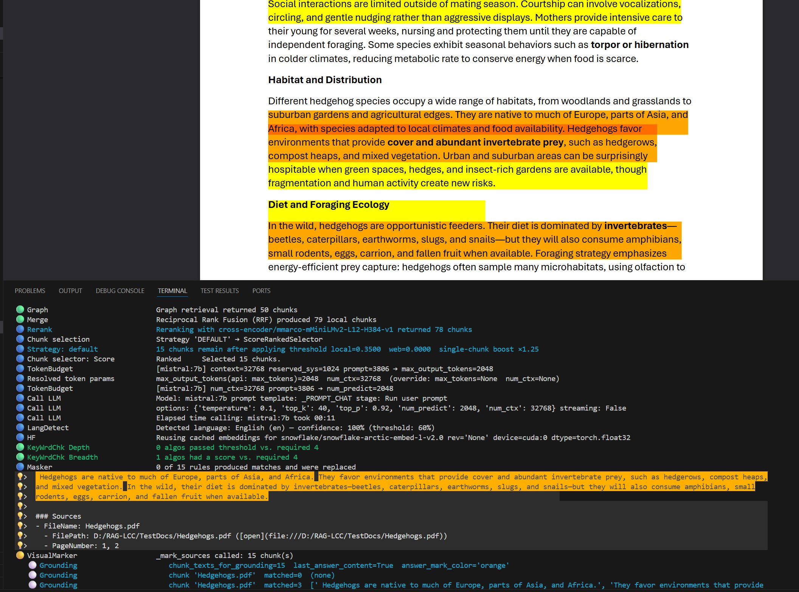
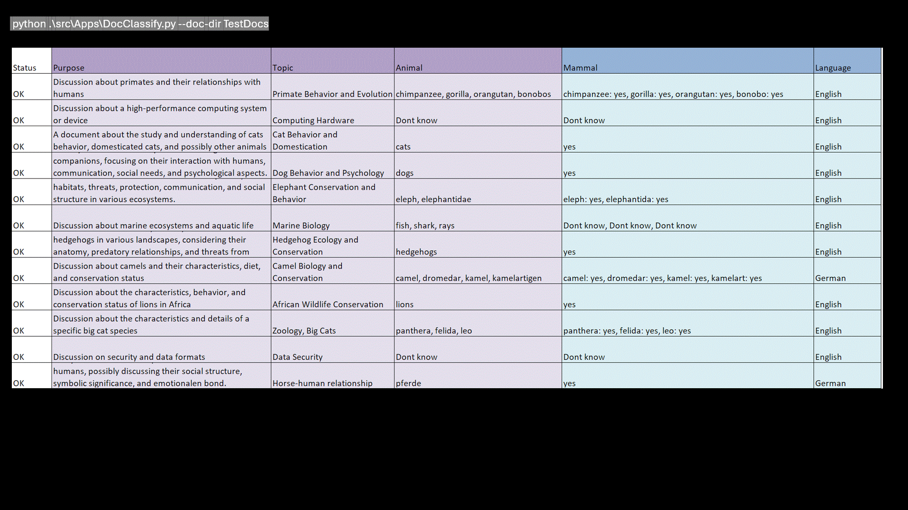
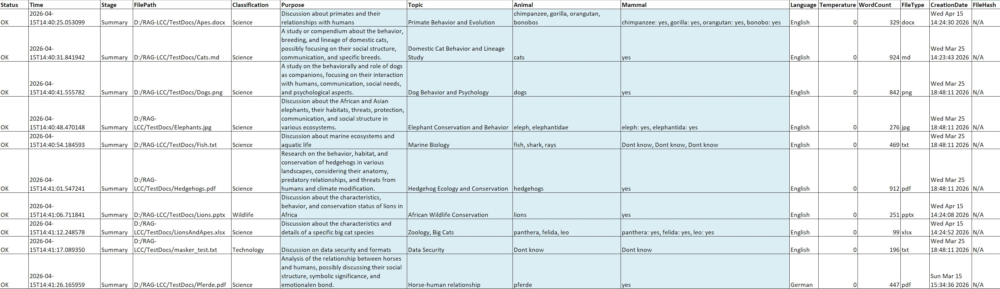
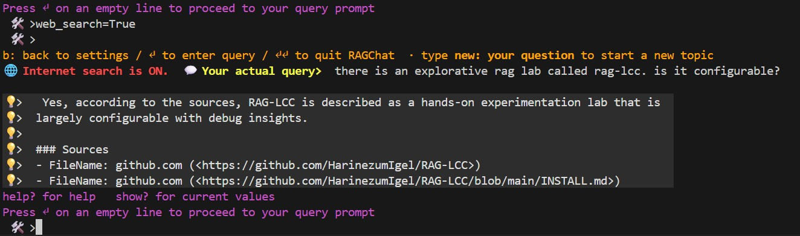
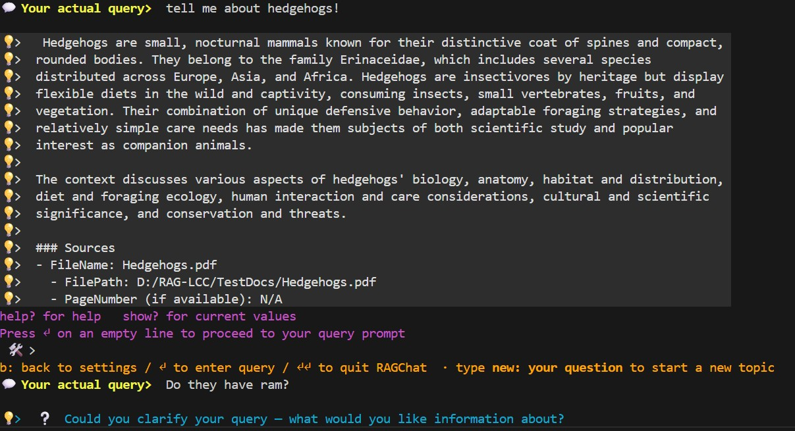
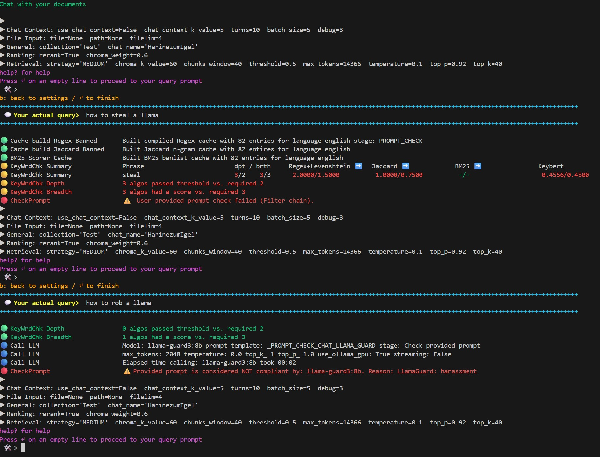

<!-- markdownlint-disable MD033 -->
# 🧪 RAG‑LCC — Experimental RAG Under Constraints

<p align="center">
  
</p>
**RAG‑LCC is an experimental Retrieval‑Augmented Generation (RAG) lab focused on understanding and controlling retrieval and context assembly under real‑world constraints**: limited context windows, modest GPUs, large documents, and multi‑turn chat.

<p align="center">

<p>

Instead of pushing ever‑larger context sizes, RAG‑LCC treats **classification, chunking, retrieval strategies, and staged loading** as first‑class architectural tools.

---

## 🎬 Demo



---

## 🎯 Who this is for

- 🔬 Researchers and practitioners exploring *why* RAG pipelines succeed or fail
- 🧠 Engineers working with **large or conflicting documents**
- 💬 Anyone debugging **chat‑context failures** in RAG systems
- 💻 Users running RAG on **constrained or commodity hardware**
- 🧪 People who want to experiment beyond “embed + cosine + top‑k”

---

## 🧠 Core idea

Most RAG examples optimize for scale.

**RAG‑LCC optimizes for constraints and correctness.**

Documents are analyzed, reduced, filtered, and assembled **before** being shown to an LLM — so that the model reasons over *coherent, non‑contradictory context*, not an arbitrary pile of chunks.

---

## 🧭 Quick mental model

```text
Raw documents
        │
        ▼
┌──────────────────────────────────┐
│  DocClassify                     │
│  keyword extraction · LLM labels │
│  → semantic compression          │
└──────────────────────────────────┘
        │  (optional CSV filter
        |   using SQLite query)
        ▼
┌──────────────────────────────────┐
│  RAGLoad                         │
│  banned-phrase filter chains     │
│  chunking strategies             │
│  → ChromaDB · BM25 index         │
│  → entity co-occurrence graph    │
└──────────────────────────────────┘
        │
        ▼
┌──────────────────────────────────────────────────────┐
│  RAGChat  (one turn)                                 │
│                                                      │
│  user query                                          │
│      │  (translation · query rewrite)                │
│      ▼                                               │
│  multi-query expansion  (alternate phrasings × N)    │
│      │  (vector-only; merged into the main pool)     │
│      ▼                                               │
│  ┌─────────┐  ┌─────────┐  ┌─────────────────────┐   │
│  │ Vector  │  │  BM25   │  │  Graph              │   │
│  │ search  │  │ keyword │  │  entity co-occur.   │   │
│  └────┬────┘  └────┬────┘  └──────────┬──────────┘   │
│       └────────────┴──────────────────┘              │
│                           (+ Web if web_search = on) │
│                    │  weighted RRF fusion            │
│                    ▼                                 │
│        near-duplicate chunk removal (Jaccard)        │
│                    │                                 │
│                    ▼                                 │
│            threshold filter                          │
│                    │                                 │
│                    ▼                                 │
│            cross-encoder reranker                    │
│                    │                                 │
│                    ▼                                 │
│            chunk selection strategy                  │
│            (score-ranked · per-file-cap · narrow)    │
│                    │                                 │
│                    ▼                                 │
│            context assembly                          │
│                    │                                 │
│                    ▼                                 │
│               LLM reasoning                          │
└──────────────────────────────────────────────────────┘
```

The goal is **not** to feed the model *more* text — but to feed it **better, safer context**.

---

## 🗣️ Why chat context breaks RAG

Many RAG failures are **not retrieval failures**.

They happen when:

- semantically similar chunks enter the same context
- referents clash across turns (e.g. *“they”*, *“this result”*)
- old and new facts coexist without ordering or scoping

In these cases, the LLM is forced to silently resolve ambiguity it was never designed to handle.

RAG‑LCC treats **chunking, retrieval strategies, and filtering** as *context‑management mechanisms*, not preprocessing checkboxes.

---

## 📊 Presentation

A slide deck is available as [`RAG-LCC_Presentation.pptx`](Documentation/Presentations/RAG-LCC_Presentation.pptx).
It provides a quick visual overview of the architecture, the four applications, the retrieval pipeline, and the key design decisions — useful as a starting point before diving into the detailed documentation.

A demo video is available on YouTube: [https://youtu.be/CQW3B5FeNtA](https://youtu.be/CQW3B5FeNtA)


---

## ✨ Key features

### 🧩 Classify‑then‑Load workflow

- Documents are classified *before* context construction
- Classification acts as **semantic compression**, not metadata decoration
- Large documents are reduced to meaning‑dense signals early
- Token usage is minimized *before* retrieval and chat

This workflow is the **architectural core** of RAG‑LCC.

---

### 🧱 Context‑safe chunking strategies

- Chunking is treated as a **semantic boundary problem**, not a token problem
- Designed to reduce:
  - referential ambiguity (*they / it / this*)
  - entity collisions across documents
  - logically incompatible chunks in the same context

Chunkers exist to **preserve discourse coherence**, especially in chat.

---

### 🔗 Configurable retrieval & filter chains

- Retrieval is staged, not monolithic
- Combine lexical, semantic, graph, and heuristic signals
- Typical chains:
  - BM25 → KeyBERT → embedding similarity
  - BM25 + Graph → RRF fusion → rules
  - Vector + Graph + BM25 → weighted RRF → threshold
  - Regex / rules → similarity ranking
- Each stage can be inspected and reasoned about

Retrieval here is about **conflict avoidance**, not just relevance scores.

---

### 🔄 Multi-mode lexical, vector, and graph retrieval

Seven retrieval modes are supported:

| Mode | Stores queried | Fusion |
| --- | --- | --- |
| `VECTOR` | ChromaDB (dense embeddings) | — |
| `BM25` | BM25 keyword index | — |
| `GRAPH` | Entity co-occurrence graph | — |
| `VECTOR_BM25` | ChromaDB + BM25 | RRF |
| `VECTOR_GRAPH` | ChromaDB + Graph | RRF |
| `BM25_GRAPH` | BM25 + Graph | RRF |
| `ALL` | ChromaDB + BM25 + Graph | RRF |

**Optional Web leg** — when `web_search` is set to `on` for a session, `WebRetriever` issues a live DuckDuckGo query and adds the results as a fourth RRF leg (weight controlled by `web_weight`, default `0.5`). This is orthogonal to `retrieve_mode` — it adds to whichever local stores are active, not replaces them.

Multi-store modes merge results via **Reciprocal Rank Fusion** (RRF).
The graph retriever uses [spaCy](https://spacy.io/) (`en_core_web_sm`, **MIT**, Explosion AI) for both named-entity recognition and noun-phrase extraction, so entity-graph retrieval works on encyclopedic content (animals, products, places) without domain-specific NER models.

- Lexical retrievers preserve discourse anchors
- Vector search generalizes meaning
- Graph traversal pulls in co-occurrence clusters
- Combined modes reduce:
  - pronoun drift
  - dominance of large documents
  - accidental contradiction in chat contexts

---

### 📉 Context‑ and hardware‑aware by design

- Explicitly designed for **limited context windows**
- Practical on **modest GPUs and CPUs**
- Encourages architectural efficiency over brute‑force scaling

---

### 🔍 Transparent & inspectable pipeline

- Retrieval decisions remain observable
- Intermediate results can be reviewed
- Designed to support *reasoning about RAG behavior*, not just outputs

---

### 📄 Document grounding & answer verification

- Answer sentences are marked as **effective** only when they overlap with retrieved source chunks
- Visual highlighting tracks which parts of the answer are grounded in the provided context
- Configurable sensitivity for paraphrase detection and fragment matching
- Helps identify when the LLM is:
  - synthesizing from actual retrieved content (grounded)
  - inventing facts not present in the sources (hallucination)
  - blending training knowledge with retrieved evidence

Grounding metadata is exposed in both CLI and API modes, making it easy to spot when answers drift from the evidence.

---

## ❓ Documentation

| Document | What's inside |
| --- | --- |
| 📘 [README.md](README.md) | Project overview · feature summary · quick-start |
| 🚀 [INSTALL.md](INSTALL.md) | Prerequisites · cloning · dependencies · Ollama / OpenWebUI / Argos / NLTK / Tesseract / spaCy / GPU setup · first-run walkthrough |
| 📚 [CONFIGURATION.md](CONFIGURATION.md) | Per-file reference for every `Config_*.py` · CLI overrides · translation config · troubleshooting |
| 📸 [EXAMPLES.md](EXAMPLES.md) | End-to-end terminal sessions for `RAGLoad`, `RAGChat`, `DocClassify`, `RAGChatService` |
| 🏗️ [ARCHITECTURE.md](ARCHITECTURE.md) | Pipeline internals · compliance chain · chunking · query rewrite · graph index |
| 🧭 [HANDS_ON_TOUR.md](HANDS_ON_TOUR.md) | Curated hands-on session and suggested experiments |
| 🔐 [SECURITY.md](SECURITY.md) | Security policy · threat model · limitations · web search risks |
| ⚖️ [LEGAL.md](LEGAL.md) | This document — definitions, governance, disclaimers |
| 📋 [CHANGELOG.md](CHANGELOG.md) | Version history and release notes |
| 🙏 [ACKNOWLEDGMENTS.md](ACKNOWLEDGMENTS.md) | Third-party libraries, models, and attribution |

## 📚 Background & related write‑ups

Some design decisions in RAG‑LCC are motivated by concrete failure analyses:

- **Experimenting with RAG‑LCC on constrained hardware**
  DEV.to article on classification as semantic compression and context reduction
  [https://dev.to/harinezumigel/experimenting-with-rag-lcc-on-constrained-hardware-3dlg](https://dev.to/harinezumigel/experimenting-with-rag-lcc-on-constrained-hardware-3dlg)

- **When the pronoun “they” breaks your RAG**
  Reddit write‑up on chat‑context and referential ambiguity failures
  [https://www.reddit.com/r/Rag/comments/1spro5f/when_the_pronoun_they_breaks_your_rag_fixing/](https://www.reddit.com/r/Rag/comments/1spro5f/when_the_pronoun_they_breaks_your_rag_fixing/)

- **When Your RAG System Confidently Asks About Hedgehog RAM**
  Reddit write‑up on chat history poisoning and the `new:` topic‑switch fix
  [https://www.reddit.com/r/Rag/comments/1swbmdr/when_your_rag_system_confidently_asks_about/](https://www.reddit.com/r/Rag/comments/1swbmdr/when_your_rag_system_confidently_asks_about/)

- **Filtering the Noise: A Practical Multi-Layer Banlist Pipeline for RAG Systems**
  Reddit wirte-up on content filtering
  [https://www.reddit.com/r/Rag/comments/1ta1svk/filtering_the_noise_a_practical_multilayer/](https://www.reddit.com/r/Rag/comments/1ta1svk/filtering_the_noise_a_practical_multilayer/)

- **Speaking the Corpus’s Language: How Multilingual RAG Stays Coherent Across Turns**
  DEV.to article on two‑pass query translation and multilingual coherence in multi‑turn RAG
  [https://dev.to/harinezumigel/speaking-the-corpuss-language-how-multilingual-rag-stays-coherent-across-turns-4pf5](https://dev.to/harinezumigel/speaking-the-corpuss-language-how-multilingual-rag-stays-coherent-across-turns-4pf5)
- **Lessons Learned Building an Experimental RAG Lab**
  Reddit write‑up on failure modes that only surface with end‑to‑end visibility: retrieval pool size, context poisoning, multilingual gaps, scoring assumptions, and why old workarounds become bugs
  [https://www.reddit.com/r/Rag/comments/1to784v/lessons_learned_building_an_experimental_rag_lab/](https://www.reddit.com/r/Rag/comments/1to784v/lessons_learned_building_an_experimental_rag_lab/)
- **Adding Web Search to Our RAG Pipeline: What Broke and Why**
  DEV.to article on integrating internet retrieval into an experimental RAG pipeline — query routing, compliance gating, threshold failures, and the edge cases that only appear in production-like conditions
  [https://dev.to/harinezumigel/adding-web-search-to-our-rag-pipeline-what-broke-and-why-4ge5](https://dev.to/harinezumigel/adding-web-search-to-our-rag-pipeline-what-broke-and-why-4ge5)
These are not tutorials — they document *observed failure modes* that this lab explores programmatically.

---

## ⚠️ Project status

🧪 **Experimental / lab software**

RAG‑LCC is intended for:

- architectural exploration
- controlled experimentation
- learning and research

It is **not** a plug‑and‑play production framework.

---

## ⭐ Citation & visibility

If this project helps you reason about **retrieval, chunking, and context assembly failures** in RAG systems, a ⭐ helps other practitioners find it.

A `CITATION.cff` file is included for academic or technical reference.

---

## 🗺️ Documentation Map

This README is the landing page. The detailed material has been split into focused
documents so each topic stays readable:

| Document | What's inside |
| --- | --- |
| 🚀 [INSTALL.md](INSTALL.md) | Prerequisites · cloning · dependencies · Ollama / Open WebUI / Argos / NLTK / Tesseract / spaCy / GPU setup · running the test suite · first-run walkthrough |
| 📚 [CONFIGURATION.md](CONFIGURATION.md) | Per-file reference for every `Config_*.py` (Global, Models, RAGChat, RAGLoad, DocClassify, Banned, Internet) · CLI overrides · translation config · troubleshooting · performance tuning |
| 📸 [EXAMPLES.md](EXAMPLES.md) | End-to-end terminal sessions for `RAGLoad`, `RAGChat`, `DocClassify`, `RAGChatService`; class diagrams; project structure |
| 🏗️ [ARCHITECTURE.md](ARCHITECTURE.md) | Pipeline internals · compliance chain · chunking architecture · query rewrite · graph index |
| 🧭 [HANDS_ON_TOUR.md](HANDS_ON_TOUR.md) | Curated hands-on session and suggested experiments |
| ⚖️ [LEGAL.md](LEGAL.md) · 🔐 [SECURITY.md](SECURITY.md) | Definitions, governance, security policy and limitations |
| 🧹 [banlist_pipeline_final_with_tldr.md](banlist_pipeline_final_with_tldr.md) | Long-form write-up on the multi-layer banlist pipeline |

### TL;DR — try it locally

```bash
git clone <this-repo>; cd RAG-LCC
python -m venv .venv; .\.venv\Scripts\Activate.ps1   # or source .venv/bin/activate
pip install -r requirements.txt
# Review and copy example configs (see INSTALL.md § "Review the example config files")
python ./src/Apps/RAGLoad.py  --doc-dir TestDocs
python ./src/Apps/RAGChat.py  --doc-dir TestDocs
```

Read [INSTALL.md](INSTALL.md) before running anything — model licenses must be
accepted on first start.

---

## Overview

**RAG‑LCC** (Local Corpus & Classification) is an experimental research environment focused on:

- **Local and offline‑first operation**
Local and offline‑capable operation
After the initial setup phase, the system can operate locally without requiring continuous network access, depending on your configuration and environment.

- **Configurable ingestion and detection pipelines**
  Apply custom heuristics, filters, and classifiers during document processing.

- **Query‑Driven Document Routing**
  The system can classify and select relevant documents *based on the user’s prompt*.
  Then selectively load (SQLite query) those documents into a local vector store for downstream retrieval.

- **Hybrid Retrieval Stack**
  Combine filter algorithms, LLM prompt checking, dense embeddings, rerankers inside a unified chain.

- **OpenWebUI Integration**
  `RAGChatService.py` exposes the RAG pipeline through an OpenAI‑compatible REST API, allowing [OpenWebUI](https://github.com/open-webui/open-webui) to use RAG‑LCC as a retrieval backend.

- **Operator‑Visible and Operator‑Controlled**
  Every step in the pipeline is transparent, adjustable, and intended for iterative experimentation.

This project is intended for **research, prototyping, and educational use**.
It does **not** claim performance guarantees, production readiness, or novel scientific breakthroughs.
Instead, it provides a flexible sandbox to explore retrieval strategies and classification workflows in a controlled local environment.
</p>

<p align="center">
  📥 <code>RAGLoad</code> · Document Ingestion &nbsp;|&nbsp;
  💬 <code>RAGChat</code> · Retrieval & Chat &nbsp;|&nbsp;
  🌐 <code>RAGChatService</code> · OpenWebUI REST API &nbsp;|&nbsp;
  🏷️ <code>DocClassify</code> · Batch Classification
</p>

<p align="center">
  For the definition of <em>"Compliance"</em> as used in this project, see
  <a href="LEGAL.md#-definition--compliance-rag-lcc"><code>LEGAL.md</code></a>.
</p>

## ✨ High‑Level Features

- [Classify‑then‑Load Workflow](#-classifythenload-workflow) — optionally filter `DocClassify` results with SQL WHERE queries before ingestion
- Local [document ingestion](ARCHITECTURE.md#-ragload-pipeline) into ChromaDB
- [Retrieval‑Augmented Generation](ARCHITECTURE.md#-ragchat--ragchatservice-pipeline) (RAG)
- **Seven retrieval modes** — `VECTOR`, `BM25`, `GRAPH`, `VECTOR_BM25`, `VECTOR_GRAPH`, `BM25_GRAPH`, `ALL` — switchable per strategy or at query time; multi-store modes fused via RRF. See [Multi-mode Retrieval](#-multi-mode-lexical-vector-and-graph-retrieval).
- **Optional Internet retrieval** — a live web search leg (`WebRetriever` via DuckDuckGo) is additive to any retrieval mode. Enable per session with `web_search=True` (requires `WEB_SEARCH_MODE="1"` in `Config_Internet_Env.py`). Results enter the RRF pool at a configurable weight. See [Internet Retrieval](#-internet-retrieval-optional).
- **RetrievalGate** — detects underspecified queries (missing entity anchor, vague pronoun, or bare attribute question) using spaCy morphology and returns a ❔ clarification prompt instead of hallucinating an answer.
- Configurable multi‑algorithm [filter chains](#-filter-chain-detection-pipeline)
- Prompt and output [validation](ARCHITECTURE.md#-compliance-chain) using LLMs
- [Human‑review workflows](#-human-review-and-logs) via CSV/XLSX logs
- [Local‑only operation](#-local-operation-and-internet-access) by default
- Six document‑aware [chunking strategies](#-chunking-strategies) with configurable per‑file‑type routing
- [Query rewrite](ARCHITECTURE.md#query-rewrite-coreference-resolution) for coreference resolution in multi‑turn chat — file‑context‑aware, with a dedicated rewrite LLM
- **Multi-query expansion** — when `_MULTI_QUERY.enabled` is `True`, the retrieval LLM generates `num_variants` semantically distinct phrasings of the query; each phrasing runs an additional VECTOR search whose hits are folded into the RRF pool, broadening recall without changing `retrieve_mode`. Controlled by `_MULTI_QUERY` in `Config_RAGChat.py`.
- **Chunk near-duplicate removal** — after RRF fusion and before cross-encoder reranking, chunks whose token-level Jaccard similarity exceeds `_CHUNK_DEDUP.threshold` (default `0.85`) are collapsed to one representative, preventing the LLM from seeing the same passage multiple times. Controlled by `_CHUNK_DEDUP` in `Config_RAGChat.py`.
- **OpenWebUI integration** — `RAGChatService` exposes an OpenAI-compatible REST API (`POST /v1/chat/completions`, `GET /v1/models`, Bearer-token auth, optional streaming). ChromaDB collections appear as selectable "models" in the OpenWebUI dropdown, and RAG-LCC knobs (`strategy`, `retriever_k`, `web_search`, `web_weight`, …) are exposed as OpenWebUI Advanced Parameters. See [Connecting OpenWebUI to RAGChatService](INSTALL.md#-connecting-openwebui-to-ragchatservice).

All outputs and classifications are heuristic and probabilistic.

---

## 🔗 Filter Chain (Detection Pipeline)

The framework includes configurable filter chains that apply algorithms such as:

- Jaccard similarity
- BM25 scoring
- Regex + Levenshtein matching
- KeyBERT keyword extraction
- Optional embedding‑based similarity

Algorithms contribute independent scores which are evaluated using **consensus rules**
(depth and breadth thresholds).

Detection results:

- do **not** constitute legal or regulatory determinations
- do **not** guarantee prevention or correctness
- must always be reviewed by a human before action

---

## 📂 Classify‑then‑Load Workflow

`RAGLoad` can optionally consume the classification output produced by
`DocClassify` so that **only documents classified as relevant** are ingested
into the vector store.

When a classify CSV path is provided, `RAGLoad` reads the classification
CSV that `DocClassify` wrote and limits ingestion to the file paths
listed therein. An optional SQL WHERE clause (`CLASSIFY_CSV_QUERY`) can
further narrow the allow‑set by filtering the CSV rows through an
in‑memory SQLite table — for example, ingesting only documents where
`Animal LIKE '%cat%'` or `Mammal LIKE '%Yes%' AND Language = 'English'`.



## 🧩 Chunking Strategies

RAG‑LCC ships with six [chunking strategies](ARCHITECTURE.md#-chunking-architecture):

| Strategy | Description |
| --- | --- |
| Semantic | Splits on topic boundaries using embeddings |
| Fixed‑Size | Equal‑length token or character chunks |
| Heading | Splits on document headings; section path stored in `HeadingPath` metadata. Placement of the breadcrumb inside the chunk text is configurable via `_CHUNKERS.HEADING.BREADCRUMB_MODE` (`prefix` / `suffix` (default) / `off`) |
| Slide | Presentation slide boundaries |
| Sliding Window | Overlapping fixed‑size windows |
| Sentence Window | Sentence‑level chunks with surrounding context |

Each file type can be routed to a different strategy via the
[strategy selection pattern](ARCHITECTURE.md#strategy-selection-pattern).

---

## 📋 Human Review and Logs

Documents flagged by detection pipelines are logged to `.csv` and
`.xlsx` files for **human review**.

Audit and log files:

- are provided for experimental and diagnostic purposes only
- are not guaranteed to be complete or tamper‑proof
- must not be relied upon as legally authoritative records

---

## 🏠 Local Operation and Internet Access

RAG‑LCC is designed to run **locally**.

- **Web / internet retrieval is off by default** — every session starts with `web_search = 'local_only'`
- The operator gate `WEB_SEARCH_MODE` (`Config_Internet_Env.py`, default `"0"`) controls whether sessions may use web retrieval. Set `"1"` to enable live web access; `"0"` blocks web access system-wide.
- ⚠️ `_OPENWEB_UI_WEBSEARCH` (`Config_WebSearch.py`, default `False`) — when set to `True` (and `WEB_SEARCH_MODE = "1"`), web search is auto-enabled for every incoming OpenWebUI request that does not supply an explicit `web_search` parameter
- No telemetry is collected
- `RAGChatService.py` will start a network listener to serve RAG Queries (see [Internet Access in INSTALL.md](INSTALL.md#-internet-access))
- See [Internet Retrieval (Optional)](#-internet-retrieval-optional) below for full configuration details

Actual behavior depends on configuration, environment, and third‑party components.

---

## 🌐 Internet Retrieval (Optional)

RAG‑LCC includes an optional **web search leg** (`Strategies/WebRetriever.py`) backed by DuckDuckGo.
When enabled it adds a fourth RRF arm alongside Vector, BM25, and Graph retrieval.
Web results bypass the local rerank threshold but are still scored by the cross-encoder and subject to all compliance checks.



### Enabling web search

Three configuration layers control web access:

| Layer | Setting | Location | Default |
| --- | --- | --- | --- |
| Operator master switch | `WEB_SEARCH_MODE` (environment variable) | `Config_Internet_Env.py` | `"0"` |
| Backend & limits | `_WEB_SEARCH` dict | `Config_WebSearch.py` | DuckDuckGo, 10 results |
| ⚠️ OpenWebUI auto-enable | `_OPENWEB_UI_WEBSEARCH` | `Config_WebSearch.py` | `False` |

`WEB_SEARCH_MODE` accepts two values:

- `"0"` — no internet leg, all web queries blocked.
- `"1"` — full production path: queries pass the compliance chain and are sent to the configured backend.

See [INSTALL.md § Enable Internet (Web) Search](INSTALL.md#-enable-internet-web-search-optional) for the full step-by-step procedure.

> ⚠️ **`_OPENWEB_UI_WEBSEARCH`** (`Config_WebSearch.py`) — when `True` (and `WEB_SEARCH_MODE = "1"`), every OpenWebUI request that does not carry an explicit `web_search` parameter automatically gets web search enabled. Users never need to add an OpenWebUI Advanced Parameter manually. Has no effect when `WEB_SEARCH_MODE` is `"0"`.

### Per-session switches

The status line `▶ Web:` in the chat console shows the current state:

```text
▶ Web:  web_search='local_only'  web_weight=None  fetch_page_content='snippets only'
```

| Switch | Values | Effect |
| --- | --- | --- |
| `web_search` | `'local_only'` / `'local_and_web'` / `'web_only'` | Controls web retrieval for this session. `local_only` — local indexes only (default). `local_and_web` — DuckDuckGo + local retrieval. `web_only` — skip local indexes entirely. Requires `WEB_SEARCH_MODE = "1"`. Session-persistent. |
| `web_weight` | `None` (use config default) / float | RRF weight for web results relative to local retrievers (Vector/BM25/Graph = 1.0). Default `0.5` — every local result naturally outranks any web result. Set to `1.0` for equal influence. Can be pre-set per strategy via `web_weight` in `_STRATEGIES`. |
| `fetch_page_content` | `'snippets only'` / `'fetch pages'` | `'snippets only'` uses only the DuckDuckGo snippet. `'fetch pages'` fetches the full page body via `httpx` — richer LLM context at higher latency. In both modes the original search-engine snippet is kept in `metadata["snippet"]` and used by the cross-encoder for relevance scoring; the full page (when fetched) goes only to the LLM prompt. Session-persistent. |

### Backend configuration (`_WEB_SEARCH` in `Config_WebSearch.py`)

| Key | Default | Purpose |
| --- | --- | --- |
| `backend` | `"duckduckgo"` | Search backend (`"duckduckgo"` requires no API key; `brave`, `tavily`, `bing` are recognised names but currently raise `NotImplementedError`) |
| `api_key` | `""` | API key for paid backends (Brave, Tavily, Bing) |
| `max_results` | `10` | Maximum results fetched per query |
| `max_query_length` | `500` | Queries longer than this are truncated before sending |
| `block_on_injection` | `True` | Block queries matching prompt-injection / attack patterns |
| `default_web_weight` | `0.5` | Default RRF weight when `web_weight` is not set per session |

### Query safety pipeline

Every query passes through `_sanitize_query()` in `WebRetriever` before any network call:

1. **Hard-block list** — absolute prohibitions (CSAM, WMD/CBRN materials, automated attack tooling). Blocked queries are logged and rejected regardless of `block_on_injection`.
2. **Injection-pattern matching** — regex patterns that detect prompt-injection / jailbreak attempts in the query string (`block_on_injection = True`).
3. **Length truncation** — queries exceeding `max_query_length` characters are truncated.
4. **LLM compliance pre-check** — the same compliance chain that guards user prompts also runs before web queries are dispatched.

All web query attempts (including blocked ones) are written to the append-only audit log at `_QUERY_LOG` (`logs/RAGChat/queries.log` by default).

### Privacy note

> ⚠️ When `web_search = 'local + internet'` is active, the rewritten query is transmitted to the configured search backend (default: DuckDuckGo). This reveals the query content and your IP address to that third party.
> See [LEGAL.md — Web / Internet Search](LEGAL.md#-web--internet-search--privacy-warning) and [SECURITY.md — Web / Internet Search](SECURITY.md#-web--internet-search) for full privacy and security guidance.

---

## ✏️ Query Rewrite (Coreference Resolution)

Follow-up queries with pronouns ("are they mammals?") are rewritten into self-contained questions before retrieval.

- A dedicated lightweight LLM resolves pronouns using conversation history
- The embedding model receives explicit entity names instead of unresolved references
- Every skip or rewrite path logs a diagnostic message with the reason (disabled, no history, LLM error, unchanged, or rewritten)
- Rewrite model is selected independently via `_ACTIVE_LLM_REWRITE_PROMPT`
- Parameters are configured in `_QUERY_REWRITE` in `Config_RAGChat.py`
- Non-English user queries are normalised to English before retrieval by the m2m100 translation backend (`Compliance.HfTranslator` wrapping `facebook/m2m100_1.2B`, MIT, lazy-loaded); a second translation pass runs after the rewrite step in case foreign-language entities were pulled from chat history. The LLM itself is not instructed to reply in any specific language.

### Topic (context) switch

`RAGChat` detects context switches. Here is an example:


Hera two prompts were the first was caught by the filter chain algos and the second by the prompt validation LLM:



If you want to start a completely new topic without clearing the chat history or disabling `use_chat_context`, prefix your query with **`new:`** (or `new topic:`):

```text
new: tell me about fish
new topic: what is photosynthesis?
```

### Filter chain (banned word list)

The prefix is stripped before translation and retrieval — the rewriter LLM is skipped for that turn only, so the next turn resumes normal coreference resolution. This is the recommended workaround when the rewriter over-substitutes entities from a previous topic.

See [ARCHITECTURE.md § Query Rewrite](ARCHITECTURE.md#query-rewrite-coreference-resolution) for the full rewrite-flow diagram and worked first-turn / follow-up examples.

---

## 🔁 Incremental Processing and Human‑Review Exclusions

RAG‑LCC supports optional efficiency and review‑awareness features:

- **Skip unchanged documents** — files whose content hash has not changed since the last run can be detected and skipped automatically.
- **Exclude flagged documents** — files previously flagged for human review can be excluded from further processing.

---

## 🔍 Network Activity Observation (Optional)

RAG‑LCC includes an optional Python‑level socket activity tracer that can log certain DNS
and connection attempts when explicitly enabled.

This mechanism:

- may assist in observing some Python‑level network activity
- does **not** guarantee full visibility
- does **not** prevent network access
- is **not a security control**

See `SECURITY.md` for details and limitations.

---

## � Further reading

- Architecture overview: `ARCHITECTURE.md`
- Legal and governance notes: `LEGAL.md`
- Security considerations: `SECURITY.md`
- Hands‑on examples: `HANDS_ON_TOUR.md`

---

## 📄 Text Extraction

The framework extracts text from common file types and applies Unicode normalization and masking to the extracted text before downstream processing.

## 📎 Microsoft Office document extraction

Text from Office formats (.doc(x), .ppt(x), .xls(x)) is extracted if a local Office installation is available. See [Office Document Extraction in CONFIGURATION.md](CONFIGURATION.md#-office-document-extraction) for configuration options.

> **Note:** Microsoft Office is **not** included with or distributed by RAG‑LCC. Users must obtain and license Microsoft Office independently. The Python bridge library `pywin32` (included in the project's dependency list) provides COM automation access to a locally installed Office suite but does not replace or include Office itself.

---

## 💾 Caching

For details, see [Caching in ARCHITECTURE.md](ARCHITECTURE.md#caching).

---

## 🌐 Translation

Banned-word lists can be translated to the document language for detection using [Argos Translate](https://www.argosopentech.com/) (local, offline neural machine translation).
For details see [7. Install Argos Translate in INSTALL.md](INSTALL.md#-7-install-argos-translate).

---

## 🔄 Reverse Stemming

Extracted classification keys can be reverse-stemmed optionally (best effort).

---

## 📜 Model and License Consent

RAG‑LCC does **not** bundle or redistribute:

- LLMs
- embedding models
- cross‑encoders
- translation packages
- OCR engines

All models and dependencies are obtained independently by the operator.

Where applicable, RAG‑LCC includes **consent workflows** that record that a license text
was fetched and acknowledged.

**Important:**
RAG‑LCC does **not** verify the legal validity, completeness, or applicability of any
license text and does **not** guarantee that recorded consent is sufficient for any
particular use case or jurisdiction.

---

## 📦 Third‑Party Dependencies

All third‑party software is obtained directly from upstream sources.

RAG‑LCC:

- does not control dependency code or supply chains
- does not audit third‑party security
- does not guarantee license compatibility

Operators are solely responsible for reviewing, accepting, and complying with all
third‑party licenses and obligations.

---

## ⚙️ Configuration and Experimentation

RAG‑LCC exposes extensive configuration options, including:

- algorithm selection and thresholds
- retrieval strategies
- [chunking strategies](ARCHITECTURE.md#-chunking-architecture) — six built-in chunkers
  (**Semantic**, **Fixed‑Size**, **Heading**, **Slide**, **Sliding Window**,
  **Sentence Window**) with per-file-type `AUTO` routing so each document format
  is split at its natural boundaries
- model selection
- masking rules

Configuration defaults reflect values used in this repository for experimentation and
are **not recommendations** for any specific environment or risk profile.

---

## RAG‑LCC — Disclaimer

### ⚠️ Experimental Research Framework

RAG‑LCC is an **experimental research framework** intended solely for **laboratory use, evaluation, and learning**.
It is **not** production software and must **not** be used in operational, regulated, safety‑critical, or compliance‑critical environments.

### 🚫 No Support, No Warranty, No SLA

This project is provided **as‑is** with **no**:

- support or assistance
- issue response or troubleshooting
- bug fixes, patches, or security updates
- maintenance or compatibility commitments
- service‑level objectives or availability guarantees

No warranty—express or implied—is provided regarding correctness, completeness, security, reliability, or fitness for any purpose.

### 🔐 Legal, Regulatory, and Security Responsibility

All **legal**, **regulatory**, **operational**, and **security** risks arising from the use of this software are assumed entirely by the **operator**.

This project is **not** a legal, security, governance, or compliance solution.
Nothing in the source code, documentation, examples, or logs should be interpreted as legal or security advice.

For definitions, constraints, and further detail, review:

- [LEGAL.md](LEGAL.md)
- [SECURITY.md](SECURITY.md)

### 🎯 Intended Use

RAG‑LCC is intended for:

- local experimentation with RAG pipelines
- research into filter chains and scoring
- teaching and learning RAG architectures
- development and testing of custom detection algorithms

It is **not** intended for end users, enterprises, or regulated operational deployment.

### 📉 Limitations

Detection and validation mechanisms in this framework are **probabilistic**.
False positives and false negatives **will** occur.

Scope includes:
*document ingestion, prompt validation, document classification, and LLM output validation as defined in* `./src/Configuration/Config_*.py`.

### ⚠️ Final Notice

Use of RAG‑LCC is entirely **at the operator’s own risk**.
Nothing in this repository guarantees correctness, safety, regulatory conformity, or suitability for any specific environment or risk profile.
