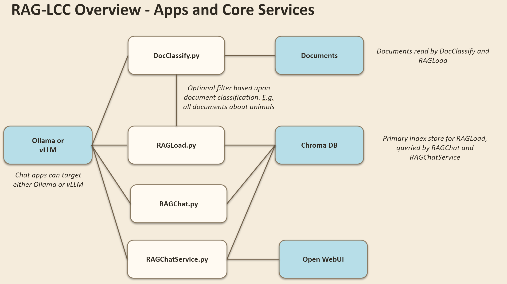
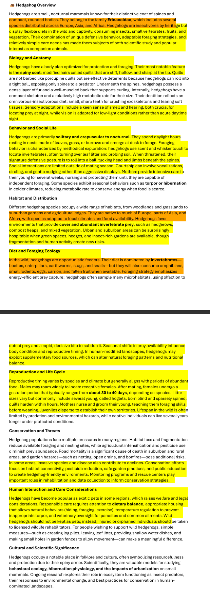
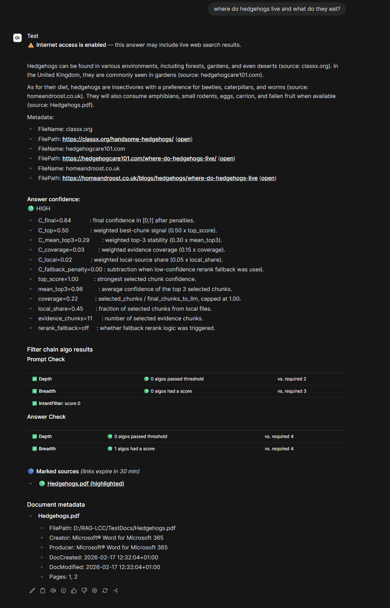

  

## Overview

Experimental Retrieval-Augmented Generation under constraints.

RAG-LCC is a practical lab for understanding where RAG systems fail and how to fix them: retrieval misses, context poisoning, multilingual drift, and compliance edge cases.

Short: If you want to understand *why* your RAG fails, RAG-LCC gives you a playground to experiment with the parameters that matter. You can tune settings, compare alternatives on a small test corpus, and carry those insights back into your own RAG. In other words, RAG-LCC is an insight tool with reusable ideas, not an everyday production RAG.

Current release: v0.5.1/1480 (2026-09-19)

## What you get

- Hybrid retrieval pipeline with Vector, BM25, Graph, and Regex retrieval
- Multi-turn chat support with query rewriting and topic switching
- Multi-query expansion for better recall
- Cross-encoder reranking and strategy-based context assembly
- Configurable orchestration flows for per-turn pipeline control
- Confidence evaluation signals for evidence-quality tuning
- Compliance filtering during ingestion, query, and answer phases
- Grounding markers so answer text can be traced to evidence chunks

## Application suite

| Application | Purpose | Typical output |
| --- | --- | --- |
| DocClassify | Classify and compress corpus content before indexing | CSV metadata used for selective loading |
| RAGLoad | Ingest and index local documents into multiple retrievers | ChromaDB + BM25 + Graph + Regex indexes |
| RAGChat | Interactive CLI RAG with grounding and safety checks | Grounded multi-turn answers |
| RAGChatService | OpenAI-compatible API wrapper for RAGChat | API endpoint for OpenWebUI and clients |

## Why this project is different

Most RAG stacks optimize only retrieval score. RAG-LCC also optimizes context quality.

- Detects contradictory or noisy context before generation
- Handles multilingual retrieval routing by language buckets
- Makes retrieval and grounding behavior observable with debug levels
- Exposes most architecture decisions through configuration

## Quick start

1. Read installation guide
  [INSTALL.md](https://github.com/HarinezumIgel/RAG-LCC/blob/main/INSTALL.md)
2. Load docs
   python ./src/Apps/RAGLoad.py --doc-dir TestDocs
3. Start chat
   python ./src/Apps/RAGChat.py --doc-dir TestDocs

## Query and grounding examples

- [QUERY_OUTPUT_EXAMPLE.md](../QUERY_OUTPUT_EXAMPLE.md)
  Full CLI transcript of a real RAGChat run, including startup checks,
  retrieval settings, configurable orchestration decisions, rerank diagnostics,
  grounding, and confidence-evaluation output.

- [Gentle tuning showcase for dev.io](rag-lcc-tuning-showcase-dev-io.md)
  Beginner-friendly article that explains the RAG-LCC mental model,
  query-output reading, practical tuning paths across all four apps,
  plus an expert lane for orchestrator and query-rewrite tuning.
  Note: RAG-LCC is an experimental learning and tuning lab, not a production-ready deployment stack.

- [How I Tune RAG Pipelines with RAG-LCC: A Hands-On Local Guide (DEV Community)](https://dev.to/harinezumigel/how-i-tune-rag-pipelines-with-rag-lcc-a-hands-on-local-guide-l8l)
  Published DEV article version of the beginner-friendly hands-on tuning walkthrough.

### CLI grounding example: hedgehog query

Shows sentence-level grounding markers in the CLI flow. This helps verify which
answer parts are directly supported by retrieved evidence chunks.

### OpenWebUI example

Shows the same grounding concept through the OpenWebUI integration path
(`RAGChatService`). Useful for validating that API/UI output preserves
evidence traceability, not just CLI output.

## Documentation hub

- Project overview
  [README.md](https://github.com/HarinezumIgel/RAG-LCC/blob/main/README.md)
- Installation
  [INSTALL.md](https://github.com/HarinezumIgel/RAG-LCC/blob/main/INSTALL.md)
- Full configuration reference
  [CONFIGURATION_REFERENCE.md](https://github.com/HarinezumIgel/RAG-LCC/blob/main/CONFIGURATION_REFERENCE.md)
- Architecture deep dive
  [ARCHITECTURE.md](https://github.com/HarinezumIgel/RAG-LCC/blob/main/ARCHITECTURE.md)
- Query output walkthrough
  [QUERY_OUTPUT_EXAMPLE.md](https://github.com/HarinezumIgel/RAG-LCC/blob/main/QUERY_OUTPUT_EXAMPLE.md)
- Hands-on tour
  [HANDS_ON_TOUR.md](https://github.com/HarinezumIgel/RAG-LCC/blob/main/HANDS_ON_TOUR.md)
- Legal and compliance notes
  [LEGAL.md](https://github.com/HarinezumIgel/RAG-LCC/blob/main/LEGAL.md)

## Source repository

[HarinezumIgel/RAG-LCC](https://github.com/HarinezumIgel/RAG-LCC)
